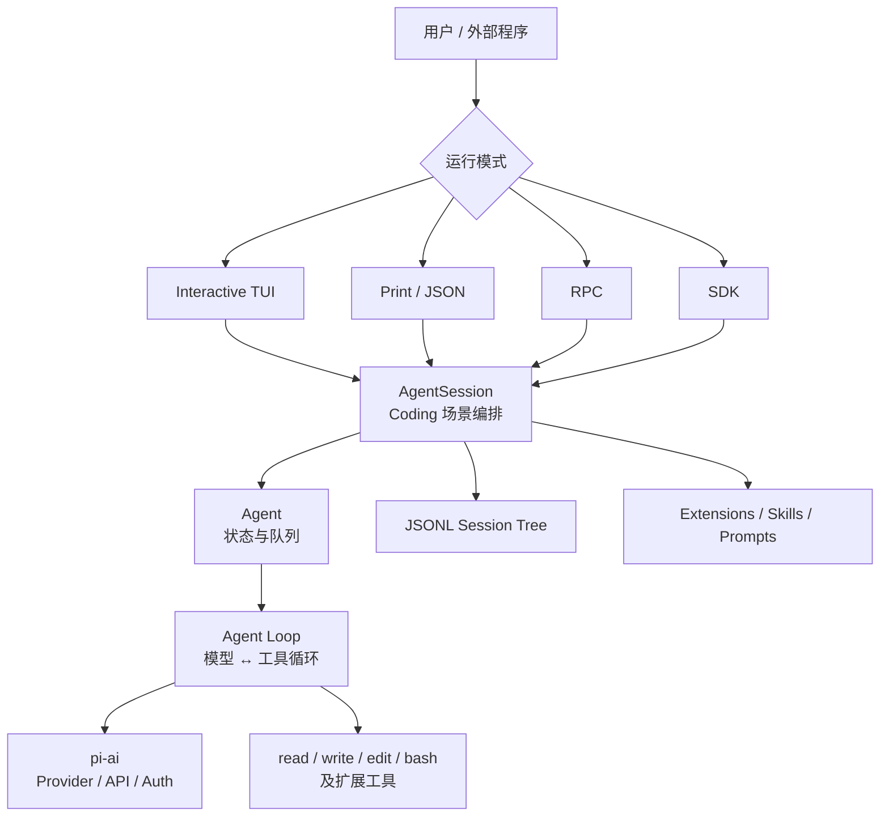
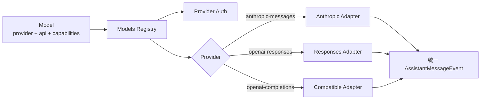
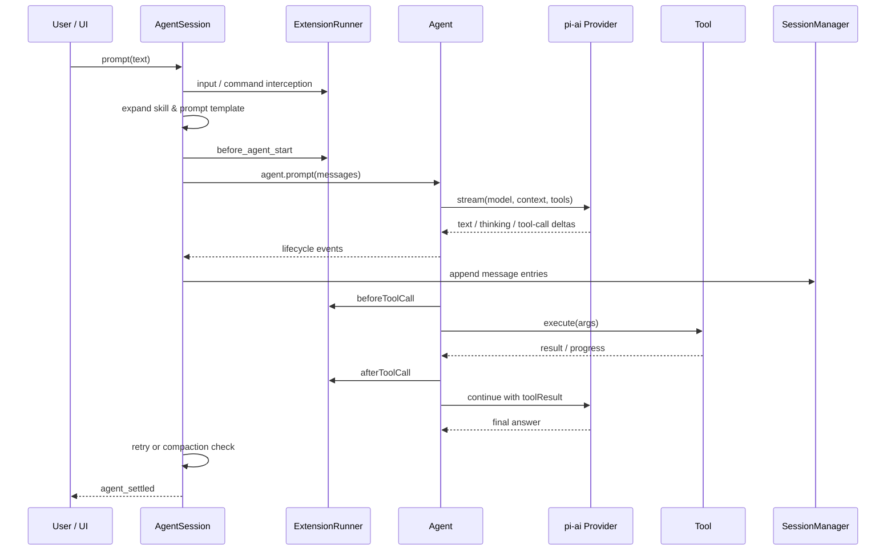
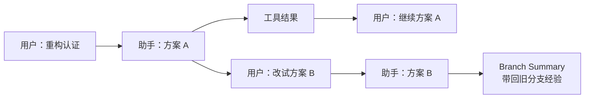
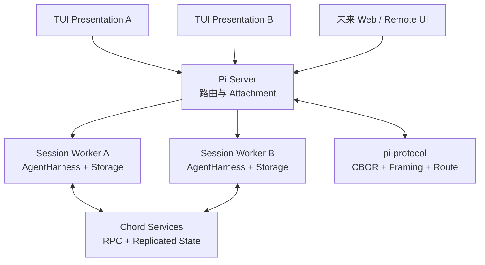

很多 Coding Agent 都在增加功能：计划模式、子 Agent、权限弹窗、浏览器、MCP、云端沙箱、任务队列。Pi 选择了相反的产品姿态——默认只提供一条足够短的 Agent Loop、四个基础工具和一个终端界面，把其他能力留给扩展。

这很容易被误读成“功能少”。但读完源码后会发现，Pi 的极简并不是删减版产品，而是一种明确的架构选择：**内核只负责稳定机制，把工作流偏好留在边界之外。** 模型怎么接、消息怎么流、工具怎么执行、历史怎么保存，这些是机制；要不要计划、何时审批、是否启用子 Agent，则是策略。

> [!IMPORTANT]
> Pi 最值得学习的，不是它只有 `read`、`write`、`edit`、`bash` 四个默认工具，而是它让同一条执行链可以被 CLI、JSON、RPC、SDK 和扩展共同复用，又没有把某一种工作方式焊死在核心里。

本文基于 Pi 仓库的 [`e44d75c`](https://github.com/earendil-works/pi/tree/e44d75c20a51142abc056c243b13c1d7bb4be687) 提交与 `0.84.4` 代码线分析。这个时间点的仓库同时包含稳定运行的经典架构，以及仍标注为 experimental 的下一代 durable `AgentHarness`。两者必须分开看，否则很容易把未来设计当成当前默认实现。

## 一、先看全景：Pi 不是一个 CLI，而是一组逐层收窄的抽象

Pi 的 Monorepo 把完整系统拆成多个包。最核心的四层是：

| 层 | 包 | 负责什么 | 不负责什么 |
| --- | --- | --- | --- |
| 模型协议层 | `pi-ai` | Provider、模型目录、认证、流式事件、不同厂商协议适配 | 工具执行、Session、UI |
| Agent 运行层 | `pi-agent-core` | Agent Loop、消息状态、工具调用、队列与生命周期事件 | Coding 场景、磁盘会话、终端 |
| Coding 编排层 | `pi-coding-agent` | 系统提示词、项目上下文、Session、压缩、重试、扩展、内置工具 | 具体模型协议实现 |
| 展示与接入层 | `pi-tui` + Modes | 终端渲染、交互输入、Print/JSON、RPC、SDK | Agent 决策逻辑 |

除此之外，仓库还出现了 `chord`、`pi-protocol`、`pi-client` 与 `pi-server`。它们不是经典 CLI 主链的简单拆包，而是在为“一个持久 Session 被多个前端、进程或远端客户端同时连接”准备新的基础设施。Pi 的根 README 也已经把自己定义为完整的 [Agent Harness 项目](https://github.com/earendil-works/pi)，而不只是 coding-agent 命令行工具。



这张图有一个重要含义：**Interactive TUI 不是 Pi 的“大脑”，`AgentSession` 也不是最底层循环。** UI 只是订阅事件并发送命令；Coding 语义集中在 Session 层；真正可复用的 Agent 循环则下沉到了 `pi-agent-core`。

## 二、第一处关键解耦：Provider 不等于 API

多模型产品最常见的架构债，是把“模型厂商”和“HTTP 协议”绑在一起。Pi 在 `pi-ai` 中把它们拆开：

- **Provider** 是运行时所有者，负责模型目录、认证方式、可用性与请求路由；
- **API** 是线协议，例如 `anthropic-messages`、`openai-responses`、`openai-completions`；
- **Model** 是数据对象，声明自己属于哪个 Provider、使用哪种 API、上下文窗口、价格、推理能力和兼容参数；
- **Models** 是注册表，完成 Provider 查找、认证合并、动态目录刷新与请求分发。

因此，一个 Provider 可以混用多种 API；多个 Provider 也可以共享同一种 OpenAI-compatible API 实现。源码中的 [`Provider`](https://github.com/earendil-works/pi/blob/e44d75c20a51142abc056c243b13c1d7bb4be687/packages/ai/src/models.ts#L97) 接口同时拥有模型目录、认证和 `stream` 能力，而 [`createProvider`](https://github.com/earendil-works/pi/blob/e44d75c20a51142abc056c243b13c1d7bb4be687/packages/ai/src/models.ts#L757) 会根据 `model.api` 选择真正的流实现。



不同厂商返回的 SSE、WebSocket、thinking block、tool call delta、usage 和停止原因，最终都被压成同一组事件：`start`、`text_delta`、`thinking_delta`、`toolcall_delta`、`done`、`error`。上层不需要知道事件来自 Anthropic 还是 OpenAI，只需要消费 [`AssistantMessageEventStream`](https://github.com/earendil-works/pi/blob/e44d75c20a51142abc056c243b13c1d7bb4be687/packages/ai/src/utils/event-stream.ts#L56)。

这层设计的价值不只是“支持很多模型”。它把模型切换从一次架构变化降成一次数据与适配变化：Agent Loop 只依赖统一消息和流事件，不依赖任何厂商 SDK。

不过，统一协议并不意味着抹平差异。`Model` 仍保存 thinking level 映射、prompt caching、兼容选项和价格等能力元数据。Pi 的做法更像“统一控制面，保留数据面差异”，而不是强迫所有模型表现成最低公分母。

## 三、Agent Loop：小循环里藏着最多的正确性约束

经典主路径的核心循环位于 [`agent-loop.ts`](https://github.com/earendil-works/pi/blob/e44d75c20a51142abc056c243b13c1d7bb4be687/packages/agent/src/agent-loop.ts)。抽象之后，它只有五步：

```text
装配上下文 → 请求模型 → 流式发布事件 → 执行工具 → 把结果放回上下文
```

只要模型继续返回 tool call，这个循环就继续；没有工具调用时结束。真正值得注意的是循环周围的语义。

### 1. AgentMessage 与 LLM Message 分离

Pi 内部允许存在 `custom`、`bashExecution`、`compactionSummary`、`branchSummary` 等消息，但模型只理解 `user`、`assistant`、`toolResult`。因此每轮调用前会先执行可选的 `transformContext()`，再通过 `convertToLlm()` 投影成模型协议消息。

```text
AgentMessage[]
  └─ transformContext：裁剪、RAG、长期记忆、扩展注入
       └─ convertToLlm：过滤 UI/Session 专用消息
            └─ Message[]：发送给 Provider
```

这个边界非常重要。**持久化格式不应该被某个模型 API 定义，UI 消息也不应该被迫伪装成用户消息。** Pi 允许应用拥有更丰富的内部事件语言，只在最后一刻投影到模型能理解的三种角色。

### 2. 工具默认并行，但结果顺序确定

当一个 assistant message 同时产生多个 tool call 时，Pi 默认并行执行。为了避免并发破坏可重放性，它采用了一个细致的策略：

1. 按模型给出的顺序做参数解析与 `beforeToolCall` 预检；
2. 允许的工具并行运行，完成事件按真实完成顺序发出；
3. 最终写入上下文的 `toolResult` 仍按原始 tool call 顺序排列。

实现可见 [`executeToolCallsParallel()`](https://github.com/earendil-works/pi/blob/e44d75c20a51142abc056c243b13c1d7bb4be687/packages/agent/src/agent-loop.ts#L487)。这同时满足了三件事：执行快、UI 能及时反馈、历史又保持确定性。如果某个工具声明 `executionMode: "sequential"`，整批调用会退回串行，避免对有顺序副作用的工具做危险并发。

### 3. 把运行过程定义成事件，而不是回调拼图

Agent 会发布 `agent_start`、`turn_start`、`message_update`、`tool_execution_start`、`tool_execution_end`、`turn_end`、`agent_end` 等事件。TUI、JSON 模式、Session 持久化和扩展都消费同一条事件流。

这让 Pi 天然具备多种呈现方式。终端可以逐 token 更新，自动化程序可以读取 JSON，SDK 使用者可以订阅生命周期，而核心循环不需要为每个消费者写一套分支。

### 4. Steering 和 Follow-up 是两个不同的队列

用户在 Agent 工作时追加一句话，可能有两种意图：

- **Steering**：当前工具批次结束后尽快注入，改变正在进行的任务；
- **Follow-up**：等 Agent 原本准备结束时再开启新一轮。

Pi 在 [`Agent`](https://github.com/earendil-works/pi/blob/e44d75c20a51142abc056c243b13c1d7bb4be687/packages/agent/src/agent.ts#L173) 内维护两条队列，并允许一次取一条或全部取出。它没有通过“中断当前 token 流”伪造实时控制，而是在稳定的 turn 边界合并新输入。这是一个小设计，却直接决定长任务能否被自然地纠偏。

## 四、AgentSession：真正的产品语义集中层

如果 `Agent` 是通用发动机，那么 `AgentSession` 是 Pi Coding Agent 的整车控制器。它负责：

- 从 `AGENTS.md`、Skills、Prompt Templates 和设置中构建系统提示词；
- 检查模型与认证；
- 把扩展事件映射到 Agent 钩子；
- 把 message 事件写入 Session；
- 处理自动重试、上下文溢出和压缩；
- 管理模型切换、thinking level、工具注册表；
- 向 TUI、RPC 和 SDK 发布统一事件。

一次输入的实际链路如下：



这里最值得借鉴的是 **所有跨层动作都有明确的稳定点**：扩展在模型调用前修改上下文，在工具执行前阻止调用，在结果入库前变换结果；自定义消息要等一个 turn 的全部 tool result 写入后才落盘，避免把消息插进 tool call 与 tool result 之间，造成 Provider 拒绝历史。

这类正确性约束很难从功能列表看出来，却是 Harness 从 Demo 走向长期可用产品的分水岭。

## 五、Session 不是聊天记录，而是一棵追加写入的事件树

Pi 把 Session 存成 JSONL。除头部外，每个条目都有 `id` 和 `parentId`；`leafId` 表示当前工作位置。追加消息就是给当前叶子增加子节点，跳到历史节点后继续对话则自然产生新分支。



[`SessionManager`](https://github.com/earendil-works/pi/blob/e44d75c20a51142abc056c243b13c1d7bb4be687/packages/coding-agent/src/core/session-manager.ts#L856) 的注释直接把它定义为 “append-only trees stored in JSONL files”。这个选择带来几个好处：

1. **历史不被覆盖**：修改早期提示词不是重写文件，而是从旧节点长出新分支；
2. **写入简单**：正常路径主要是追加一行，崩溃恢复和人工检查都比较直接；
3. **状态可重放**：模型、thinking level、压缩、标签、扩展数据都是事件；
4. **分支是数据结构，不是 UI 特效**：`/tree`、`/fork`、`/clone` 只是对同一事件树的不同操作。

代价也很明确：每次给模型的并不是整棵树，而是从根到当前 leaf 的一条路径。Session 层必须负责解析模型切换、压缩边界和自定义事件，才能重建正确上下文。换句话说，Pi 用更简单、可审计的写入模型，换来了更复杂的读取投影。

## 六、Compaction：不是把旧消息删掉，而是增加一个新的语义检查点

长会话真正困难的地方，不是“总结一下聊天”，而是不能破坏工具调用配对、当前任务状态和文件操作历史。

Pi 的自动压缩会从新到旧计算 token，保留最近一段上下文，把更早的完整 turn 总结成结构化摘要。压缩结果作为新的 `CompactionEntry` 追加到 Session，而旧条目仍然存在。下一次构建上下文时，系统发送“摘要 + 保留尾部”，而不是发送完整历史。

当单个 turn 本身已经超过预算时，Pi 允许在 turn 内切分，但不会把 tool result 与它对应的 tool call 拆开。压缩摘要还累计记录读过和修改过的文件，使多次压缩不会遗失工作面的基本地图。详细规则见官方的 [Compaction 文档](https://pi.dev/docs/latest/compaction)。

更关键的是触发时机：当前实现会在工具结果已经进入上下文、下一次模型调用尚未开始时检查阈值。这样大体积工具输出不会先把下一次 Provider 请求撑爆。若已经发生 context overflow，系统会移除失败的 assistant message、压缩并重试一次；不会无限重试。

这说明 Pi 把 Compaction 当成 Agent Loop 的恢复协议，而不是一个 UI 命令。

## 七、扩展系统：用事件拦截和依赖注入承载“产品意见”

Pi 官方首页把它概括为 [“Primitives, not features”](https://pi.dev/)：不内置 plan mode、sub-agents、permission gates 等固定实现，而是提供构造这些功能的原语。

扩展可以：

- 注册模型可调用的工具；
- 注册命令、快捷键、Flags 与 Provider；
- 在 `input`、`before_agent_start`、`context` 阶段修改输入；
- 在 `tool_call` 阶段阻止危险动作，在 `tool_result` 阶段改写输出；
- 自定义压缩、渲染、编辑器、状态栏与弹窗；
- 把自定义条目持久化到 Session；
- 在 `/reload` 后重建运行时而不重启整个进程。

`ResourceLoader` 负责发现全局和项目内的 Extensions、Skills、Prompts、Themes；`ExtensionRunner` 管理订阅和调用；`AgentSession._bindExtensionCore()` 再把 Session、模型、工具和 UI 能力以接口形式注入扩展。扩展并不直接修改 Agent Loop，而是在稳定事件边界上改变策略。

这套设计解释了 Pi 为什么能保持默认体验克制：

```text
Plan Mode      = 命令 + 状态 + 工具门禁
Permission     = tool_call 拦截 + UI confirm
Sub-agent      = 自定义工具 + 进程 / tmux / RPC
Long-term RAG  = context 事件 + 自定义存储
Custom UI      = TUI component + lifecycle events
```

但这里也存在最重要的边界条件：**Extension 是进程内受信代码，不是沙箱插件。** 它能访问 Node.js、文件系统、网络和凭证，权限与 Pi 进程相同。强扩展性与强隔离不是同一件事。

## 八、安全模型：Pi 选择诚实地外置边界

Pi 明确说明自己没有内置的文件系统、进程、网络或凭证沙箱，默认继承启动用户的权限。Project Trust 只控制项目本地设置、扩展与 Packages 是否在启动时加载，它不是工具执行沙箱。官方 [Security 文档](https://pi.dev/docs/latest/security) 也强调，仓库文件、构建输出和模型结果中的 prompt injection 属于本地 Agent 的预期风险。

这是一种有争议但逻辑一致的选择：进程内做一个“看起来安全”的半沙箱，可能比明确没有沙箱更危险。Pi 把真正隔离交给 OS、容器、微型虚拟机或策略控制环境，并提供三种参考方式：整个 Pi 放进 Docker/OpenShell，或让宿主 Pi 通过 Gondolin Extension 把内置工具路由到 micro-VM。参见官方 [Containerization 指南](https://pi.dev/docs/latest/containerization)。

从架构上看，这意味着 Pi 的安全分成两层：

| 边界 | 解决什么 | 不解决什么 |
| --- | --- | --- |
| Project Trust | 防止仓库在未确认前自动加载本地扩展与设置 | 不限制模型后续调用工具 |
| 外部 Sandbox | 限制文件、进程、网络、凭证的真实影响范围 | 不替代应用内的审批与策略 |

对个人高级用户，这种模型简单透明；对企业默认部署，它则意味着必须额外建设沙箱、审批、凭证最小化和审计。Pi 是可组合的 Harness，不是开箱即用的治理平台。

## 九、不能忽略的第二条线：Durable AgentHarness 正在把 Pi 拆成多进程系统

截至本文分析的提交，经典 `Agent + AgentSession` 仍是默认 CLI 主路径；但仓库中已经存在另一套更系统的 durable 架构：

- `AgentHarness`：把持久 Session、Lane、Operation、恢复点、Hook 和工具执行组织成运行时；
- `Chord`：提供 Facet、Service、依赖图、复制状态和远端服务边界；
- `pi-protocol`：定义 CBOR 帧、路由、请求关联、取消与 Attachment；
- `pi-server`：管理 Session 路由和多 Presentation Attachment；
- `pi-client`：通过 Unix Socket 等字节传输连接服务；
- experimental mini：把 TUI、Server、Worker 拆成三个进程验证整条链路。



实验性 `mini` 的拓扑说明得很直白：Presentation 只渲染复制过来的 `LaneSnapshot`，不持有 Agent 状态；Server 负责路由和 Worker 生命周期；每个 Session Worker 持有 Harness、Storage 与 Model Runtime。两个 TUI 可以连接同一个 Session，并看到同一份实时 Transcript。

这不是为了“把 CLI 变成微服务”而拆进程，而是在解决四个经典架构难题：

1. **Durability**：Worker 崩溃或替换后，从最后一个 recovery state 恢复未完成 Operation；
2. **多端观察**：多个 Presentation 同时订阅一个 Session，不复制 Agent 真相源；
3. **位置透明**：调用方只看到 Service，不需要知道服务运行在 Server 还是 Worker；
4. **插件分面**：一个插件可以把 Worker、TUI、Browser 端代码拆成不同 Facet，各自在合适进程加载。

Chord 的 replicated state 也很讲究：生产者维护可变 state proxy，每次 `publish()` 生成紧凑 delta；消费者先获得完整 snapshot，再开始接收更新，避免“订阅建立期间丢事件”的窗口。每个远端订阅维护独立路径字典，断连或替换后重新水合。这已经不是传统 Coding Agent CLI 的问题域，而是协作型 Agent Runtime 的基础设施。

但必须强调：这些包和命令仍被官方标成 experimental，协议也声明没有兼容性保证。文章读者不应该据此认定 Pi 的默认 CLI 已经是分布式架构。更准确的判断是：**经典架构证明了产品形态，durable 架构正在把同一套原则推广到跨进程和多端场景。**

## 十、Pi 的“极简”到底做对了什么

### 1. 机制与策略分离得足够彻底

Agent Loop 决定何时继续，Extension 决定是否允许；Session 保存事实，Compaction 决定如何投影；Provider 管认证和目录，API Adapter 管线协议。每一层都能独立替换策略，而不会迫使其他层理解细节。

### 2. 流式事件是架构主干，不是 UI 优化

模型 token、工具进度、生命周期、Session 与扩展都围绕事件组织，因此多种模式只是不同消费者。很多系统先写同步核心，再给 UI 补 streaming；Pi 从一开始就把 streaming 当成事实协议。

### 3. Session 设计优先可恢复与可审计

追加写 JSONL、树状 parentId、独立模型与压缩事件，使历史既能人工阅读，也能程序重建。它没有把内存中的 messages 数组直接序列化成“最终真相”。

### 4. 默认功能少，但扩展点贴近真实控制面

扩展不只是在工具列表里加一个函数，而是能影响输入、上下文、Provider 请求、工具前后、压缩、Session 与 UI。可扩展性的质量取决于扩展点是否位于真正的决策边界，Pi 在这方面做得比“提供一个插件目录”深入得多。

## 十一、架构代价与风险

Pi 的设计并非没有成本。

第一，**最小内核不等于代码库简单**。稳定主路径里，`AgentSession` 和 `InteractiveMode` 都已经成为数千行级别的集中类。它们承担大量产品语义，维护时需要格外警惕隐式状态组合。新的 AgentHarness/Chord 路线某种程度上正是在重新划分这些责任。

第二，**扩展 API 很强，也扩大了兼容面与信任面**。事件顺序、重载、错误隔离、工具注册覆盖、Session 自定义条目都可能成为长期包袱；任意第三方 Extension 也等同于执行本地代码。

第三，**安全与治理不是默认产品能力**。对偏好完全控制的开发者，这是自由；对需要集中策略、审批记录与最小权限的组织，这是额外工程。

第四，**两代架构并存会增加认知成本**。读者目前能同时看到旧 `Agent`、经典 `AgentSession`、新 `AgentHarness`、Session Service、Protocol 与 experimental client/server。若未来迁移边界不清晰，生态扩展可能面对两套生命周期和状态模型。

第五，**Provider 统一层要持续追赶厂商差异**。Reasoning replay、cache、deferred response、tool schema、usage 和错误语义一直变化。Pi 保留差异的设计是正确的，但维护成本不会因为接口统一而消失。

## 十二、给 Agent 架构设计者的六条启示

如果你正在构建自己的 Coding Agent，Pi 提供了六条比“照抄功能”更有价值的经验：

1. **先定义内部消息语言，再适配模型协议。** 不要让 OpenAI 或 Anthropic 的 message schema 成为整个产品的数据模型。
2. **把事件顺序写成契约。** `message_end`、工具预检、结果持久化和 `agent_settled` 的先后，都会影响可恢复性。
3. **把历史保存成事实，把上下文做成投影。** Session 应该可审计，发给模型的内容则可以压缩、过滤和重组。
4. **扩展点要放在决策边界。** 输入前、模型前、工具前后、压缩前后，比一个宽泛的“插件回调”更有用。
5. **并发执行与确定性记录要分开设计。** 工具可以并行，写入顺序仍应稳定。
6. **明确区分 Trust 与 Sandbox。** 是否加载仓库配置，和代码实际能访问什么资源，是两个完全不同的问题。

## 结语：Pi 是一套反框架式框架

Pi 最有意思的矛盾是：它用一套相当完整的架构，去保护用户“不必接受完整产品意见”的自由。

它并不否认 plan mode、sub-agents、permissions 或 remote workers 的价值，而是否认这些能力必须只有一种内置形态。经典架构通过 Provider、Agent、AgentSession、Session Tree、TUI 与 Extension 的分层，让用户可以在同一内核上建立不同工作流；新的 AgentHarness、Chord 和协议层，则试图把这种可组合性推进到持久任务、多进程和多端协作。

所以，“minimal”更准确的解释不是代码少，也不是功能弱，而是：

> **核心只保留所有工作流都需要的机制，任何带有强烈产品偏好的策略，都必须证明自己值得进入默认路径。**

这也是 Pi 与许多一体化 Coding Agent 最根本的区别。前者交付的是一个可以继续塑形的运行系统，后者交付的是一套已经替你做完选择的工作方式。哪种更好，取决于用户需要的是产品，还是材料。

延伸阅读：

- [Pi 官方文档](https://pi.dev/docs/latest)
- [Pi GitHub 仓库](https://github.com/earendil-works/pi)
- [Agent Core README](https://github.com/earendil-works/pi/blob/e44d75c20a51142abc056c243b13c1d7bb4be687/packages/agent/README.md)
- [Extensions 文档](https://pi.dev/docs/latest/extensions)
- [Session Format](https://pi.dev/docs/latest/session-format)
- [Coding Agent Harness 对决：Claude Code、Codex 与三种开源答案](/writing/coding-agent-harness-showdown/)
