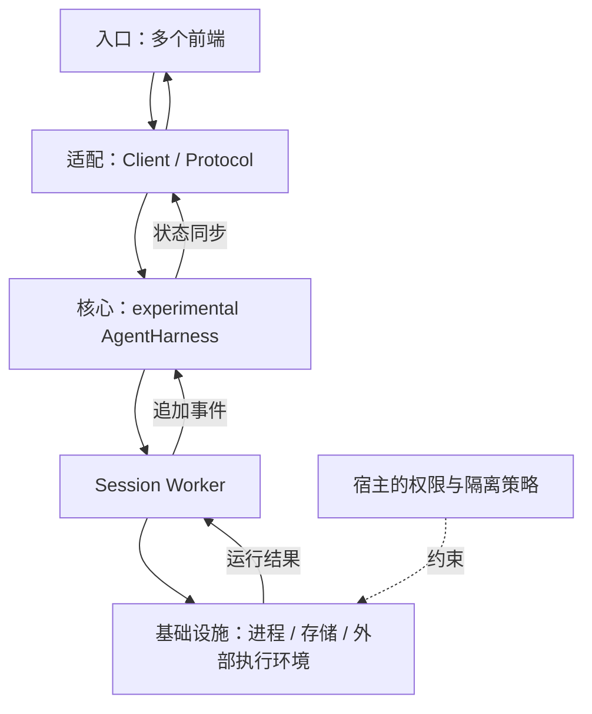
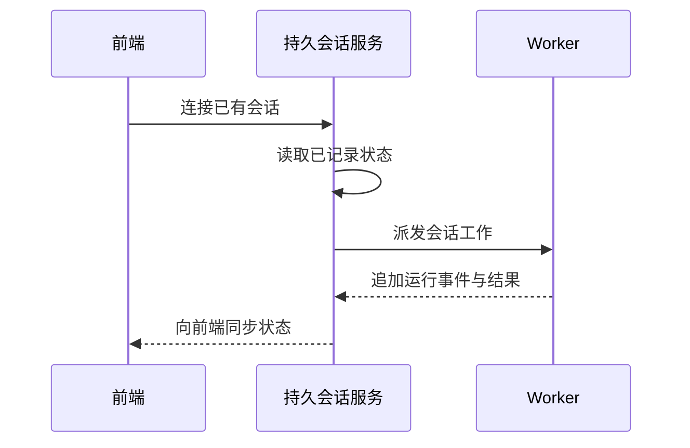
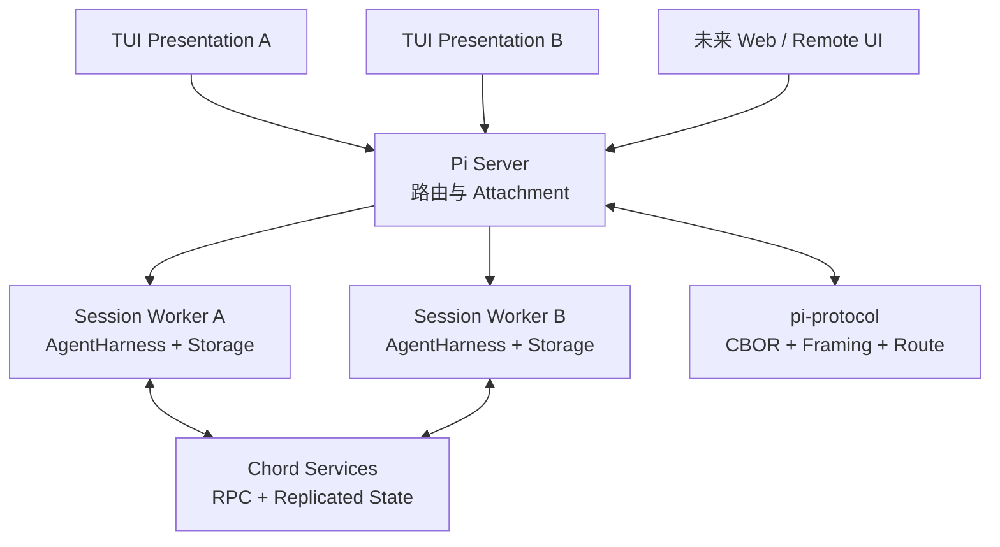

## 定位与价值

本篇分别检查经典 Pi 的外部隔离责任和 experimental AgentHarness 的多进程恢复，避免把两条实现线混成默认产品。

完整定位与安装见[项目总览](/writing/pi-architecture-deep-dive/)。

研究基线：[earendil-works/pi @ e44d75c](https://github.com/earendil-works/pi/blob/e44d75c20a51142abc056c243b13c1d7bb4be687/README.md)；源码与社区核对日期为 2026-09-06。

## 技术架构



*图 1｜按职责归纳的调用地图；箭头表示请求与结果，不表示四个独立部署服务。*

## 核心机制



*图 2｜本篇关键流程的职责示意；部署者提出的验收要求与框架内建行为需按正文区分。*

### 经典路径的隔离责任

Pi 明确说明自己没有内置的文件系统、进程、网络或凭证沙箱，默认继承启动用户的权限。Project Trust 只控制项目本地设置、扩展与 Packages 是否在启动时加载，它不是工具执行沙箱。官方 [Security 文档](https://pi.dev/docs/latest/security) 也强调，仓库文件、构建输出和模型结果中的 prompt injection 属于本地 Agent 的预期风险。

Project Trust 与执行沙箱保护不同边界，不能互相替代。Pi 把真正隔离交给 OS、容器、微型虚拟机或策略控制环境，并提供三种参考方式：整个 Pi 放进 Docker/OpenShell，或让宿主 Pi 通过 Gondolin Extension 把内置工具路由到 micro-VM。参见官方 [Containerization 指南](https://pi.dev/docs/latest/containerization)。

从架构上看，这意味着 Pi 的安全分成两层：

| 边界 | 解决什么 | 不解决什么 |
| --- | --- | --- |
| Project Trust | 防止仓库在未确认前自动加载本地扩展与设置 | 不限制模型后续调用工具 |
| 外部 Sandbox | 限制文件、进程、网络、凭证的真实影响范围 | 不替代应用内的审批与策略 |

对个人高级用户，这种模型简单透明；对企业默认部署，它则意味着必须额外建设沙箱、审批、凭证最小化和审计。Pi 是可组合的 Harness，不是开箱即用的治理平台。


### Durable 路径与多端恢复

#### 不能忽略的第二条线：Durable AgentHarness 正在把 Pi 拆成多进程系统

截至本文分析的提交，经典 `Agent + AgentSession` 仍是默认 CLI 主路径；但仓库中已经存在另一套更系统的 durable 架构：

- `AgentHarness`：把持久 Session、Lane、Operation、恢复点、Hook 和工具执行组织成运行时；
- `Chord`：提供 Facet、Service、依赖图、复制状态和远端服务边界；
- `pi-protocol`：定义 CBOR 帧、路由、请求关联、取消与 Attachment；
- `pi-server`：管理 Session 路由和多 Presentation Attachment；
- `pi-client`：通过 Unix Socket 等字节传输连接服务；
- experimental mini：把 TUI、Server、Worker 拆成三个进程验证整条链路。



*图 3｜Pi 的 Durable AgentHarness 将 Session、Worker、协议与多个客户端拆成可恢复的进程边界。*

实验性 `mini` 的拓扑说明得很直白：Presentation 只渲染复制过来的 `LaneSnapshot`，不持有 Agent 状态；Server 负责路由和 Worker 生命周期；每个 Session Worker 持有 Harness、Storage 与 Model Runtime。两个 TUI 可以连接同一个 Session，并看到同一份实时 Transcript。

这不是为了“把 CLI 变成微服务”而拆进程，而是在解决四个经典架构难题：

1. **Durability**：Worker 崩溃或替换后，从最后一个 recovery state 恢复未完成 Operation；
2. **多端观察**：多个 Presentation 同时订阅一个 Session，不复制 Agent 真相源；
3. **位置透明**：调用方只看到 Service，不需要知道服务运行在 Server 还是 Worker；
4. **插件分面**：一个插件可以把 Worker、TUI、Browser 端代码拆成不同 Facet，各自在合适进程加载。

Chord 的 replicated state 也很讲究：生产者维护可变 state proxy，每次 `publish()` 生成紧凑 delta；消费者先获得完整 snapshot，再开始接收更新，避免“订阅建立期间丢事件”的窗口。每个远端订阅维护独立路径字典，断连或替换后重新水合。这已经不是传统 Coding Agent CLI 的问题域，而是协作型 Agent Runtime 的基础设施。

但必须强调：这些包和命令仍被官方标成 experimental，协议也声明没有兼容性保证。文章读者不应该据此认定 Pi 的默认 CLI 已经是分布式架构。更准确的判断是：**经典架构证明了产品形态，durable 架构正在把同一套原则推广到跨进程和多端场景。**

#### 架构代价与风险

Pi 的设计并非没有成本。

第一，**最小内核不等于代码库简单**。稳定主路径里，`AgentSession` 和 `InteractiveMode` 都已经成为数千行级别的集中类。它们承担大量产品语义，维护时需要格外警惕隐式状态组合。新的 AgentHarness/Chord 路线某种程度上正是在重新划分这些责任。

第二，**扩展 API 很强，也扩大了兼容面与信任面**。事件顺序、重载、错误隔离、工具注册覆盖、Session 自定义条目都可能成为长期包袱；任意第三方 Extension 也等同于执行本地代码。

第三，**安全与治理不是默认产品能力**。对偏好完全控制的开发者，这是自由；对需要集中策略、审批记录与最小权限的组织，这是额外工程。

第四，**两代架构并存会增加认知成本**。读者目前能同时看到旧 `Agent`、经典 `AgentSession`、新 `AgentHarness`、Session Service、Protocol 与 experimental client/server。若未来迁移边界不清晰，生态扩展可能面对两套生命周期和状态模型。

第五，**Provider 统一层要持续追赶厂商差异**。Reasoning replay、cache、deferred response、tool schema、usage 和错误语义一直变化。Pi 保留差异的设计是正确的，但维护成本不会因为接口统一而消失。

#### 多端恢复应验证什么

假设两个终端观察同一个 Session，Worker 在工具写入之后退出。新 Worker 接管时，应核对以下状态，而不只验证两个屏幕重新出现相同文字：

| 状态 | 验收问题 |
| --- | --- |
| Session / Operation | 是否接管同一操作和同一版本，旧 Worker 是否失去执行权？ |
| Snapshot / Delta | 断连重连后能否从快照恢复，是否漏掉或重复应用更新？ |
| 工具副作用 | 写入是否已经发生，能否按原操作身份查询？ |
| Presentation | 界面能否区分正在恢复、结果未知和已完成？ |

这是针对实验架构的建议测试，本文没有部署多进程 mini。经典 Session 树和事件投影的详细解释保留在[Session 篇](/writing/pi-session-extension-architecture/)；需要可运行的持久引擎比较，可使用[架构对照实验](/writing/harness-architecture-selection/)。

延伸阅读：

- [Pi 官方文档](https://pi.dev/docs/latest)
- [Pi GitHub 仓库](https://github.com/earendil-works/pi)
- [Agent Core README](https://github.com/earendil-works/pi/blob/e44d75c20a51142abc056c243b13c1d7bb4be687/packages/agent/README.md)
- [Extensions 文档](https://pi.dev/docs/latest/extensions)
- [Session Format](https://pi.dev/docs/latest/session-format)
- [Coding Agent Harness 对决：Claude Code、Codex 与三种开源答案](/writing/coding-agent-harness-showdown/)

## 快速上手

先按[项目总览](/writing/pi-architecture-deep-dive/#快速上手)准备运行环境；本篇的最小实验直接执行固定快照中的测试。另需按仓库贡献指南安装开发与测试依赖。

```bash
npx vitest run test/experimental-session-worker-lifecycle.test.ts
```

在 packages/coding-agent 目录运行，检查实验性 Worker 生命周期。

模型、执行环境与存储等共用配置，以及安装常见问题，见[总览的三个配置项](/writing/pi-architecture-deep-dive/#快速上手)。本篇命令仅在明确记录实跑结果时才作为通过证据。

## 生态与社区

许可证、官方集成、提交与 Issue 样本统一见[项目总览的生态与社区](/writing/pi-architecture-deep-dive/#生态与社区)。本篇的治理建议不表示上游已提供对应 SLA 或托管能力。

## 源码阅读路径

按下面顺序阅读固定提交：先找包或命令入口，再进入核心抽象、具体实现和测试。

| 顺序 | 目录 → 文件 | 函数、对象或检查重点 |
| --- | --- | --- |
| 1 | [packages/coding-agent/package.json](https://github.com/earendil-works/pi/blob/e44d75c20a51142abc056c243b13c1d7bb4be687/packages/coding-agent/package.json) | bin → 打包后的 cli.js |
| 2 | [packages/coding-agent/src/cli.ts](https://github.com/earendil-works/pi/blob/e44d75c20a51142abc056c243b13c1d7bb4be687/packages/coding-agent/src/cli.ts) | CLI 入口 |
| 3 | [packages/agent/src/agent-loop.ts](https://github.com/earendil-works/pi/blob/e44d75c20a51142abc056c243b13c1d7bb4be687/packages/agent/src/agent-loop.ts) | agentLoop：通用循环 |
| 4 | [packages/coding-agent/src/core/agent-session.ts](https://github.com/earendil-works/pi/blob/e44d75c20a51142abc056c243b13c1d7bb4be687/packages/coding-agent/src/core/agent-session.ts) | AgentSession：产品会话语义 |
| 5 | [packages/coding-agent/test/experimental-session-worker-lifecycle.test.ts](https://github.com/earendil-works/pi/blob/e44d75c20a51142abc056c243b13c1d7bb4be687/packages/coding-agent/test/experimental-session-worker-lifecycle.test.ts) | 在 packages/coding-agent 目录运行，检查实验性 Worker 生命周期。 |
