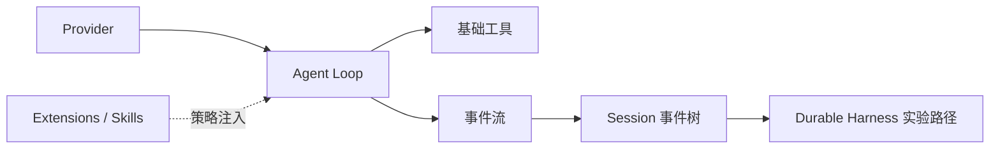

> 系列：[1. 全景](/writing/pi-series-overview/)｜[2. 最小内核](/writing/pi-architecture-deep-dive/)｜[3. Session 与扩展](/writing/pi-session-extension-architecture/)｜[4. Durable Harness](/writing/pi-durable-harness-governance/)｜[5. 整体判断](/writing/pi-series-synthesis/)

Pi 的价值不能用默认功能数量衡量。它把 Provider、流式事件、工具循环和 Session 保持得很薄，再把计划、审批、子 Agent 和工作流偏好留给 Extensions、Skills 或外部系统。[官方仓库](https://github.com/earendil-works/pi)

*图 1｜Pi 用稳定事件连接模型、工具、历史与扩展，把产品意见留在内核之外。*

本系列先看最小循环怎样维持并发和消息顺序，再进入追加式 Session 与上下文投影，最后研究安全外置和多进程 Durable Harness。核心追问始终是：极简究竟减少了系统责任，还是让责任变得更清楚？

---

下一篇：[最小内核](/writing/pi-architecture-deep-dive/)。

下一篇从 Provider 和事件循环开始，解释“少”为什么仍需要严格契约。
