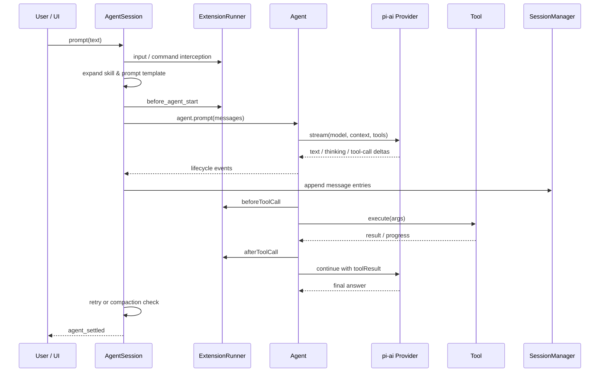
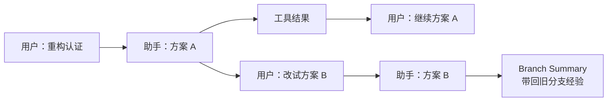

> 系列：[1. 全景](/writing/pi-series-overview/)｜[2. 最小内核](/writing/pi-architecture-deep-dive/)｜[3. Session 与扩展](/writing/pi-session-extension-architecture/)｜[4. Durable Harness](/writing/pi-durable-harness-governance/)｜[5. 整体判断](/writing/pi-series-synthesis/)

Pi 的最小内核没有把历史保存成最终 messages 数组，而是让 AgentSession 同时承担持久化、上下文投影、扩展和 UI 的产品语义。本篇关注这条状态主线。

## AgentSession：真正的产品语义集中层

如果 `Agent` 是通用发动机，那么 `AgentSession` 是 Pi Coding Agent 的整车控制器。它负责：

- 从 `AGENTS.md`、Skills、Prompt Templates 和设置中构建系统提示词；
- 检查模型与认证；
- 把扩展事件映射到 Agent 钩子；
- 把 message 事件写入 Session；
- 处理自动重试、上下文溢出和压缩；
- 管理模型切换、thinking level、工具注册表；
- 向 TUI、RPC 和 SDK 发布统一事件。

一次输入的实际链路如下：



*图 1｜AgentSession 位于工具、模型、扩展、持久化与 UI 之间，是产品语义的集中层。*

这里最值得借鉴的是 **所有跨层动作都有明确的稳定点**：扩展在模型调用前修改上下文，在工具执行前阻止调用，在结果入库前变换结果；自定义消息要等一个 turn 的全部 tool result 写入后才落盘，避免把消息插进 tool call 与 tool result 之间，造成 Provider 拒绝历史。

这类正确性约束很难从功能列表看出来，却是 Harness 从 Demo 走向长期可用产品的分水岭。

## Session 不是聊天记录，而是一棵追加写入的事件树

Pi 把 Session 存成 JSONL。除头部外，每个条目都有 `id` 和 `parentId`；`leafId` 表示当前工作位置。追加消息就是给当前叶子增加子节点，跳到历史节点后继续对话则自然产生新分支。



*图 2｜追加写入的 Session 事件树允许分支、回溯与上下文投影同时存在。*

[`SessionManager`](https://github.com/earendil-works/pi/blob/e44d75c20a51142abc056c243b13c1d7bb4be687/packages/coding-agent/src/core/session-manager.ts#L856) 的注释直接把它定义为 “append-only trees stored in JSONL files”。这个选择带来几个好处：

1. **历史不被覆盖**：修改早期提示词不是重写文件，而是从旧节点长出新分支；
2. **写入简单**：正常路径主要是追加一行，崩溃恢复和人工检查都比较直接；
3. **状态可重放**：模型、thinking level、压缩、标签、扩展数据都是事件；
4. **分支是数据结构，不是 UI 特效**：`/tree`、`/fork`、`/clone` 只是对同一事件树的不同操作。

代价也很明确：每次给模型的并不是整棵树，而是从根到当前 leaf 的一条路径。Session 层必须负责解析模型切换、压缩边界和自定义事件，才能重建正确上下文。换句话说，Pi 用更简单、可审计的写入模型，换来了更复杂的读取投影。

## Compaction：不是把旧消息删掉，而是增加一个新的语义检查点

长会话真正困难的地方，不是“总结一下聊天”，而是不能破坏工具调用配对、当前任务状态和文件操作历史。

Pi 的自动压缩会从新到旧计算 token，保留最近一段上下文，把更早的完整 turn 总结成结构化摘要。压缩结果作为新的 `CompactionEntry` 追加到 Session，而旧条目仍然存在。下一次构建上下文时，系统发送“摘要 + 保留尾部”，而不是发送完整历史。

当单个 turn 本身已经超过预算时，Pi 允许在 turn 内切分，但不会把 tool result 与它对应的 tool call 拆开。压缩摘要还累计记录读过和修改过的文件，使多次压缩不会遗失工作面的基本地图。详细规则见官方的 [Compaction 文档](https://pi.dev/docs/latest/compaction)。

更关键的是触发时机：当前实现会在工具结果已经进入上下文、下一次模型调用尚未开始时检查阈值。这样大体积工具输出不会先把下一次 Provider 请求撑爆。若已经发生 context overflow，系统会移除失败的 assistant message、压缩并重试一次；不会无限重试。

这说明 Pi 把 Compaction 当成 Agent Loop 的恢复协议，而不是一个 UI 命令。

## 扩展系统：用事件拦截和依赖注入承载“产品意见”

Pi 官方首页把它概括为 [“Primitives, not features”](https://pi.dev/)：不内置 plan mode、sub-agents、permission gates 等固定实现，而是提供构造这些功能的原语。

扩展可以：

- 注册模型可调用的工具；
- 注册命令、快捷键、Flags 与 Provider；
- 在 `input`、`before_agent_start`、`context` 阶段修改输入；
- 在 `tool_call` 阶段阻止危险动作，在 `tool_result` 阶段改写输出；
- 自定义压缩、渲染、编辑器、状态栏与弹窗；
- 把自定义条目持久化到 Session；
- 在 `/reload` 后重建运行时而不重启整个进程。

`ResourceLoader` 负责发现全局和项目内的 Extensions、Skills、Prompts、Themes；`ExtensionRunner` 管理订阅和调用；`AgentSession._bindExtensionCore()` 再把 Session、模型、工具和 UI 能力以接口形式注入扩展。扩展并不直接修改 Agent Loop，而是在稳定事件边界上改变策略。

这套设计解释了 Pi 为什么能保持默认体验克制：

```text
Plan Mode      = 命令 + 状态 + 工具门禁
Permission     = tool_call 拦截 + UI confirm
Sub-agent      = 自定义工具 + 进程 / tmux / RPC
Long-term RAG  = context 事件 + 自定义存储
Custom UI      = TUI component + lifecycle events
```

但这里也存在最重要的边界条件：**Extension 是进程内受信代码，不是沙箱插件。** 它能访问 Node.js、文件系统、网络和凭证，权限与 Pi 进程相同。强扩展性与强隔离不是同一件事。

---

上一篇：[Pi 内核](/writing/pi-architecture-deep-dive/)。

Session 与扩展解释了单进程产品如何被塑形。下一篇进入安全外置和 Durable AgentHarness，看 Pi 如何把持久任务推进到多进程系统。

下一篇：[Pi 扩展](/writing/pi-durable-harness-governance/)。
