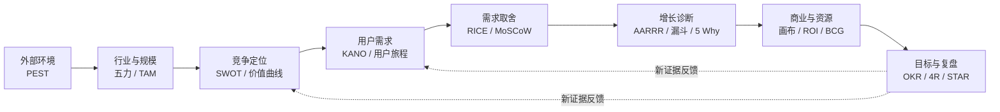

产品经理很容易陷入一种“框架收藏癖”：知道 PEST 的四个字母，也能背出 RICE 的公式，真正面对一个产品问题时，却不知道该先用哪个、分析到什么程度，以及分析结果如何变成行动。

原因并不复杂。框架不是答案，而是帮助我们提出一组更完整问题的工具。它们分别服务于不同尺度：PEST 看宏观环境，五力看行业结构，用户旅程看具体体验，RICE 帮助做版本取舍，OKR 则负责把选择变成团队共同承担的结果。如果把不同尺度的工具混在一起，再漂亮的表格也无法支持决策。

本文用一个贯穿始终的虚构案例来说明这些框架的作用：一家创业团队准备做一款面向中小企业的 **AI 会议助手「MeetFlow」**，它能够录音转写、提炼结论、生成待办，并把任务同步到企业协作工具。团队需要判断这个方向是否值得进入、为谁做、先做什么、如何增长，以及如何衡量结果。

> [!IMPORTANT]
> 使用分析框架的目标不是“把格子填满”，而是减少决策盲区。每次分析都应该落到一个明确结论：继续、停止、聚焦、验证，或调整资源。

## 一、先把框架放回产品工作的完整链路

常用框架可以按照产品决策顺序分成八组：

| 产品问题 | 优先使用的框架 | 期望得到的结果 |
| --- | --- | --- |
| 外部环境是否有利 | PEST | 趋势、约束与关键假设 |
| 行业是否值得进入 | 波特五力 | 竞争强度与利润来源 |
| 机会到底有多大 | TAM / SAM / SOM | 分层市场规模与测算依据 |
| 应该占据什么位置 | SWOT、价值曲线 | 差异化定位与能力缺口 |
| 用户真正需要什么 | KANO、用户旅程地图 | 需求层次、痛点与机会点 |
| 下一步先做什么 | RICE、MoSCoW、价值四象限 | 可解释的版本优先级 |
| 增长为什么受阻 | AARRR、漏斗、5 Why、MECE | 流失环节与根因假设 |
| 如何管理商业结果 | 商业模式画布、ROI、BCG、OKR、复盘 | 商业闭环、资源选择与迭代行动 |

这不是一条只能从左到右走一次的瀑布流程。成熟产品经常从漏斗异常出发，回到用户旅程重新理解问题；新政策出现时，也要重新检查 PEST 和商业模式。框架之间真正的关系是：**前面的框架帮助选择方向，后面的框架帮助验证和修正方向。**

## 二、看外部环境：PEST

PEST 从政治与政策（Political）、经济（Economic）、社会（Social）、技术（Technological）四个维度观察那些单个公司无法控制、却可能改变行业的力量。

对 MeetFlow，团队可以这样分析：

| 维度 | 观察到的变化 | 对产品的影响 | 产品动作 |
| --- | --- | --- | --- |
| 政策 | 企业对会议录音、个人信息和数据跨境更加敏感 | 云端默认录音可能阻碍采购 | 增加明确授权、数据保留策略与私有化选项 |
| 经济 | 中小企业控制软件席位成本 | “每人每月”定价阻力增大 | 尝试按有效会议时长或团队套餐计费 |
| 社会 | 远程与混合办公让会后信息断层更常见 | 自动纪要和行动同步的价值上升 | 把“会后闭环”作为核心场景，而非只卖转写 |
| 技术 | 语音识别和大模型摘要成本持续下降 | 基础转写更容易同质化 | 将投入转向业务词汇、任务执行和系统集成 |

PEST 的价值不在于罗列新闻，而在于识别三类内容：**不可逆趋势、关键不确定性、必须遵守的边界**。例如，“模型成本还会下降”是需要验证的趋势假设；“录音必须获得参会人授权”则应直接进入产品约束。

它适合在立项、年度规划和重大政策或技术变化时使用。不要每周重做一份 PEST，也不要把与业务无关的宏观信息塞进表格。

## 三、看行业竞争：波特五力

波特五力分析的不是“有几个竞品”，而是行业中的价值会被谁拿走。五种力量分别是现有竞争者、潜在进入者、替代品、供应商议价能力和客户议价能力。

以 AI 会议助手为例：

1. **现有竞争者：强。** 视频会议平台、协作软件和独立 AI 纪要工具都在提供相似功能，基础摘要很难形成长期壁垒。
2. **潜在进入者：强。** 通用大模型和语音 API 降低了开发门槛，一个小团队也能快速做出可演示版本。
3. **替代品：中到强。** 人工记录、会议模板、聊天软件中的简单总结，以及“不记录会议”本身都是替代方案。
4. **供应商议价能力：中。** 产品依赖语音识别、基础模型、云服务和协作平台 API；任何一方涨价或限制权限都会影响毛利和体验。
5. **客户议价能力：强。** 企业切换单一会议工具的成本不算高，大客户还会要求折扣、合规审查和定制集成。

结论不是简单地说“竞争激烈，所以不做”，而是寻找利润仍可能存在的位置。MeetFlow 不应把“更准确的摘要”作为唯一卖点，而可以聚焦某类高价值会议，例如销售复盘：识别客户异议、更新 CRM、生成跟进邮件，并追踪承诺是否完成。这样做提高了场景深度、迁移成本和可衡量价值。

波特五力特别适合回答两个问题：这个行业长期能否赚钱？要建立哪一种壁垒？它不适合替代具体的竞品功能分析。

## 四、看市场规模：TAM / SAM / SOM

TAM、SAM、SOM 是三层逐步收窄的市场边界：

- **TAM（Total Addressable Market）**：在没有产品、地域和交付限制时，理论上存在的全部需求；
- **SAM（Serviceable Available Market）**：以当前产品形态和商业模式能够服务的市场；
- **SOM（Serviceable Obtainable Market）**：在特定周期、渠道和竞争条件下，真正有可能拿到的市场。

MeetFlow 可以采用自下而上的方式估算。以下数字只用于演示计算方法：

| 层级 | 示例口径 | 估算 |
| --- | --- | ---: |
| TAM | 1000 万潜在知识工作团队 × 年均 3000 元会议智能化支出 | 300 亿元 / 年 |
| SAM | 首期支持的地区与协作平台覆盖 80 万中小销售团队 × 年均 3600 元 | 28.8 亿元 / 年 |
| SOM | 三年内渠道可触达 5 万团队 × 5% 付费转化 × 年均 3600 元 | 900 万元 / 年 |

三个数字中，SOM 对早期团队最重要，因为它迫使团队把“市场很大”翻译成可执行假设：能触达多少客户、转化率多少、客单价多少、需要多久。每个变量都应注明来源，并通过销售访谈、投放实验或历史数据更新。

> [!WARNING]
> 不要用 TAM 证明项目一定成立。一个千亿市场，如果团队只能触达极小人群、获客成本高于客户终身价值，仍然不是一个可行机会。

## 五、看竞争与自身定位：SWOT ＋价值曲线

### SWOT：把内外部因素转化为战略动作

SWOT 分为内部的优势（Strengths）、劣势（Weaknesses），以及外部的机会（Opportunities）、威胁（Threats）。MeetFlow 的初版分析可能是：

| | 有利因素 | 不利因素 |
| --- | --- | --- |
| 内部 | 团队熟悉销售流程，能快速接入主流 CRM | 品牌弱、训练数据少、企业销售能力不足 |
| 外部 | 企业希望减少会后录入，模型工具调用能力成熟 | 平台厂商捆绑免费摘要，录音合规要求提高 |

仅列四格没有太大意义，真正有价值的是组合策略：

- **SO：** 利用销售流程经验，抢先做“会议结论自动进入 CRM”的深度闭环；
- **WO：** 与销售咨询机构合作获客，补足企业销售能力；
- **ST：** 避开平台厂商擅长的通用摘要，用垂直模板和执行结果形成差异；
- **WT：** 在没有完成合规和数据隔离前，不进入强监管的大客户市场。

SWOT 的作用是帮助团队形成战略选择，而不是把“团队年轻有活力”这样的套话写进四个格子。

### 价值曲线：决定哪些地方不跟竞品一样

价值曲线把用户在意的要素放在横轴，把各产品的投入或体验水平放在纵轴。MeetFlow 可以比较“转写准确度、摘要速度、销售洞察、CRM 自动化、合规控制、价格”六个要素。

如果所有曲线都高度重合，说明产品只是在同一套价值标准上追赶。更有意义的策略可能是：转写准确度做到可靠而非行业最高，降低对花哨摘要模板的投入，显著提高销售洞察、CRM 自动化和承诺追踪能力。

价值曲线最终要回答四个动作：哪些要素应**剔除、减少、增加、创造**？它把一句空泛的“差异化”变成资源分配选择。

## 六、看用户需求：KANO ＋用户旅程地图

### KANO：不同需求不会以同一种方式影响满意度

KANO 通常把需求分为：

- **基础需求：** 没有就强烈不满，做好了也只是“应该的”。例如录音不丢失、说话人基本准确、权限清晰；
- **期望需求：** 做得越好，满意度越高。例如转写准确率、摘要速度、可支持语言数量；
- **兴奋需求：** 用户未必主动提出，出现时却能创造惊喜。例如自动识别客户异议并生成针对性的跟进建议；
- **无差异或反向需求：** 做不做影响很小，甚至功能越多越让部分用户反感。例如自动代替用户发送所有会后邮件。

KANO 能避免两类错误：一是用“惊喜功能”掩盖基础体验缺陷，二是不断优化已经接近饱和的期望需求。对 MeetFlow 来说，如果录音经常失败，再聪明的销售洞察也无法留住用户。

需求类别并非永久不变。竞争者普及之后，今天的兴奋需求会变成明天的基础需求，因此需要定期通过问卷、访谈和行为数据重新判断。

### 用户旅程地图：在完整任务中寻找机会

用户旅程地图按时间梳理用户目标、行为、触点、情绪和痛点。以销售经理李然为例：

| 阶段 | 用户行为 | 主要触点 | 痛点 | 产品机会 |
| --- | --- | --- | --- | --- |
| 会前 | 查客户背景、准备议程 | CRM、日历、聊天记录 | 信息散落，准备耗时 | 自动汇总客户历史与未决事项 |
| 会中 | 沟通需求、记录承诺 | 视频会议、纸笔 | 记录会打断交流 | 低干扰录音，实时标记关键片段 |
| 会后 10 分钟 | 回忆结论、分配待办 | 文档、群聊 | 容易遗漏责任人与截止时间 | 生成可确认的结论和待办 |
| 当天 | 更新 CRM、发送跟进 | CRM、邮箱 | 重复录入，内容不一致 | 用户确认后同步 CRM 并生成邮件 |
| 一周后 | 检查承诺和商机进展 | CRM、任务工具 | 待办无人追踪 | 提醒逾期承诺，关联商机变化 |

这张图揭示了一个重要事实：用户需要的不是一份“漂亮纪要”，而是从会前准备到会后履约的连续结果。用户旅程地图的作用，就是让产品从页面和功能视角回到用户任务视角。

## 七、做需求取舍：RICE、MoSCoW 与价值四象限

### RICE：让相互竞争的需求可比较

RICE 用覆盖人数（Reach）、影响程度（Impact）、信心（Confidence）和投入（Effort）计算优先级：

$$
RICE = \frac{Reach \times Impact \times Confidence}{Effort}
$$

假设 MeetFlow 在比较三个需求：

| 需求 | Reach | Impact | Confidence | Effort | RICE 得分 |
| --- | ---: | ---: | ---: | ---: | ---: |
| CRM 自动同步 | 800 | 2.0 | 80% | 4 | 320 |
| 20 种新语言 | 300 | 1.0 | 60% | 6 | 30 |
| 会议模板市场 | 500 | 0.5 | 50% | 5 | 25 |

按这组假设，CRM 自动同步应优先。但 RICE 不是客观真理：Reach 的时间窗口必须一致，Impact 的量级必须提前约定，Confidence 要反映证据质量，Effort 也应包含设计、研发、运营和维护成本。它的价值是暴露分歧，而不是用小数点消灭判断。

### MoSCoW：守住一次发布的边界

MoSCoW 把范围分为 Must have、Should have、Could have、Won't have this time。对于 MeetFlow 的“销售团队版”首发：

- **Must：** 稳定录音、生成待办、用户确认后同步 CRM；
- **Should：** 自定义销售术语、会后邮件草稿；
- **Could：** 团队模板分享、摘要主题皮肤；
- **Won't this time：** 自动发送邮件、支持全部 CRM。

“Won't”不是永远不做，而是明确本周期不做。MoSCoW 适合发布范围管理，RICE 适合候选需求排序，两者可以配合使用。

### 价值四象限：快速处理直观取舍

把需求按用户或商业价值与实现成本分成四类：高价值低成本的“快速收益”优先；高价值高成本的“战略投入”拆解验证；低价值低成本的“填充项”谨慎穿插；低价值高成本的需求明确放弃。

四象限简单直观，适合工作坊快速对齐，但坐标很容易被主观判断影响。重要需求仍应补充数据、风险和依赖分析。

## 八、做增长与问题诊断：AARRR、漏斗、5 Why 与 MECE

### AARRR：定位增长发生在哪一个生命周期阶段

AARRR 把用户生命周期拆成获客（Acquisition）、激活（Activation）、留存（Retention）、收入（Revenue）和推荐（Referral）。MeetFlow 可以分别定义：

| 阶段 | 示例指标 | 关键产品问题 |
| --- | --- | --- |
| 获客 | 官网到注册转化率 | 哪类用户被价值主张吸引？ |
| 激活 | 注册 24 小时内完成首场会议并确认待办 | 用户多快看到核心价值？ |
| 留存 | 连续 4 周每周完成 2 场有效会议 | 产品是否进入稳定工作流？ |
| 收入 | 团队试用转付费率、净收入留存 | 谁愿意为何种结果付费？ |
| 推荐 | 邀请同事率、推荐带来的新团队数 | 价值是否天然需要协作扩散？ |

每一层只选择能代表用户价值的关键事件。下载 App 或打开页面不一定是激活；对 MeetFlow，“生成一次摘要”也可能不够，用户确认并同步了可执行待办，才更接近真正体验到价值。

### 漏斗模型：找到具体流失位置

假设 1000 名注册用户中，700 人连接日历，420 人成功录制首场会议，260 人打开纪要，只有 90 人确认并同步待办。最大问题不是注册，而是从“看到纪要”到“确认待办”的转化。

漏斗告诉我们**问题发生在哪里**，但不能直接说明为什么。还要按用户来源、团队规模、会议类型、设备和版本分群，避免平均数掩盖真实差异。

### 5 Why：沿着证据追到可行动的根因

团队可以对“用户不确认待办”连续追问：

1. 为什么不确认？因为生成的责任人经常不对。
2. 为什么责任人不对？因为系统只识别发言人，没有识别被指派的人。
3. 为什么没有识别被指派的人？因为提示和数据结构只抽取“谁说了什么”。
4. 为什么只按发言人抽取？因为最初按通用会议摘要设计，没有研究销售会议的任务分配语言。
5. 为什么没有研究？因为团队用内部会议数据验证了功能，却直接外推到客户场景。

此时根因不是“模型不够聪明”，而是研究样本与目标场景不匹配。下一步应该补充真实销售会议样本、重写标注规则并建立责任人准确率评估。

5 Why 不要求机械地问满五次，也不能用猜测替代证据。每一层都应通过录屏、访谈、日志或实验验证。

### MECE：把复杂问题拆得不重不漏

当付费转化下降时，可以先按 MECE 原则拆成四类：

- **流量结构：** 新用户来源是否改变；
- **产品价值：** 激活和留存是否下降；
- **商业机制：** 价格、套餐和支付流程是否变化；
- **外部因素：** 季节、竞品促销或政策是否影响购买。

MECE 是一种结构化拆解原则，不负责告诉你正确分类是什么。好的拆解要服务于行动：每个分支最好对应不同的数据、负责人或验证方法。

## 九、看商业化与资源配置：商业模式画布、ROI 与波士顿矩阵

### 商业模式画布：检查产品能否形成商业闭环

商业模式画布包含客户细分、价值主张、渠道、客户关系、收入来源、核心资源、关键活动、关键伙伴和成本结构九个模块。MeetFlow 的简化版本是：

| 模块 | 示例内容 |
| --- | --- |
| 客户细分 | 20—200 人、已有标准 CRM 的 B2B 销售团队 |
| 价值主张 | 减少会后录入，避免客户承诺遗漏，提高销售复盘质量 |
| 渠道 | CRM 应用市场、销售培训机构、内容营销 |
| 客户关系 | 自助试用 + 团队管理员成功服务 |
| 收入来源 | 团队订阅、超额会议时长、企业集成服务 |
| 核心资源 | 场景数据、工作流集成、语音与模型能力 |
| 关键活动 | 会议理解、集成维护、合规与客户成功 |
| 关键伙伴 | CRM 厂商、会议平台、云与模型供应商 |
| 成本结构 | 推理与存储成本、研发、获客、合规和客户支持 |

画布的作用是检查模块之间是否互相支持。例如，若价值主张是“减少人工时间”，收入就更适合与团队规模或使用量相关；如果主要渠道是 CRM 应用市场，关键活动必须包含长期的 API 兼容维护。

### ROI：把“有价值”变成投入产出判断

最基础的 ROI 计算是：

$$
ROI = \frac{Gain - Cost}{Cost} \times 100\%
$$

假设一个 20 人销售团队每人每周花 1.5 小时整理会议，综合人力成本为每小时 150 元。MeetFlow 使这项工作减少 60%，一年按 48 周计算，节省约 12.96 万元。若年度软件费用和实施成本合计 4 万元，则：

$$
ROI = \frac{12.96 - 4}{4} \times 100\% = 224\%
$$

这是销售论证的起点，不是最终事实。团队还要计算采用率、审核 AI 结果的时间、错误带来的返工，以及机会成本。对长期项目，则应进一步考虑现金流时间和风险。

### 波士顿矩阵：在产品组合之间分配资源

波士顿矩阵按市场增长率和相对市场份额，把业务分成明星、现金牛、问题和瘦狗。假设公司还有三条产品线：成熟的人工会议转写服务可能是“现金牛”；增长快且份额上升的销售会议助手是“明星”；刚进入的招聘面试分析属于“问题业务”；长期低增长、低份额的通用录音存储则可能需要收缩。

它适合产品组合层面的资源讨论，不适合给单个功能排优先级。市场份额也不等于用户价值，分类只是战略对话的起点。

## 十、管理目标与复盘：OKR、4R 与 STAR

### OKR：把方向变成可验证结果

OKR 由目标（Objective）和关键结果（Key Results）组成。好的 O 表达方向和价值，KR 衡量结果而不是工作量。

MeetFlow 一个季度的 OKR 可以是：

**O：让销售团队在第一次会议中感受到可信、可执行的会后闭环。**

- KR1：首场会议成功完成率从 62% 提升到 85%；
- KR2：纪要到待办确认率从 35% 提升到 65%；
- KR3：确认后的 CRM 同步准确率达到 98%；
- KR4：激活团队的 4 周留存率从 28% 提升到 45%。

“上线 CRM 同步功能”是任务，不是 KR。它可以是实现 KR 的项目，但只有用户行为和业务结果改变，目标才算实现。

### 4R：让复盘产生下一轮行动

4R 在不同团队中有不同版本，但核心都应覆盖四件事：**结果、原因、规律或经验、后续行动**。一次 CRM 同步功能复盘可以写成：

- **Result：** 按时上线，使用率达到预期，但同步准确率只有 91%，未达到 98% 的 KR；
- **Reason：** 自定义字段映射覆盖不足，灰度客户又集中在高度定制的 CRM 环境；
- **Rule / Learning：** 集成类功能不能只按“接口调用成功”验收，还要以业务字段正确落库为完成标准；
- **Reaction / Action：** 建立字段映射检查器，扩充 20 种真实配置样本，下次灰度按复杂度分层。

复盘不是寻找责任人，而是更新团队对系统的认识。行动项必须有负责人、期限和验证标准，否则复盘只会生成另一份文档。

### STAR：还原关键事件，沉淀可复用经验

STAR 按情境（Situation）、任务（Task）、行动（Action）、结果（Result）讲清一次事件。它适合复盘中的关键片段、项目汇报和经验分享。

例如：“大客户试用前两天发现数据不能跨境存储（S），团队必须在不延期的情况下完成隔离方案（T）；产品缩小首期数据范围，工程切换区域存储，销售重新约定验收边界（A）；试用按期开始，后续又把这套流程沉淀成企业客户合规清单（R）。”

STAR 的优势是让表达具体、可验证，但它不是战略分析框架，也不适合取代包含多重原因的系统复盘。

## 十一、如何选择框架，而不是把所有框架都用一遍

遇到问题时，可以先判断自己处于哪个决策层级：

| 你正在问的问题 | 建议起点 | 不要误用 |
| --- | --- | --- |
| 这个方向要不要进入？ | PEST、五力、TAM / SAM / SOM | 用 RICE 给不同赛道打分 |
| 为什么用户会选择我们？ | SWOT、价值曲线、用户研究 | 只看竞品功能清单 |
| 用户在哪一步最痛？ | 用户旅程、漏斗、访谈 | 只用 KANO 问卷替代理解场景 |
| 下个版本做什么？ | RICE + MoSCoW | 用战略框架代替交付范围 |
| 为什么某指标下降？ | 漏斗 + MECE + 5 Why | 看到相关性就宣布根因 |
| 项目值不值得投入？ | 商业模式画布、ROI | 只用 TAM 证明收益 |
| 团队如何对齐执行？ | OKR + 项目计划 + 复盘 | 把任务列表当作 KR |

一次分析通常只需要一到三个框架。一个实用的组合方式是：先用一个框架**定位问题**，再用一个框架**深入解释**，最后用一个工具**做出选择**。例如先用 AARRR 发现激活环节异常，再用用户旅程和 5 Why 寻找原因，最后用 RICE 决定修复项优先级。

## 十二、框架真正进入产品工作的四条原则

### 1. 先写决策，再选框架

在分析文档开头写清楚：“这次需要决定什么？”是进入销售会议场景，还是决定下季度先做 CRM 同步？决策不同，所需证据和框架也不同。

### 2. 区分事实、假设与判断

“过去四周有 35% 的用户确认待办”是事实；“因为责任人识别不准”是假设；“优先优化责任人抽取”是判断。三者混在一起，团队就无法知道该验证什么。

### 3. 每个框架都要连接数据和行动

PEST 的政策变化应进入合规需求，用户旅程的痛点应变成机会假设，RICE 的高分项应进入候选版本，5 Why 的根因应对应实验。没有下一步动作的分析，大概率只是信息整理。

### 4. 允许框架被现实推翻

框架只是某一时点的认知模型。市场规模、需求类别、竞争位置和优先级都会随着新证据变化。保留测算口径、数据来源和更新时间，比维护一份看似永远正确的结论更重要。

## 结语：框架的终点是更好的判断

产品经理最值得优先掌握的，可以浓缩为八组能力：用 PEST 看环境，用五力看竞争，用 TAM / SAM / SOM 看规模，用 SWOT 和价值曲线看定位，用 KANO 与用户旅程看需求，用 RICE 和 MoSCoW 做取舍，用漏斗、5 Why 与 MECE 诊断问题，最后用 OKR、ROI 和复盘管理结果。

但也要记住，它们并不都是“分析框架”。OKR 是目标管理体系，RICE 和 MoSCoW 是优先级工具，ROI 是财务指标，STAR 更接近结构化表达。真正偏战略分析的核心，仍然是 PEST、五力、TAM / SAM / SOM、SWOT、价值曲线和商业模式画布。

熟练使用框架的标志，不是能背出多少缩写，而是面对模糊问题时，能够快速判断：现在缺的是外部信息、用户证据、结构化拆解，还是一次明确取舍。框架负责照亮盲区，产品经理仍要为最后的判断负责。
