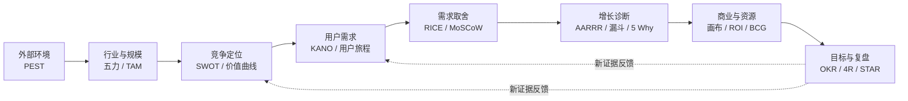

> 产品分析框架系列：[1 · 决策地图](/writing/product-analysis-frameworks/) · [2 · 市场与定位](/writing/product-frameworks-market/) · [3 · 需求与取舍](/writing/product-frameworks-prioritization/) · [4 · 增长与商业](/writing/product-frameworks-growth/) · [5 · 执行与复盘](/writing/product-frameworks-delivery/) · [6 · 深入思考](/writing/product-frameworks-synthesis/)

> 案例说明：MeetFlow 是虚构的 AI 会议助手，服务中小销售团队。以下市场变化、用户数据、财务数字与目标均为教学假设，不是市场调查、法律判断或收益承诺。

产品经理很容易陷入一种“框架收藏癖”：知道 PEST 的四个字母，也能背出 RICE 的公式，真正面对一个产品问题时，却不知道该先用哪个、分析到什么程度，以及分析结果如何变成行动。

原因并不复杂。框架不是答案，而是帮助我们提出一组更完整问题的工具。它们分别服务于不同尺度：PEST 看宏观环境，五力看行业结构，用户旅程看具体体验，RICE 帮助做版本取舍，OKR 则负责把选择变成团队共同承担的结果。如果把不同尺度的工具混在一起，再漂亮的表格也无法支持决策。

本文用一个贯穿始终的虚构案例来说明这些框架的作用：一家创业团队准备做一款面向中小企业的 **AI 会议助手「MeetFlow」**，它能够录音转写、提炼结论、生成待办，并把任务同步到企业协作工具。团队需要判断这个方向是否值得进入、为谁做、先做什么、如何增长，以及如何衡量结果。

> [!IMPORTANT]
> 使用分析框架的目标不是“把格子填满”，而是减少决策盲区。每次分析都应该落到一个明确结论：继续、停止、聚焦、验证，或调整资源。


## 先把框架放回产品工作的完整链路

常用框架可以按照产品决策顺序分成八组：

| 产品问题 | 优先使用的框架 | 期望得到的结果 |
| --- | --- | --- |
| 外部环境是否有利 | PEST | 趋势、约束与关键假设 |
| 行业是否值得进入 | 波特五力 | 竞争强度与利润来源 |
| 机会到底有多大 | TAM / SAM / SOM | 分层市场规模与测算依据 |
| 应该占据什么位置 | SWOT、价值曲线 | 差异化定位与能力缺口 |
| 用户真正需要什么 | KANO、用户旅程地图 | 需求层次、痛点与机会点 |
| 下一步先做什么 | RICE、MoSCoW、价值四象限 | 可解释的版本优先级 |
| 增长为什么受阻 | AARRR、漏斗、5 Why、MECE | 流失环节与根因假设 |
| 如何管理商业结果 | 商业模式画布、ROI、BCG、OKR、复盘 | 商业闭环、资源选择与迭代行动 |



*图 1｜从战略到执行，证据如何反向修正判断。*

这不是一条只能从左到右走一次的瀑布流程。成熟产品经常从漏斗异常出发，回到用户旅程重新理解问题；新政策出现时，也要重新检查 PEST 和商业模式。框架之间真正的关系是：**前面的框架帮助选择方向，后面的框架帮助验证和修正方向。**


## 别把总览理解成工具目录

一张总图必须解释信息如何流动。市场判断给出“为谁做”的边界，用户研究确认“什么问题值得解决”，优先级工具把机会变成发布范围，增长与商业数据检验结果，复盘再修改先前的假设。

例如，团队一开始认为用户需要更漂亮的摘要；试用发现销售经理仍要手工更新 CRM。这个反馈会同时改变需求、定位和定价，而不只是新增一个功能。

因此，前后章节是证据关系，不是必须依次填完的表格流程。

## 本系列最后要回答的问题

“会用很多框架”和“能做出好判断”不是一回事。我们将用五个阶段积累证据，最后讨论：**框架是在减少不确定性，还是只让不确定性看起来有了格式？**

| 篇章 | 核心决定 | 读完应拿到的产物 |
|---|---|---|
| 市场与定位 | 为谁进入什么市场？ | 市场假设与差异化选择 |
| 需求与取舍 | 本次先解决哪个问题？ | 旅程、证据和版本边界 |
| 增长与商业 | 用户价值能否支撑生意？ | 漏斗诊断与单位经济口径 |
| 执行与复盘 | 如何证明本轮有所进步？ | 目标、验收和学习记录 |
| 深入思考 | 哪些判断需要被推翻？ | 可更新的决策契约 |

## 开始之前，写下六句话

```text
这次要决定：是否做销售会议后的 CRM 同步
目标用户：已经使用标准 CRM 的中小销售团队
已有证据：待填真实访谈与行为记录，不用想象代替
最大未知：用户是否愿意确认并持续使用同步结果
本轮不做：自动外发邮件、支持所有 CRM
重新判断的条件：关键假设被试用数据否定
```

这不是复杂模板，而是防止团队在不同问题上互相争论。若市场负责人想讨论赛道，研发负责人想讨论两周发布范围，RICE 表算得再精确也无法解决错位。

首篇到这里就够了。暂时不用背每一个缩写，先把决定、证据、责任人与下一步动作放在同一页。

---

地图已经有了，但第一个决定还没做：为什么这个市场值得进入，团队能占据什么位置？下一篇把宏观判断变成可验证的市场假设。

下一篇：[从市场很大，到我们为什么能做](/writing/product-frameworks-market/)。
