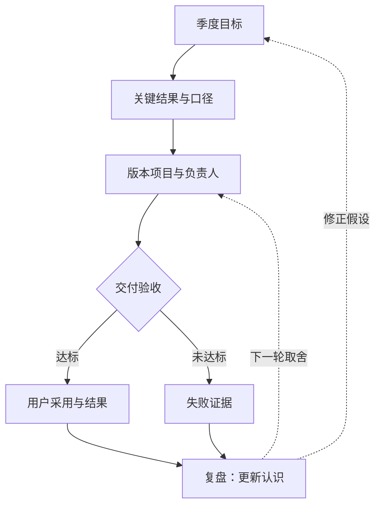

> 产品分析框架系列：[1 · 决策地图](/writing/product-analysis-frameworks/) · [2 · 市场与定位](/writing/product-frameworks-market/) · [3 · 需求与取舍](/writing/product-frameworks-prioritization/) · [4 · 增长与商业](/writing/product-frameworks-growth/) · [5 · 执行与复盘](/writing/product-frameworks-delivery/) · [6 · 深入思考](/writing/product-frameworks-synthesis/)

> 阅读时间为估计，包含图表理解；动手实验另计。

> 案例说明：MeetFlow 是虚构的 AI 会议助手，服务中小销售团队。以下市场变化、用户数据、财务数字与目标均为教学假设，不是市场调查、法律判断或收益承诺。


分析的价值最终要体现在组织做了什么、停止了什么、学到了什么。这一篇继续追踪 CRM 同步：功能按时上线，如果客户还在反复修正字段，项目应该算成功吗？

## 管理目标与复盘：OKR、4R 与 STAR

### OKR：把方向变成可验证结果

OKR 由目标（Objective）和关键结果（Key Results）组成。好的 O 表达方向和价值，KR 衡量结果而不是工作量。

MeetFlow 一个季度的 OKR 可以是：

**O：让销售团队在第一次会议中感受到可信、可执行的会后闭环。**

- KR1：首场会议成功完成率从 62% 提升到 85%；
- KR2：纪要到待办确认率从 35% 提升到 65%；
- KR3：确认后的 CRM 同步准确率达到 98%；
- KR4：激活团队的 4 周留存率从 28% 提升到 45%。

“上线 CRM 同步功能”是任务，不是 KR。它可以是实现 KR 的项目，但只有用户行为和业务结果改变，目标才算实现。

### 4R：让复盘产生下一轮行动

4R 在不同团队中有不同版本，但核心都应覆盖四件事：**结果、原因、规律或经验、后续行动**。一次 CRM 同步功能复盘可以写成：

- **Result：** 按时上线，使用率达到预期，但同步准确率只有 91%，未达到 98% 的 KR；
- **Reason：** 自定义字段映射覆盖不足，灰度客户又集中在高度定制的 CRM 环境；
- **Rule / Learning：** 集成类功能不能只按“接口调用成功”验收，还要以业务字段正确落库为完成标准；
- **Reaction / Action：** 建立字段映射检查器，扩充 20 种真实配置样本，下次灰度按复杂度分层。

复盘不是寻找责任人，而是更新团队对系统的认识。行动项必须有负责人、期限和验证标准，否则复盘只会生成另一份文档。

### STAR：还原关键事件，沉淀可复用经验

STAR 按情境（Situation）、任务（Task）、行动（Action）、结果（Result）讲清一次事件。它适合复盘中的关键片段、项目汇报和经验分享。

例如：“大客户试用前两天发现数据不能跨境存储（S），团队必须在不延期的情况下完成隔离方案（T）；产品缩小首期数据范围，工程切换区域存储，销售重新约定验收边界（A）；试用按期开始，后续又把这套流程沉淀成企业客户合规清单（R）。”

STAR 的优势是让表达具体、可验证，但它不是战略分析框架，也不适合取代包含多重原因的系统复盘。


## 目标、验收与诊断，不要相互替代

OKR 表达方向与结果，验收条款决定某次交付能否进入下一阶段，诊断指标解释哪里需要改。不能把每个日志计数都写成 KR，也不能因为季度留存提升，就忽略当前版本写错客户信息。

给每个指标定义分母、观察窗口和负责人。例如“同步准确率 98%”至少还需说明：按字段、记录还是完整任务统计？失败与超时是否计入？真实客户自定义字段是否包含在内？



*图 1｜目标、验收与复盘形成可追踪反馈。矩形表示模块或步骤，圆柱表示存储，菱形表示判断；实线表示主路径，虚线表示约束、信息支撑或反馈。图为教学抽象，不代表全部实现细节。*

## 实践：一张真正能接着工作的复盘卡

```text
决定：首期只覆盖标准 CRM 字段，需用户确认
预期：减少会后录入，保持数据正确
实际：标准字段可用，定制字段失败集中
证据：匿名任务编号、字段对账和用户复核时间
待验证解释：字段复杂度是主因，而非识别模型退化
行动：补充映射校验与复杂度分层回归
负责人 / 到期日：由团队填写，不写“大家跟进”
关闭条件：原始失败与相邻场景均通过，复核时间未上升
```

最后一项尤其重要。行动项不应在“已经开发”时关闭，而应在预期问题被验证解决时关闭。若下轮仍失败，保留旧判断及其证据，不要无痕修改历史，让团队误以为从未判断错。

## 让经验有适用边界

“以后都应该做字段检查”太宽，“这个版本增加二十个用例”又太窄。更可复用的经验是：集成任务的验收应落在业务对象和字段终态，不能止于接口返回成功；复杂度分层必须覆盖实际客户分布。

4R 在不同团队有不同版本，本篇只是采用结果、原因、经验、行动四类信息组织复盘，不把它描述成唯一标准。

本篇完成后，应有一份结果口径、一张责任明确的行动表，以及能改变下一轮优先级的证据。否则，复盘只是把旧项目重新讲了一遍。

---

上一篇：[增长与商业](/writing/product-frameworks-growth/)。

市场、需求、增长和复盘都走完了，仍可能做出错误决定。终篇讨论框架的真正边界：它们如何帮助我们看见未知，又如何掩盖未知。

下一篇：[框架的终点，不是确定性，而是更好的判断](/writing/product-frameworks-synthesis/)。
