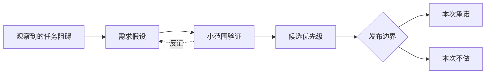

> 案例说明：MeetFlow 是虚构的 AI 会议助手，服务中小销售团队。以下市场变化、用户数据、财务数字与目标均为教学假设，不是市场调查、法律判断或收益承诺。

市场篇让我们选择销售会议场景。现在回到一个人：销售经理李然开完会，究竟还要做什么？如果只问“你想要哪些功能”，容易得到很多愿望，得不到任务中的真实阻碍。

## 看用户需求：KANO ＋用户旅程地图

### KANO：不同需求不会以同一种方式影响满意度

KANO 通常把需求分为：

- **基础需求：** 没有就强烈不满，做好了也只是“应该的”。例如录音不丢失、说话人基本准确、权限清晰；
- **期望需求：** 做得越好，满意度越高。例如转写准确率、摘要速度、可支持语言数量；
- **兴奋需求：** 用户未必主动提出，出现时却能创造惊喜。例如自动识别客户异议并生成针对性的跟进建议；
- **无差异或反向需求：** 做不做影响很小，甚至功能越多越让部分用户反感。例如自动代替用户发送所有会后邮件。

KANO 能避免两类错误：一是用“惊喜功能”掩盖基础体验缺陷，二是不断优化已经接近饱和的期望需求。对 MeetFlow 来说，如果录音经常失败，再聪明的销售洞察也无法留住用户。

需求类别并非永久不变。竞争者普及之后，今天的兴奋需求会变成明天的基础需求，因此需要定期通过问卷、访谈和行为数据重新判断。

### 用户旅程地图：在完整任务中寻找机会

用户旅程地图按时间梳理用户目标、行为、触点、情绪和痛点。以销售经理李然为例：

| 阶段 | 用户行为 | 主要触点 | 痛点 | 产品机会 |
| --- | --- | --- | --- | --- |
| 会前 | 查客户背景、准备议程 | CRM、日历、聊天记录 | 信息散落，准备耗时 | 自动汇总客户历史与未决事项 |
| 会中 | 沟通需求、记录承诺 | 视频会议、纸笔 | 记录会打断交流 | 低干扰录音，实时标记关键片段 |
| 会后 10 分钟 | 回忆结论、分配待办 | 文档、群聊 | 容易遗漏责任人与截止时间 | 生成可确认的结论和待办 |
| 当天 | 更新 CRM、发送跟进 | CRM、邮箱 | 重复录入，内容不一致 | 用户确认后同步 CRM 并生成邮件 |
| 一周后 | 检查承诺和商机进展 | CRM、任务工具 | 待办无人追踪 | 提醒逾期承诺，关联商机变化 |

这张图揭示了一个重要事实：用户需要的不是一份“漂亮纪要”，而是从会前准备到会后履约的连续结果。用户旅程地图的作用，就是让产品从页面和功能视角回到用户任务视角。

## 做需求取舍：RICE、MoSCoW 与价值四象限

### RICE：让相互竞争的需求可比较

RICE 用覆盖人数（Reach）、影响程度（Impact）、信心（Confidence）和投入（Effort）计算优先级：

$$
RICE = \frac{Reach \times Impact \times Confidence}{Effort}
$$

假设 MeetFlow 在比较三个需求：

| 需求 | Reach | Impact | Confidence | Effort | RICE 得分 |
| --- | ---: | ---: | ---: | ---: | ---: |
| CRM 自动同步 | 800 | 2.0 | 80% | 4 | 320 |
| 20 种新语言 | 300 | 1.0 | 60% | 6 | 30 |
| 会议模板市场 | 500 | 0.5 | 50% | 5 | 25 |

按这组假设，CRM 自动同步应优先。但 RICE 不是客观真理：Reach 的时间窗口必须一致，Impact 的量级必须提前约定，Confidence 要反映证据质量，Effort 也应包含设计、研发、运营和维护成本。它的价值是暴露分歧，而不是用小数点消灭判断。

### MoSCoW：守住一次发布的边界

MoSCoW 把范围分为 Must have、Should have、Could have、Won't have this time。对于 MeetFlow 的“销售团队版”首发：

- **Must：** 稳定录音、生成待办、用户确认后同步 CRM；
- **Should：** 自定义销售术语、会后邮件草稿；
- **Could：** 团队模板分享、摘要主题皮肤；
- **Won't this time：** 自动发送邮件、支持全部 CRM。

“Won't”不是永远不做，而是明确本周期不做。MoSCoW 适合发布范围管理，RICE 适合候选需求排序，两者可以配合使用。

### 价值四象限：快速处理直观取舍

把需求按用户或商业价值与实现成本分成四类：高价值低成本的“快速收益”优先；高价值高成本的“战略投入”拆解验证；低价值低成本的“填充项”谨慎穿插；低价值高成本的需求明确放弃。

四象限简单直观，适合工作坊快速对齐，但坐标很容易被主观判断影响。重要需求仍应补充数据、风险和依赖分析。

## 两张表之间，不能缺少证据

用户旅程中的“痛点”应能回到访谈、观察或日志。KANO 类型是对用户反应的假设，不应由产品经理凭感觉永久贴标签。旅程方法可参考 [NN/g 的说明](https://www.nngroup.com/articles/journey-mapping-101/)。

同样，RICE 的 Confidence 不是团队支持人数。采访五位热情用户，不能证明八百位客户都有相同需求。[Intercom 的 RICE 原文](https://www.intercom.com/blog/rice-simple-prioritization-for-product-managers/)也明确提醒，依赖和必要基础能力可能让执行顺序不同于分数顺序。

*图 1｜用户证据如何进入一次发布的承诺与取舍。*

## 实践：给高分需求做一次压力测试

把 CRM 同步的 Reach 从 800 下调到 400，Effort 从 4 上调到 8，其他假设不变，得分从 320 变成 80。这个变化不自动推翻它，但会暴露团队对触达和成本的依赖。

然后列出前置条件：身份与字段映射、用户确认、失败重试、对账。若只估算接口开发而忽略这些成本，分数本身就失去了比较意义。
