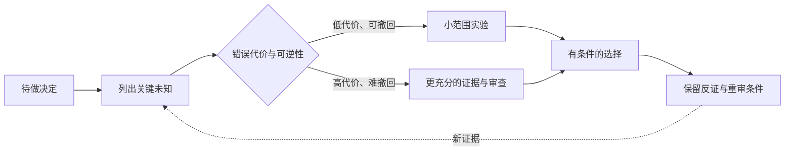

> 产品分析框架系列：[1 · 决策地图](/writing/product-analysis-frameworks/) · [2 · 市场与定位](/writing/product-frameworks-market/) · [3 · 需求与取舍](/writing/product-frameworks-prioritization/) · [4 · 增长与商业](/writing/product-frameworks-growth/) · [5 · 执行与复盘](/writing/product-frameworks-delivery/) · [6 · 深入思考](/writing/product-frameworks-synthesis/)

> 阅读时间为估计，包含图表理解；动手实验另计。

> 案例说明：MeetFlow 是虚构的 AI 会议助手，服务中小销售团队。以下市场变化、用户数据、财务数字与目标均为教学假设，不是市场调查、法律判断或收益承诺。

MeetFlow 从市场分析走到需求、增长和复盘，终于形成了一套看起来完整的产品方法。但完整不等于正确。一个团队完全可能填满所有表格，仍然做出用户不需要的产品。

原因在于：框架帮助组织问题，不负责生成证据，也不替你承担取舍。前五篇的价值，是让错误更早暴露、更容易修正，而不是让决策变得没有风险。

## 如何选择框架，而不是把所有框架都用一遍

遇到问题时，可以先判断自己处于哪个决策层级：

| 你正在问的问题 | 建议起点 | 不要误用 |
| --- | --- | --- |
| 这个方向要不要进入？ | PEST、五力、TAM / SAM / SOM | 用 RICE 给不同赛道打分 |
| 为什么用户会选择我们？ | SWOT、价值曲线、用户研究 | 只看竞品功能清单 |
| 用户在哪一步最痛？ | 用户旅程、漏斗、访谈 | 只用 KANO 问卷替代理解场景 |
| 下个版本做什么？ | RICE + MoSCoW | 用战略框架代替交付范围 |
| 为什么某指标下降？ | 漏斗 + MECE + 5 Why | 看到相关性就宣布根因 |
| 项目值不值得投入？ | 商业模式画布、ROI | 只用 TAM 证明收益 |
| 团队如何对齐执行？ | OKR + 项目计划 + 复盘 | 把任务列表当作 KR |

一次分析通常只需要一到三个框架。一个实用的组合方式是：先用一个框架**定位问题**，再用一个框架**深入解释**，最后用一个工具**做出选择**。例如先用 AARRR 发现激活环节异常，再用用户旅程和 5 Why 寻找原因，最后用 RICE 决定修复项优先级。

## 框架真正进入产品工作的四条原则

### 先写决策，再选框架

在分析文档开头写清楚：“这次需要决定什么？”是进入销售会议场景，还是决定下季度先做 CRM 同步？决策不同，所需证据和框架也不同。

### 区分事实、假设与判断

“过去四周有 35% 的用户确认待办”是事实；“因为责任人识别不准”是假设；“优先优化责任人抽取”是判断。三者混在一起，团队就无法知道该验证什么。

### 每个框架都要连接数据和行动

PEST 的政策变化应进入合规需求，用户旅程的痛点应变成机会假设，RICE 的高分项应进入候选版本，5 Why 的根因应对应实验。没有下一步动作的分析，大概率只是信息整理。

### 允许框架被现实推翻

框架只是某一时点的认知模型。市场规模、需求类别、竞争位置和优先级都会随着新证据变化。保留测算口径、数据来源和更新时间，比维护一份看似永远正确的结论更重要。

## 回看案例：真正改变方向的不是分数

市场篇让我们假设销售会议有深度价值；旅程篇发现会后录入；优先级篇选择 CRM 同步；增长篇发现用户不确认；复盘篇追踪到字段复杂度。

每一次变化都来自新证据对旧判断的约束。RICE 得分没有自己下降，TAM 也没有自己告诉团队“你服务不了这些客户”。需要人把真实世界带回模型。

这意味着框架的核心产物不是一张静态答案表，而是**一份可以被追问、被证伪、被更新的决策记录**。

## 三种看起来专业的误用

**把同一假设包装三次。** 市场规模、RICE Reach 和收入预测都来自同一个未经验证的客户数，即使三张表结论一致，也没有增加三份独立证据。

**让局部指标绑架目标。** 用户确认率上升，可能因为确认按钮更显眼，也可能因为系统自动勾选。若错误同步更多，指标提高反而损害目标。

**只允许证据支持，不允许证据反对。** 试用失败就说用户不成熟，增长停滞就说营销不够，复盘只讨论执行。这样的体系再完整，也无法纠正方向。

## 不是所有未知都值得先研究透

证据也有成本。低代价、可撤回的小功能可以快速实验；高代价、难逆转的平台迁移需要更多前置验证。研究深度应随决策影响面变化，而不是每个问题都跑一遍全套框架。

*图 1｜按错误代价与可逆性决定验证深度。矩形表示模块或步骤，圆柱表示存储，菱形表示判断；实线表示主路径，虚线表示约束、信息支撑或反馈。图为教学抽象，不代表全部实现细节。*

一个好问题是：“再收集这份数据，会改变哪一个决定？”如果答案是不会，就应考虑停止分析；如果一个未知可能让整个方案失效，就应优先验证。

## 最终判断：方法的价值在于让组织能改口

会背框架的人可以做出规范报告，能判断的人会公开自己的假设和反证条件。成熟组织还需要允许判断被推翻，而不把改口当成失职。

MeetFlow 是否最终成功，不由本文的假设数字证明。但这条决策链提供了一个可执行的工作方式：每次选择有证据，每次投入有边界，每次失败能更新认识。

框架负责照亮盲区，产品经理和团队仍然为最后的判断负责。它们最重要的作用，是让这种责任能够被解释、检查和持续改进。

---

上一篇：[执行与复盘](/writing/product-frameworks-delivery/)。

本系列到此完成。可继续阅读 [AI 产品价值系列](/writing/ai-capability-product-metrics/)，把“有价值”的承诺落到可验证的 AI 工作结果。
