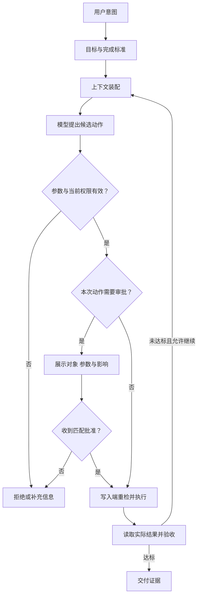
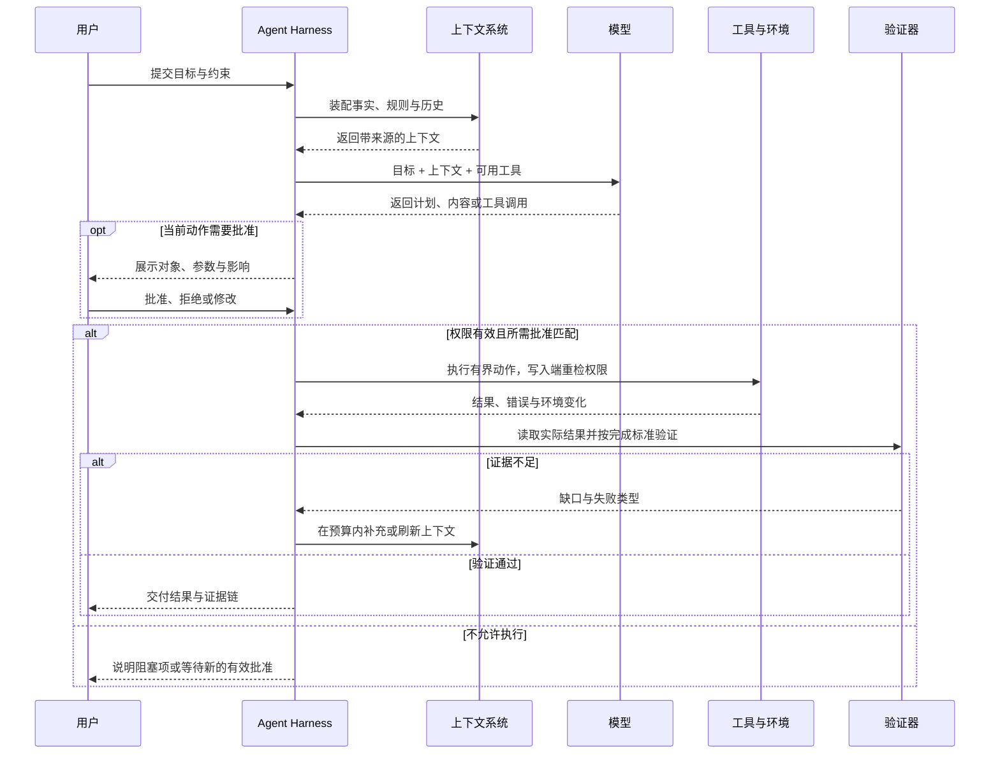

产品团队要求 Agent 分析客户反馈。只写“自动输出结论”仍缺少输入范围、交付形式和权限边界：分析哪个版本的反馈，如何引用原话，是否可以修改工单，哪些结果需要人确认？

本文把这些问题组织成结果契约，再据任务风险安排自治范围与上下文。目标是让用户知道委托了什么，让系统能判断是否完成，以及失败后怎样接管。

## 先画一张产品工作的对象地图

当用户委托多步骤结果时，产品需同时描述目标、执行边界、环境反馈和完成证据。Agent 会动态选择下一步，因此这些规则必须在每次行动时仍然成立。

一个真正可交付的闭环至少包含六层：




*图 1｜Agent 产品从用户意图出发，经过上下文、推理、执行与验证，最终交付可审查证据。*

这张图解释了为什么“换一个更强模型”经常不能直接换来更好的产品：模型只是推理节点，产品体验由整条链路的最弱环节决定。上下文错误，模型会在错误事实之上认真推理；工具定义模糊，执行会变得偶然；没有验证，流畅的输出也可能是假完成；没有恢复，第一次异常就会把用户重新推回人工流程。

因此，AI 产品经理不只是描述“AI 要做什么”，还要定义：

- 系统在什么条件下可以行动；
- 每一步需要看到哪些事实；
- 哪些事实来自用户，哪些来自系统，哪些必须现场查询；
- 什么证据足以说明任务完成；
- 出错时是重试、降级、回滚，还是交还给人。

## 委托范围决定产品承诺

下面四种形态可以并存，不是行业必须依次经历的阶段：

| 委托范围 | 需要展示 | 需要验收 |
| --- | --- | --- |
| 回答问题 | 答案、来源、未知项 | 内容是否受证据支持 |
| 执行一个动作 | 目标资源、参数、许可 | 动作及资源终态 |
| 完成多步骤任务 | 进度、待处理项、接管入口 | 跨步骤目标与剩余影响 |
| 持续承担一类任务 | 策略范围、调度、历史结果 | 每次结果及长期失败分布 |

项目规则表达做法，权限限制可执行动作，隔离环境控制文件与网络访问。三者需要同时设计，具体实现见[工具与安全边界](/writing/harness-engineering-security/)。

## 从“需求文档”转向“结果契约”

Agent 产品最常见的误区，是把传统 PRD 里的功能描述换成一句更开放的自然语言。例如“让 Agent 自动分析客户反馈并输出结论”。这听起来很智能，但没有定义产品。

更有效的起点是一份**结果契约（Outcome Contract）**：

```yaml
job: 分析最近 7 天的客户反馈，并给出下一迭代建议

outcome:
  deliverable: 一页结论、证据链接、建议优先级
  done_when:
    - 覆盖所有有效反馈来源
    - 每个结论关联支持它的原始证据；争议结论保留独立来源与反例
    - 建议能映射到明确用户问题

boundaries:
  may_read: [客服工单, 访谈记录, 产品埋点]
  may_write: [分析草稿]
  requires_approval: [创建需求, 修改路线图, 通知外部用户]
  must_not: [删除原始数据, 推断用户敏感属性]

recovery:
  missing_data: 标记缺口，不补造结论
  conflicting_evidence: 并列展示并请求人工判断
  read_failure: 对可重试读取限次重试，仍失败则标记材料缺口
  write_unknown: 查询原操作结果；不能确认时保留未知并交接
```

这份契约把“聪明”改写成了可检验的产品行为。产品、设计、工程与业务可以据此讨论同一个对象：交付物是什么，系统可以触碰什么，什么情况下必须停下来。

我会用五个问题检查一项 Agent 需求是否已经成形：

1. **委托对象是什么？** 用户交出去的是一个动作、一个阶段，还是一个完整结果？
2. **完成证据是什么？** 除了 Agent 自己声称完成，还有什么可独立检查的产物或状态？
3. **最坏副作用是什么？** 错一次只是多花几秒，还是会误发消息、覆盖数据、损害客户关系？
4. **人在何处介入最有价值？** 是提供目标、消除歧义、批准动作，还是验收最终结果？
5. **失败后如何继续？** 系统能否保留已完成工作，让人从故障点接管，而不是从头再来？

如果这五个问题没有答案，继续调提示词通常只是在优化演示。

## 用“自治阶梯”决定人机边界

人机协同不是在“全自动”和“全人工”之间二选一。更现实的做法，是按风险和可验证性逐级释放自治权。

| 层级 | Agent 的权限 | 人的角色 | 适用条件 |
| --- | --- | --- | --- |
| L0 辅助 | 解释、检索、建议 | 全程执行 | 结果难验证或责任极高 |
| L1 草拟 | 生成计划与产物草稿 | 修改并提交 | 质量可快速人工判断 |
| L2 预执行 | 填好参数并展示影响 | 单点批准 | 动作可逆、边界明确 |
| L3 有界执行 | 在预算和范围内连续行动 | 处理例外、最终验收 | 有可靠验证与回滚 |
| L4 持续委托 | 监测、决策并定期执行 | 制定政策、抽样审计 | 稳定数据、成熟治理 |

自治程度不应由市场叙事决定，而应由三个变量共同决定：**错误代价、验证成本、恢复能力**。一个动作即使模型成功率很高，只要失败不可逆且难以及时发现，就不适合直接自动执行。相反，某些准确率并不惊艳的任务，只要容易验证、能够撤销，反而可以更早进入有界自治。

可以用一个简单的期望价值模型帮助讨论：

$$
V = P_s \cdot U - C_m - C_h - P_f \cdot L
$$

其中 $P_s$ 是任务成功概率，$U$ 是成功带来的价值，$C_m$ 是模型与工具成本，$C_h$ 是人工介入成本，$P_f$ 是产生有害失败的概率，$L$ 是失败损失。产品优化的目标不是单独提高 $P_s$，而是提升整个系统的 $V$。

这解释了一个常见现象：增加一次关键确认可能让流程多十秒，却显著降低 $P_f \cdot L$；增加一个结果校验器可能提高计算成本，却减少人工返工。局部看是“更慢”，整体看却是更好的产品。

## 定义上下文的来源与时效

上下文规格需要说明信息怎样取得、筛选、更新和追溯；提示词只能使用已经提供的信息。

一套可维护的上下文设计至少回答四件事：

- **事实层**：当前任务必须知道哪些用户、业务与环境事实？
- **规则层**：有哪些政策、约束、团队规范与审批要求？
- **历史层**：哪些过去决策会影响当前任务，保留多久，谁可以修改？
- **现场层**：执行时必须重新查询什么，避免把过期信息当成事实？



*图 2｜上下文系统在每次行动前提供带来源的事实，并把执行结果送入验证与下一轮决策。*

产品经理在这里最重要的工作，不是决定向量数据库选哪一种，而是制定**上下文规格**：来源、所有者、时效、可信度、冲突处理和隐私范围。缺少这些定义，再先进的检索也只会更快地把噪声送给模型。

> [!WARNING]
> “记住得更多”不等于“理解得更好”。无限累积历史会引入过期事实、目标漂移和隐私风险。好的记忆系统不仅会写入，也必须会过期、纠错、引用来源和被用户看见。

## 产品经理开始设计反馈质量

Agent 能够更快地产生方案、代码和内容，但产出速度不是学习速度。只有当结果接触真实环境、获得可解释反馈，并修改下一轮任务和系统，组织才真正学到东西。

因此，产品工作的新对象包括三种反馈：

- **环境反馈**：测试、数据、工具返回和下游系统是否接受结果；
- **用户反馈**：结果是否减少了真实工作，而不是只让演示更流畅；
- **组织反馈**：失败是否进入样本、规则和优先级，还是每次靠人临时救场。

过程可见也因此不是装饰。用户需要知道系统在做什么，团队更需要知道为什么失败。没有轨迹、证据和接管原因，失败只能成为抱怨，无法成为可复用知识。
