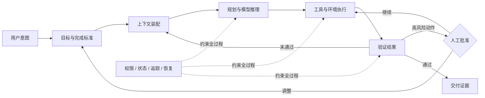

> 系列：[1. 工作系统](/writing/product-work-methodology/)｜[2. 结果契约](/writing/agent-product-contracts-context/)｜[3. 产品节奏](/writing/agent-product-evaluation-rhythm/)｜[4. 组织未知](/writing/lu-qi-researcher-founder/)｜[5. 思维与行动](/writing/researcher-founder-thinking/)｜[6. 学习边界](/writing/learning-organization-boundaries/)｜[7. 整体思考](/writing/ai-product-work-synthesis/)

过去，产品经理主要处理的是确定性：按钮触发什么接口，状态如何流转，异常时页面显示什么。即使需求复杂，只要规则被写清楚，同样的输入大体会得到同样的结果。

Agent 产品改变了问题的性质。模型会推理，会调用工具，会根据现场信息改变路径，但也会遗漏、误判和过度执行。于是产品工作不再只是定义功能，而是在设计一份新的**委托关系**：用户愿意把什么交给 AI，系统凭什么知道已经做完，哪些动作必须获得批准，失败后由谁发现、谁恢复、谁承担最后判断。

这也是我理解的 Agent Harness：它不是模型外面多包一层提示词，而是把概率性的模型能力，组织成可交付工作的产品系统。

> [!IMPORTANT]
> Agent 产品的最小单位不是一次回答，也不是一个功能，而是一份可验证的工作契约：目标、上下文、工具、边界、证据与恢复机制缺一不可。

## 先画一张产品工作的对象地图

传统软件的核心抽象是“功能”。Agent 产品更合适的核心抽象是“工作闭环”。两者差别不在界面，而在责任：功能只需要正确响应操作，工作闭环还必须判断下一步、处理环境变化，并对结果给出证据。

一个真正可交付的闭环至少包含六层：

*图 1｜Agent 产品从用户意图出发，经过上下文、推理、执行与验证，最终交付可审查证据。*

这张图解释了为什么“换一个更强模型”经常不能直接换来更好的产品：模型只是推理节点，产品体验由整条链路的最弱环节决定。上下文错误，模型会在错误事实之上认真推理；工具定义模糊，执行会变得偶然；没有验证，流畅的输出也可能是假完成；没有恢复，第一次异常就会把用户重新推回人工流程。

因此，AI 产品经理不只是描述“AI 要做什么”，还要定义：

- 系统在什么条件下可以行动；
- 每一步需要看到哪些事实；
- 哪些事实来自用户，哪些来自系统，哪些必须现场查询；
- 什么证据足以说明任务完成；
- 出错时是重试、降级、回滚，还是交还给人。

## Agent Harness 已经进入“工作系统”阶段

从产品演进看，Agent Harness 大致经历了四个阶段：

| 阶段 | 产品承诺 | 主要界面 | 真正瓶颈 |
| --- | --- | --- | --- |
| 对话助手 | 给出更好的答案 | 聊天窗口 | 知识与表达质量 |
| 工具 Agent | 替用户完成一个动作 | 对话 + 工具调用 | 参数、权限与错误处理 |
| 工作流 Agent | 完成多步骤任务 | 计划、进度、产物 | 状态、验证与中途干预 |
| 协同工作系统 | 持续承担一类工作 | 任务空间、团队与环境 | 责任边界、记忆、治理与组织适配 |

现在行业的重心正在从第二阶段走向第三、第四阶段。OpenAI 的官方模型指南已经把工具编排、状态管理、追踪、交接和评估作为 agentic system 的基本结构，并明确要求定义工具范围、输出证据、并发、重试与停止条件；Claude Code 的产品结构则把项目记忆、权限、Hooks、MCP 与隔离的子智能体纳入同一个执行环境。两者路径不同，却指向同一个结论：**基础模型能力正在被越来越多产品复用，Harness 对工作环境的组织能力正在成为产品差异。**

这里不应把 OpenAI 与 Claude Code 简化成一张“谁的功能更多”的表格。它们更有价值的地方，是展示了两种不同的产品重心：

- **OpenAI / Codex 路径**更强调通用的任务运行时：任务可以被编排、追踪、交接、并行处理，并通过评估持续校准。对产品经理的启示是，任务状态和证据链本身就是产品界面。
- **Claude Code 路径**更强调深入开发环境后的可控扩展：项目规则告诉 Agent“这里如何工作”，权限和 Hooks 负责硬边界，MCP 扩展外部系统，子智能体隔离不同任务。对产品经理的启示是，指导模型的软约束与限制行为的硬约束不能混为一谈。

Anthropic 的配置文档给出了一个很好的区分：项目说明适合表达“我们在这里如何做事”，权限和 Hooks 则用于保证“哪些事情绝不能发生”。这不是工程实现细节，而是一条产品原则：**期望不能代替约束，提示不能代替权限。**

> [!NOTE]
> 以上判断来自对当前产品结构的观察，而不是宣称某一家已经解决了通用智能体问题。模型和产品版本会快速变化，但上下文、工具、权限、验证、恢复这五类问题会长期存在。

---

工作系统是新的设计对象，但还需要一种可以交付给工程、评测和运营共同执行的表达。下一篇把传统需求文档改写成结果契约。

下一篇：[结果契约](/writing/agent-product-contracts-context/)。
