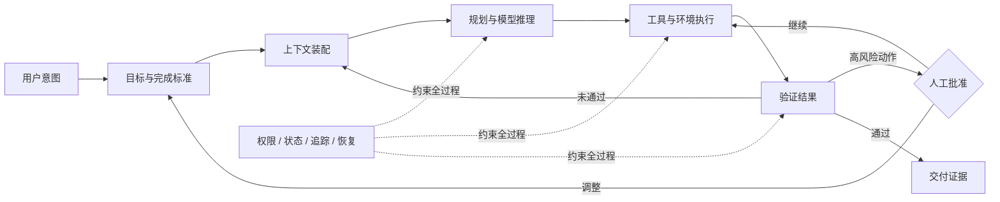
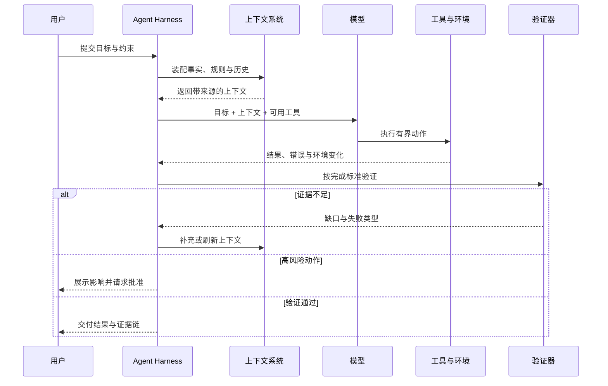

过去，产品经理主要处理的是确定性：按钮触发什么接口，状态如何流转，异常时页面显示什么。即使需求复杂，只要规则被写清楚，同样的输入大体会得到同样的结果。

Agent 产品改变了问题的性质。模型会推理，会调用工具，会根据现场信息改变路径，但也会遗漏、误判和过度执行。于是产品工作不再只是定义功能，而是在设计一份新的**委托关系**：用户愿意把什么交给 AI，系统凭什么知道已经做完，哪些动作必须获得批准，失败后由谁发现、谁恢复、谁承担最后判断。

这也是我理解的 Agent Harness：它不是模型外面多包一层提示词，而是把概率性的模型能力，组织成可交付工作的产品系统。

> [!IMPORTANT]
> Agent 产品的最小单位不是一次回答，也不是一个功能，而是一份可验证的工作契约：目标、上下文、工具、边界、证据与恢复机制缺一不可。

## 一、先重新定义产品经理的对象

传统软件的核心抽象是“功能”。Agent 产品更合适的核心抽象是“工作闭环”。两者差别不在界面，而在责任：功能只需要正确响应操作，工作闭环还必须判断下一步、处理环境变化，并对结果给出证据。

一个真正可交付的闭环至少包含六层：



这张图解释了为什么“换一个更强模型”经常不能直接换来更好的产品：模型只是推理节点，产品体验由整条链路的最弱环节决定。上下文错误，模型会在错误事实之上认真推理；工具定义模糊，执行会变得偶然；没有验证，流畅的输出也可能是假完成；没有恢复，第一次异常就会把用户重新推回人工流程。

因此，AI 产品经理不只是描述“AI 要做什么”，还要定义：

- 系统在什么条件下可以行动；
- 每一步需要看到哪些事实；
- 哪些事实来自用户，哪些来自系统，哪些必须现场查询；
- 什么证据足以说明任务完成；
- 出错时是重试、降级、回滚，还是交还给人。

## 二、Agent Harness 已经进入“工作系统”阶段

从产品演进看，Agent Harness 大致经历了四个阶段：

| 阶段 | 产品承诺 | 主要界面 | 真正瓶颈 |
| --- | --- | --- | --- |
| 对话助手 | 给出更好的答案 | 聊天窗口 | 知识与表达质量 |
| 工具 Agent | 替用户完成一个动作 | 对话 + 工具调用 | 参数、权限与错误处理 |
| 工作流 Agent | 完成多步骤任务 | 计划、进度、产物 | 状态、验证与中途干预 |
| 协同工作系统 | 持续承担一类工作 | 任务空间、团队与环境 | 责任边界、记忆、治理与组织适配 |

现在行业的重心正在从第二阶段走向第三、第四阶段。OpenAI 的官方模型指南已经把工具编排、状态管理、追踪、交接和评估作为 agentic system 的基本结构，并明确要求定义工具范围、输出证据、并发、重试与停止条件；Claude Code 的产品结构则把项目记忆、权限、Hooks、MCP 与隔离的子智能体纳入同一个执行环境。两者路径不同，却指向同一个结论：**基础模型能力正在被越来越多产品复用，Harness 对工作环境的组织能力正在成为产品差异。**

这里不应把 OpenAI 与 Claude Code 简化成一张“谁的功能更多”的表格。它们更有价值的地方，是展示了两种不同的产品重心：

- **OpenAI / Codex 路径**更强调通用的任务运行时：任务可以被编排、追踪、交接、并行处理，并通过评估持续校准。对产品经理的启示是，任务状态和证据链本身就是产品界面。
- **Claude Code 路径**更强调深入开发环境后的可控扩展：项目规则告诉 Agent“这里如何工作”，权限和 Hooks 负责硬边界，MCP 扩展外部系统，子智能体隔离不同任务。对产品经理的启示是，指导模型的软约束与限制行为的硬约束不能混为一谈。

Anthropic 的配置文档给出了一个很好的区分：项目说明适合表达“我们在这里如何做事”，权限和 Hooks 则用于保证“哪些事情绝不能发生”。这不是工程实现细节，而是一条产品原则：**期望不能代替约束，提示不能代替权限。**

> [!NOTE]
> 以上判断来自对当前产品结构的观察，而不是宣称某一家已经解决了通用智能体问题。模型和产品版本会快速变化，但上下文、工具、权限、验证、恢复这五类问题会长期存在。

## 三、从“需求文档”转向“结果契约”

Agent 产品最常见的误区，是把传统 PRD 里的功能描述换成一句更开放的自然语言。例如“让 Agent 自动分析客户反馈并输出结论”。这听起来很智能，但没有定义产品。

更有效的起点是一份**结果契约（Outcome Contract）**：

```yaml
job: 分析最近 7 天的客户反馈，并给出下一迭代建议

outcome:
  deliverable: 一页结论、证据链接、建议优先级
  done_when:
    - 覆盖所有有效反馈来源
    - 每个结论至少有两条原始证据
    - 建议能映射到明确用户问题

boundaries:
  may_read: [客服工单, 访谈记录, 产品埋点]
  may_write: [分析草稿]
  requires_approval: [创建需求, 修改路线图, 通知外部用户]
  must_not: [删除原始数据, 推断用户敏感属性]

recovery:
  missing_data: 标记缺口，不补造结论
  conflicting_evidence: 并列展示并请求人工判断
  tool_failure: 重试一次，随后降级为可继续的草稿
```

这份契约把“聪明”改写成了可检验的产品行为。它也让产品、设计、工程、安全和业务第一次能够讨论同一个对象：交付物是什么，系统可以触碰什么，什么情况下必须停下来。

我会用五个问题检查一项 Agent 需求是否已经成形：

1. **委托对象是什么？** 用户交出去的是一个动作、一个阶段，还是一个完整结果？
2. **完成证据是什么？** 除了 Agent 自己声称完成，还有什么可独立检查的产物或状态？
3. **最坏副作用是什么？** 错一次只是多花几秒，还是会误发消息、覆盖数据、损害客户关系？
4. **人在何处介入最有价值？** 是提供目标、消除歧义、批准动作，还是验收最终结果？
5. **失败后如何继续？** 系统能否保留已完成工作，让人从故障点接管，而不是从头再来？

如果这五个问题没有答案，继续调提示词通常只是在优化演示。

## 四、用“自治阶梯”决定人机边界

人机协同不是在“全自动”和“全人工”之间二选一。更现实的做法，是按风险和可验证性逐级释放自治权。

| 层级 | Agent 的权限 | 人的角色 | 适用条件 |
| --- | --- | --- | --- |
| L0 辅助 | 解释、检索、建议 | 全程执行 | 结果难验证或责任极高 |
| L1 草拟 | 生成计划与产物草稿 | 修改并提交 | 质量可快速人工判断 |
| L2 预执行 | 填好参数并展示影响 | 单点批准 | 动作可逆、边界明确 |
| L3 有界执行 | 在预算和范围内连续行动 | 处理例外、最终验收 | 有可靠验证与回滚 |
| L4 持续委托 | 监测、决策并定期执行 | 制定政策、抽样审计 | 稳定数据、成熟治理 |

自治程度不应由市场叙事决定，而应由三个变量共同决定：**错误代价、验证成本、恢复能力**。一个动作即使模型成功率很高，只要失败不可逆且难以及时发现，就不适合直接自动执行。相反，某些准确率并不惊艳的任务，只要容易验证、能够撤销，反而可以更早进入有界自治。

可以用一个简单的期望价值模型帮助讨论：

$$
V = P_s \cdot U - C_m - C_h - P_f \cdot L
$$

其中 $P_s$ 是任务成功概率，$U$ 是成功带来的价值，$C_m$ 是模型与工具成本，$C_h$ 是人工介入成本，$P_f$ 是产生有害失败的概率，$L$ 是失败损失。产品优化的目标不是单独提高 $P_s$，而是提升整个系统的 $V$。

这解释了一个常见现象：增加一次关键确认可能让流程多十秒，却显著降低 $P_f \cdot L$；增加一个结果校验器可能提高计算成本，却减少人工返工。局部看是“更慢”，整体看却是更好的产品。

## 五、把上下文当作产品供应链

模型输出依赖上下文，就像实体产品依赖供应链。提示词只是最后的装配说明，真正决定质量的是信息能否被正确取得、筛选、排序、更新和追溯。

一套可维护的上下文设计至少回答四件事：

- **事实层**：当前任务必须知道哪些用户、业务与环境事实？
- **规则层**：有哪些政策、约束、团队规范与审批要求？
- **历史层**：哪些过去决策会影响当前任务，保留多久，谁可以修改？
- **现场层**：执行时必须重新查询什么，避免把过期信息当成事实？



产品经理在这里最重要的工作，不是决定向量数据库选哪一种，而是制定**上下文规格**：来源、所有者、时效、可信度、冲突处理和隐私范围。缺少这些定义，再先进的检索也只会更快地把噪声送给模型。

> [!WARNING]
> “记住得更多”不等于“理解得更好”。无限累积历史会引入过期事实、目标漂移和隐私风险。好的记忆系统不仅会写入，也必须会过期、纠错、引用来源和被用户看见。

## 六、评估的单位必须是任务，而不是回答

Agent 产品不能只用“回答是否正确”来评估，因为大量失败发生在答案之外：选错工具、漏掉步骤、重复执行、超出权限、产物正确但没有保存、保存成功却没有告诉用户在哪里。

我倾向于建立一套面向任务的失败分类：

| 类别 | 典型问题 | 产品手段 |
| --- | --- | --- |
| 意图失败 | 解决了错误的问题 | 目标回显、歧义确认 |
| 上下文失败 | 缺失、过期或冲突信息 | 来源标记、刷新策略、缺口提示 |
| 规划失败 | 步骤顺序错误或遗漏依赖 | 检查点、计划审阅、任务模板 |
| 工具失败 | 参数错误、接口异常、重复调用 | 类型约束、幂等、重试上限 |
| 边界失败 | 未经批准执行高风险动作 | 最小权限、审批闸门、Hook |
| 验证失败 | 把“已执行”误认为“已完成” | 独立验证器、结果证据 |
| 恢复失败 | 出错后丢失进度或循环重试 | 状态快照、回滚、人工接管 |

评估集也不应只收集“正常问题”。真正有价值的样本通常来自生产中的边缘情况：输入不完整、权限不足、工具超时、两个事实冲突、用户中途改目标、任务被打断后恢复。每一次失败都应该变成一个可重复运行的案例，而不是只修当次提示词。

下面这张图不是行业数据，而是一张**产品评审模板示例**。数值只用于演示：同一版本不应只报告完成率，还要同时审视边界、恢复、可观测性与成本。

```echarts
{
  "tooltip": { "trigger": "axis" },
  "legend": { "data": ["当前版本", "发布门槛"] },
  "radar": {
    "indicator": [
      { "name": "任务成功", "max": 100 },
      { "name": "边界遵守", "max": 100 },
      { "name": "失败恢复", "max": 100 },
      { "name": "过程可见", "max": 100 },
      { "name": "成本效率", "max": 100 }
    ]
  },
  "series": [{
    "type": "radar",
    "data": [
      { "value": [82, 94, 68, 76, 71], "name": "当前版本" },
      { "value": [80, 95, 80, 80, 70], "name": "发布门槛" }
    ]
  }]
}
```

这组示例里，平均分看起来足够，但“失败恢复”没有过线，因此不能通过发布评审。一个好的指标体系必须允许团队说“不发布”，否则它只是展示进展的装饰。

## 七、过程可见，才可能建立信任

传统产品常把内部过程隐藏起来，因为确定性流程只需给出结果。Agent 不同：路径会变化，也可能在某一步需要新的判断。如果界面只剩一个旋转图标，用户既不知道系统在做什么，也不知道什么时候应该介入。

真正有用的过程反馈应回答：

1. 当前在完成哪个子目标；
2. 已经读取或改变了什么；
3. 为什么选择这一步；
4. 哪里存在不确定性；
5. 用户现在可以批准、修改、撤销还是接管什么。

这里的原则不是暴露模型的全部思维过程，而是提供**可行动的状态**。例如“正在分析”没有行动价值；“已读取 42 条反馈，发现 7 条缺少产品版本，是否忽略后继续？”才有。

信任也不是靠拟人化语气建立的。稳定的信任来自四件事：行为边界一致、重要动作可预期、结果有证据、失败可恢复。产品经理应把这四件事当成交互系统，而不是一句“AI 可能犯错”的免责声明。

## 八、一套可执行的产品工作节奏

方法论只有进入日常节奏才有价值。对一个新的 Agent Harness 产品，我会用三个周期推进。

### 0—30 天：找到值得委托的窄任务

- 观察真实工作，不从模型能力清单倒推需求；
- 收集 30—50 个真实任务，保留输入、过程、结果和返工原因；
- 写出结果契约和人工基线：现在由谁完成，多久，哪里最耗判断；
- 只做一个可闭环的任务，不急于搭建通用平台。

### 31—60 天：建立边界和评估闭环

- 明确上下文规格、工具输入输出和权限矩阵；
- 把高风险动作放在批准闸门之后；
- 将真实失败整理成评估集和失败分类；
- 记录每次执行的状态、工具结果、人工介入点和最终证据。

### 61—90 天：从可用走向可托付

- 根据失败类型改系统，不只改提示词；
- 为中断、超时和部分成功设计恢复；
- 逐级提高自治，不一次性移除人工；
- 同时观察成功率、人工介入、恢复率、时延、成本与用户复用。

每周评审时，我会要求团队带来的不是“这个版本回答更好了”，而是三样东西：**新增了哪些真实失败样本，哪一类失败显著下降，系统因此可以安全地多承担哪一段工作。**

<details>
  <summary>一页式 Agent 产品评审清单</summary>
  <ul>
    <li>任务：用户究竟委托了什么结果？</li>
    <li>证据：系统如何证明自己完成了？</li>
    <li>上下文：事实来自哪里，何时过期？</li>
    <li>工具：每个工具的输入、输出、错误与幂等性是否清楚？</li>
    <li>权限：什么可以自动做，什么必须批准，什么永远禁止？</li>
    <li>评估：正常、边缘、对抗与恢复样本是否都被覆盖？</li>
    <li>介入：用户何时能看见、暂停、修改、撤销与接管？</li>
    <li>指标：成功是否以真实任务和最终状态计算？</li>
  </ul>
</details>

## 九、最后的判断：产品经理在设计责任，而不只是体验

Agent Harness 时代，产品经理的价值不会因为模型更聪明而下降，反而会从功能定义扩展到系统治理。模型能够生成越来越多方案，但仍然需要有人决定：什么值得自动化，什么证据算完成，什么风险不能转嫁给用户，组织愿意把多大的行动权交给系统。

所以，AI 产品工作的核心不是“让 AI 无所不能”，而是让它在清楚的边界内承担更多真实工作，并让人始终保有理解、判断和接管的能力。

好的 Agent 产品不以“它像不像人”衡量，而以三个问题衡量：

- 它是否让工作真实向前推进？
- 它是否让责任和风险变得更清楚？
- 它是否能从每次失败中形成下一次更可靠的系统能力？

当这三个问题能够被持续回答，Agent 才从一次惊艳的演示，变成值得长期托付的产品。

---

## 延伸阅读

- [OpenAI：Model guidance](https://developers.openai.com/api/docs/guides/latest-model)——工具范围、输出证据、重试、停止条件、状态与评估。
- [Anthropic：How Claude Code works](https://code.claude.com/docs/en/how-claude-code-works)——工具、记忆、MCP、Skills 与子智能体如何构成执行环境。
- [Anthropic：Configure permissions](https://code.claude.com/docs/en/permissions)——工具和子智能体的允许、询问与拒绝规则。
- [Anthropic：Automate workflows with hooks](https://code.claude.com/docs/en/hooks-guide)——在工具调用、权限请求、会话与子智能体生命周期中加入确定性控制。
- [Anthropic：Create custom subagents](https://code.claude.com/docs/en/subagents)——隔离上下文、限制工具和分派专门任务的产品机制。
