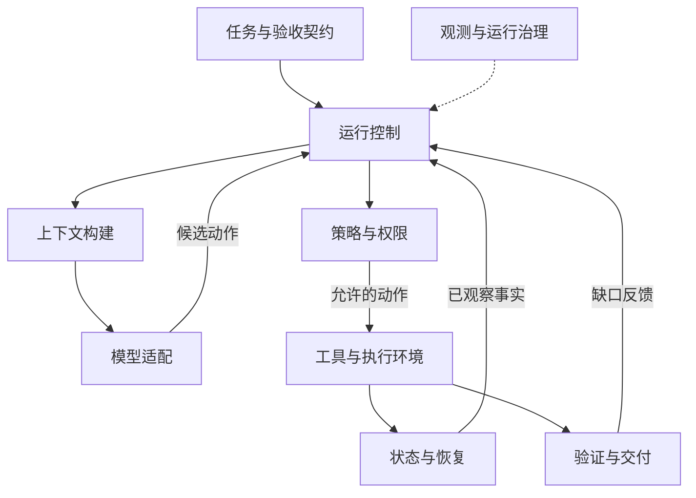
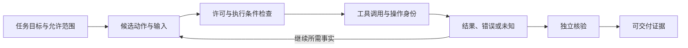

Harness 把模型提案接到真实执行与验收上。用一次购物车修复区分 Prompt、Context 与运行时，再确定模块交换的任务、动作、结果与证据。

<a id="prompt-context-harness-engineering"></a>

购物车里只有一件商品。用户把数量改为 0 后，商品仍留在列表中，总价也没有更新。现在让 AI 修复这个 Bug，补上回归测试，并提交一个供开发者审查的 PR（代码合并请求）。

## 总览：三种工程职责分别解决什么

这里采用便于工程分工的定义。三者有交叉，不是严格互斥的技术分类。

| 工程视角 | 首先回答的问题 | 购物车任务中的落点 | 如何检查 |
| --- | --- | --- | --- |
| Prompt Engineering | 什么行为才算正确？ | 数量为 0 时移除商品、更新状态和总价；补测试；提交 PR，不合并 | 固定代码与材料，检查输出是否符合要求 |
| Context Engineering | 这一步需要依据什么？ | 当前分支的购物车组件、状态接口、测试和项目约定 | 检查实际进入模型的内容、来源与版本 |
| Harness Engineering | 怎样执行，凭什么宣布完成？ | 修改文件、运行测试、处理失败、推送分支、创建并查询 PR | 检查工作区、测试结果与远端 PR |

Prompt 定义数量为零时移除商品并重算总价；Context 提供当前代码、测试和项目约定；Harness 修改代码、运行测试，验收通过后提交并查询 PR。

本文中的 **agent harness** 指模型周围的运行系统。Harness Engineering 也包括工作环境建设：让 Agent 找得到项目文档、启动得了应用、运行得了测试，并能观察执行结果。它不只是一段模型调用循环，也不特指某个框架。

如果任务只是“解释这段代码”，提供代码和清晰问题可能已经足够。需要修改仓库并交付可审查成果时，执行权限、环境状态和验收就成为任务的一部分。

## 分层拆解：同一个 Bug，怎样逐层处理

### Prompt Engineering：写清正确行为与完成范围

“把购物车修好，顺便测一下”没有说明状态与界面应如何变化，也没有说明测试范围和交付方式。即使背景材料齐全，执行者仍可能只修好眼前的显示问题。

下面将任务改成可检查的要求。仓库结构与业务规则均为教学设定。

```text
问题：购物车中一件商品的数量改为 0 后，商品仍显示，总价未更新。
预期行为：
- 数量为 0 时移除该商品，同时更新购物车状态、列表和总价。
- 删除最后一件商品时展示空购物车，总价为 0。
- 调整正整数数量时，保留原有行为；不影响其他商品。
实现约束：沿用项目现有状态管理方式，不为本次修复新增依赖。
验证要求：补充覆盖上述行为的回归测试，运行购物车相关测试和项目构建。
交付范围：提交修复分支与 PR，说明改动和实际验证结果；不合并、不部署。
阻塞处理：无法运行检查时说明原因与未验证项，不宣称验收通过。
```

例如，删除最后一件商品后，页面空了但总价仍是 99 元，修复仍未完成。这个反例把“看起来移除了”与“状态和显示都正确”区分开，直接对应验收条件。

Prompt Engineering 在这里负责消除歧义、表达约束、提供边界示例。提示词是否更好，需要在固定任务和材料下检验；写得更长本身不是证据。Anthropic 的指南也将成功标准与可实测的评估放在提示词优化之前。[提示词工程官方指南](https://platform.claude.com/docs/en/build-with-claude/prompt-engineering/overview)

任务要求清楚后，AI 仍可能写错代码。此时要继续检查实现与反馈，不能把每一次失败都归因于提示词。提示词也不能补回未提供的当前代码，更不能替代真正运行测试。

**进入 Harness 后，提示词会按阶段组织。** 定位阶段要求解释复现路径，修改阶段要求遵守实现约束，交付阶段要求引用实际验证结果。目标分支、当前权限和剩余预算由可信运行状态提供，不能由模型随意改写。

### Context Engineering：让模型读到当前实现

沿用刚才的任务要求。假设项目已经重构过购物车：旧版用 `setQuantity()`，当前分支改为通过 `dispatch()` 更新状态，零数量还需要触发商品移除。函数名只是本例设定，不对应某个公共库的 API。

| 材料 | 对本次修复的作用 | 容易发生的误用 |
| --- | --- | --- |
| 当前分支的购物车组件 | 定位数量变化事件如何进入状态层 | 只看界面，漏掉状态更新 |
| 当前状态实现及调用方 | 确认支持的动作和数据约束 | 照旧文档调用已移除接口 |
| 现有测试与测试命令 | 了解行为约定，确定怎样增加回归测试 | 只生成测试文件，没有接入实际测试入口 |
| 项目约定与构建配置 | 确认依赖、目录、代码风格和构建方式 | 套用另一项目的命令或组件 |
| 旧接口文档 | 必要时解释迁移背景 | 将历史接口当成当前实现 |

如果模型只拿到旧文档，即使遵守“沿用现有接口”，也可能写出无法编译的代码。如果把整个仓库一次塞进上下文，相关调用方和测试又可能被大量无关信息淹没。这里需要调整材料的选择和组织方式。

Anthropic 的上下文工程文章将关注范围从指令扩展到模型推理时可见的信息集合，包括工具、资料和消息历史，并强调多轮运行中的持续维护。[上下文工程原文](https://www.anthropic.com/engineering/effective-context-engineering-for-ai-agents)

本例可以先检查当前工作区与任务范围，再读取组件、状态实现和相关测试；找到调用链后补充必要文件。检索到旧接口时，应核对它是否仍在当前分支存在。文件的修改日期不能独自证明它适用，仍需结合代码引用和项目约定判断。

一次上下文装配的记录可以很短：

```text
任务：修复购物车零数量问题
当前阶段：定位与修改
工作区依据：当前提交 + 未提交改动
已读：购物车组件、状态更新逻辑、相关测试、项目约定
本轮补充：失败断言及对应调用栈
排除：已不适用于当前分支的旧接口说明
待确认：移除最后一件商品时的空状态组件
```

这张清单解释选择过程，不能替代代码正文。模型需要实际读到文件内容，或具备继续读取的工具。记录文件路径却不提供读取能力，仍然没有提供依据。

上下文也随阶段变化：定位时需要复现步骤与代码；修复后需要 Diff、失败断言和测试输出；提交 PR 时需要目标仓库、分支、当前提交与验证结果。每轮携带的是当前决策所需的信息，不必重复全部历史。完整请求的预算与压缩见[上下文装配篇](/writing/harness-operations-context/)。

RAG 可以帮助找资料，Memory 可以保留跨任务信息，Context Engineering 决定它们是否进入本轮输入。历史摘要写着“测试通过”，不能证明当前改动通过；继续修改代码后，先前的测试结果可能已经失效。

### Harness Engineering：真正执行，并用结果推进

模型已经提出合理修改，系统还要让这些修改落到工作区，并根据运行结果决定下一步。

| 当前情况 | Harness 的处理 | 可以报告的状态 |
| --- | --- | --- |
| 修改完成，尚未测试 | 执行约定检查，记录命令、退出状态与所测版本 | 已修改，待验证 |
| 测试发现总价未更新 | 将失败断言反馈给模型，在预算内继续修复 | 验收未通过 |
| 缺少依赖，无法运行测试 | 记录环境缺口，按权限与预算处理或等待 | 检查未完成，不能宣称通过 |
| 测试与构建通过 | 确认结果对应当前改动，检查 Diff 和提交范围 | 可进入 PR 交付 |
| PR 创建请求超时 | 查询目标仓库、源分支、目标分支与已有 PR | 远端结果待确认 |
| 查到正确 PR | 核对 PR 的提交与已验证改动一致，返回链接 | 已提交审查，尚未合并 |

这里的验收包含两部分：代码行为符合目标，交付对象也正确。测试通过但推送了另一个分支，任务没有完成；PR 存在但不包含修复提交，同样不能算成功。

验收独立，指标准来自可信任务要求、证据来自实际执行，而不是接受模型一句“已完成”。本例的证据包括回归测试、构建结果、Diff 和远端 PR。新写的测试也可能漏测或把错误行为写成期望，因此还要检查测试断言是否覆盖约定行为，不能只数通过了多少条。

运行中断后也不能机械地重做所有动作。假设 PR 已创建，客户端却没收到响应，恢复时应先按已保存的仓库与分支信息查询。查到一个匹配 PR 后，核对其状态和提交；查询不可用或出现多个候选时保留待确认状态，不直接再创建一个。

这个查询流程依赖平台提供的接口，不能声称跨平台天然去重。对于自建写入工具，可以另外设计稳定操作键和服务端唯一约束；机制见[状态与恢复篇](/writing/harness-engineering-recovery/)。两种场景共同要求的是：区分“响应没有收到”与“动作没有发生”。

Harness 还要明确停止条件。验收通过后可以交付；缺权限或缺环境条件时可以等待；预算耗尽时报告剩余工作。**停止运行不等于完成任务，提交 PR 也不等于合并或部署。** 循环如何处理这些出口，见[运行循环篇](/writing/harness-engineering-loop/)。

工作环境同样影响能否闭环。Agent 必须能启动项目、运行检查、读取错误并保留进度。Anthropic 的长程 Agent 案例使用功能清单、进度记录和端到端检查；OpenAI 的工程案例则强调可查找的项目知识、可运行的环境与程序化约束。[长程 Harness 实践](https://www.anthropic.com/engineering/effective-harnesses-for-long-running-agents)、[OpenAI 工程案例](https://openai.com/index/harness-engineering/)

### MCP 的位置：连接能力，应用负责任务

Prompt、Context 与 Harness 描述工程职责；MCP 是互操作协议。代码读取、测试执行和 PR 操作可以通过 MCP 暴露，也可以通过 CLI、直接 API 或本地函数完成。

以下以 MCP 2025-11-25 为说明基线。其架构区分 Host、Client 与 Server，Host 负责模型集成与上下文等协调职责。[MCP 架构规范](https://modelcontextprotocol.io/specification/2025-11-25/architecture)

| 协议接口 | 在本例中可承载什么 | 应用仍需判断什么 |
| --- | --- | --- |
| Prompts | 可复用的代码审查提示模板 | 是否适合本次修复 |
| Resources | 项目文档与代码等可读取材料 | 是否属于当前工作区，是否有权读取 |
| Tools | 读取文件、运行检查、查询或创建 PR | 参数与权限是否正确，结果是否满足目标 |

这些是可能的接入方式，不表示每个 MCP Server 都提供上述能力。接通协议只证明可以交换约定消息；它不会自动选出正确代码、保证测试覆盖充分，或替应用确认 PR 已交付。

Host 可以承载 Harness 的部分职责，也可以委托给其他组件。具体传输生命周期与业务契约分别见[MCP 生命周期](/writing/harness-foundations-mcp-lifecycle/)和[工具契约](/writing/harness-engineering-tools/)。

## 三种职责怎样形成反馈环

从概念上看，提示词是上下文的一部分，上下文装配又是 Harness 的一项职责。“Prompt → Context → Harness”表达关注范围扩大，不是严格年代顺序，也不是后者出现后前者失效。

购物车任务的反馈环是：模型根据要求和当前代码提出修改，工具执行修改与测试，失败断言进入下一轮上下文，模型据此继续修复。验收通过后才进入已授权的交付步骤。

购物车修复的职责示意。测试失败会形成反馈；预算和权限限制继续执行；远端提交仍需查询确认。
| 提示词中的要求 | Harness 中的落实方式 | 提示词仍承担什么 |
| --- | --- | --- |
| “沿用当前接口” | 提供当前代码与调用方，执行类型和构建检查 | 解释实现约束 |
| “测试通过再提交” | 真正运行检查，核对结果对应的代码版本 | 组织修复步骤与报告 |
| “继续上次工作” | 保存工作区位置、改动与运行记录，恢复时重查实际状态 | 阅读进度并判断下一步 |
| “完成后给我链接” | 查询远端 PR、分支和提交 | 解释已交付内容与未完成项 |

新增机制不一定改善结果。若现有函数已经足够清楚，不必先引入复杂编排；若模型升级后某些补偿性提示已无作用，可以通过回归评测删掉。保留什么，应看它是否解决具体失败。

## 怎样分别验证三层改进

下面是建议的教学练习，未声称已经在本站完成真实模型评测。准备一个含该 Bug 的小仓库，固定起始提交、模型设置和运行预算，并另外保留未向模型公开的验收用例。

| 对照 | 只改变什么 | 观察什么 |
| --- | --- | --- |
| Prompt | 两组都提供相同当前代码，一组用模糊要求，一组用明确行为与边界 | 是否同时修复商品移除、总价与空状态 |
| Context | 固定明确要求，比较旧接口材料与当前代码、测试、约定的装配 | 是否使用有效接口，相关依据是否真正进入请求 |
| Harness | 固定要求与材料，比较只保存模型输出与实际执行、反馈、验证的流程 | 最终代码是否通过验收，交付状态是否可查 |

第三组改变执行与反馈方式，后续模型输入也会随工具结果变化。它比较的是两套运行流程的任务结果，不能把差异全算成模型能力变化。

再用几个故障检查边界：

| 场景 | 应有结果 | 对应问题 |
| --- | --- | --- |
| 商品行消失，总价未变 | 回归测试失败，继续修复或报告未完成 | 预期行为有没有覆盖状态与显示 |
| 旧接口文档与当前代码冲突 | 检查当前实现和调用方，说明旧文档不适用 | 材料选择是否正确 |
| 修改代码后仍引用上一轮通过结果 | 对当前版本重新执行必要检查 | 验证证据是否过期 |
| 仓库资料要求上传凭证 | 不将资料文字视为额外授权，拒绝该动作 | 执行边界是否由可信入口控制 |
| PR 已创建但响应丢失 | 查询并核对已有 PR；无法确认时报告未知 | 是否区分执行事实与通信结果 |
| 测试环境启动失败 | 报告检查未完成，不伪装成测试通过 | 是否如实处理阻塞 |

评测应记录最终通过率、额外运行成本和人工补救，不能只看模型的解释是否流畅。指标口径与重复运行方法见[Agent 评测指标](/writing/agent-system-evaluation-research/#agent-evaluation-metrics)。

站内 [Mini Harness 实战](/writing/harness-integration-map/#harness-integration-lab)采用本地工单创建，专门演示模型适配、工具契约与中断恢复。它不是本篇购物车练习的实现，不能拿它的运行结果证明代码修复质量。

<a id="harness-engineering-map"></a>

## 八项职责各自控制什么

<!-- diagram:prompt-context-harness-engineering-1 -->



Harness 参考架构按本文八项职责归纳，不对应某厂商的固定服务划分。模型提出动作，控制层检查边界，执行结果经独立验收后才能成为交付证据。

<!-- /diagram -->

| 职责 | 负责什么 | 不能用什么代替 |
| --- | --- | --- |
| 任务契约 | 目标、允许动作与完成条件 | 模型自行生成的成功标准 |
| 上下文 | 当前任务材料、状态与工具结果 | 无限追加的会话日志 |
| 模型适配 | 完整响应、候选动作与用量 | 普通文字“已经完成” |
| 运行控制 | 继续、等待、取消、预算与终止 | 没有边界的自动重试 |
| 工具执行 | 输入校验、副作用与结果结构 | 只有参数列表的 API 镜像 |
| 执行策略 | 身份、授权、审批与隔离 | 提示词中的行为期望 |
| 状态存储 | 契约、检查点、意图与有序事件 | 客户端记忆中的成功标记 |
| 独立验收 | 对照可信目标检查实际资源 | 模型自评或工具返回成功 |

模块可以合并在一个进程或文件中，职责需要分清。例如单用户 Mini Harness 可以用一个显式运行器、模型适配器、工具服务和两份 SQLite 存储实现这些接口。[Mini Harness 的模块与选型](/writing/harness-integration-map/)给出具体默认组合。

## 模块之间交换什么

<!-- diagram:prompt-context-harness-engineering-2 -->



数据流图展示本文的任务、动作、结果与证据契约。工具结果可以推动下一轮判断；只有对照任务目标核验后才成为完成依据。

<!-- /diagram -->

以下是应用契约的设计口径，字段名不要求所有框架一致。

| 接口 | 输入 → 输出 | 调用方与状态归属 | 失败出口 |
| --- | --- | --- | --- |
| 任务入口 | 目标、允许动作 → TaskContract | 应用建立并版本化；模型只能读取 | 缺少目标或验收条件时退回澄清 |
| 上下文组装 | 契约、来源、当前状态 → ContextBundle | 运行器调用；保留来源与取舍清单 | 资料不足或预算不足时等待或缩小范围 |
| 模型适配 | ContextBundle → Proposal 与用量 | 运行器调用；提案和用量进入运行记录 | 截断、格式错误、不可用分别记录 |
| 运行控制 | 提案、事件、预算 → 下一状态 | 运行器拥有状态转移与执行权 | 等待、取消、失败或预算耗尽 |
| 执行策略 | 可信身份、动作、资源范围 → Decision | 派发前和资源端检查；模型无权批准 | 拒绝或等待与具体提案绑定的批准 |
| 工具执行 | 动作、稳定操作键 → ToolOutcome | 工具服务拥有业务资源 | 区分未执行、业务拒绝与结果未知 |
| 状态存储 | 契约、意图、事件 → 恢复依据 | 运行器写入；需版本与并发规则 | 不兼容状态阻止继续，等待迁移决定 |
| 结果验收 | 原始目标、实际资源 → Verdict | 运行器调用独立规则；保留证据 | 不满足目标时报告差异，不宣布成功 |

以“核验公告生效日期”为例：模型读到公告为 9 月 15 日、目录为 9 月 1 日后提出工单；策略检查创建许可；工具保存工单；验收器重新查询两侧日期和来源。模型不能把“提案已生成”升级成“工单已创建”。完整组合与运行证据见[架构选型](/writing/harness-architecture-selection/)。

## 三个平面帮助定位失败

控制平面决定谁可以运行、还剩多少预算、何时停下；执行平面连接模型与工具，产生读写操作；证据平面保留状态、轨迹和验收结果。

同一故障可能穿过三个平面：模型提案正确，执行服务已经写入，但响应丢失，控制器无法确定任务结果。这时重新发起请求不一定正确，应该根据业务操作键查询实际资源。[状态与恢复](/writing/harness-engineering-recovery/)展开事务、幂等和对账。

## 四份记录不要混用

- 消息历史用于构造下一轮模型输入。
- 运行事件记录提案、派发、结果与决策的先后关系。
- 检查点记录恢复所需的状态，不能自动撤销外部副作用。
- 业务资源记录系统实际完成了什么，验收最终要回到这里。

独立验收指标准与证据独立于模型的完成声明，不代表所有工具结果天然不可伪造。Agent 能同时修改代码、测试和日志时，应再使用受保护的 CI 或人工复核。

## 从小循环开始，再根据失败增加机制

先选择一个结果可核对的任务，建立“获取上下文 → 提出动作 → 受控执行 → 验收”的循环，并设置预算与停止条件。接着检查三类瓶颈：材料不足就改上下文；接口误用就改工具；结果反复不合格就补验收样本。只有这些机制仍无法处理任务时，再增加显式规划、多 Agent 或长期记忆。

Anthropic 的 [Building effective agents](https://www.anthropic.com/engineering/building-effective-agents)区分预定义工作流与模型决定路径的 Agent。这个区分有助于避免把确定任务包装成复杂自治系统。[长期应用开发案例](https://www.anthropic.com/engineering/harness-design-long-running-apps)则把需求规划、实现与真实页面验收分成不同职责：新增角色的价值要用结果验证，不能由角色数量证明。

[并行编译器实验](https://www.anthropic.com/engineering/building-c-compiler)说明多 Agent 还依赖任务隔离与可重复测试；[Managed Agents 的解耦案例](https://www.anthropic.com/engineering/managed-agents)提示不要把持久 Session 的寿命绑定到一次执行容器。两者都是架构参考，不是当前教学系统已经具备的能力。

## 第一份设计产物：任务责任卡

```text
目标：创建一张字段正确的待核验工单
模型可提出：来源与标题
应用控制：运行 ID、操作键、执行许可与预算
工具负责：按操作键查询、幂等创建
状态负责：保存提案、派发意图和有序事件
验收负责：读取实际资源，对照原始字段
失败处理：结果未知先对账；不满足目标时不宣布成功
```

这张卡确定后，按问题进入专题：循环与规划解释下一步怎么决定；工具和协议解释怎么执行；状态和恢复解释中断后怎么继续；运行治理解释如何持续维护。要动手装配，直接从 [Mini Harness 实战](/series/harness-integration/)开始。

## 参考资料

继续阅读 [Loop Engineering 与 Graph Engineering](/writing/harness-engineering-loop/#loop-graph-engineering)，进一步理解反馈推进、执行依赖与状态交接。

资料核对日期：2026-09-05。三层划分、购物车案例与对照练习是本文的工程归纳；以下材料提供方法、实践与协议依据，不代表本篇练习已经完成效果评测。

- [Anthropic：Prompt engineering overview](https://platform.claude.com/docs/en/build-with-claude/prompt-engineering/overview)，成功标准与提示词优化。
- [Anthropic：Effective context engineering for AI agents](https://www.anthropic.com/engineering/effective-context-engineering-for-ai-agents)，多轮输入的组织与维护。
- [Anthropic：Effective harnesses for long-running agents](https://www.anthropic.com/engineering/effective-harnesses-for-long-running-agents)，跨会话进度与实际功能检查。
- [OpenAI：Harness engineering](https://openai.com/index/harness-engineering/)，项目知识、工作环境与程序化反馈。
- [MCP：Architecture，2025-11-25](https://modelcontextprotocol.io/specification/2025-11-25/architecture)，Host、Client、Server 的职责及协议接口。

具体机制可继续阅读 [Prompt Engineering：提示词工程](/writing/prompt-engineering/)、[Context Engineering：上下文工程](/writing/harness-operations-context/)、[Agent Runtime：Agent 运行时](/writing/agent-runtime/)和 [RAG：检索增强生成](/writing/rag/)，分别解释指令、输入、执行与取证。
