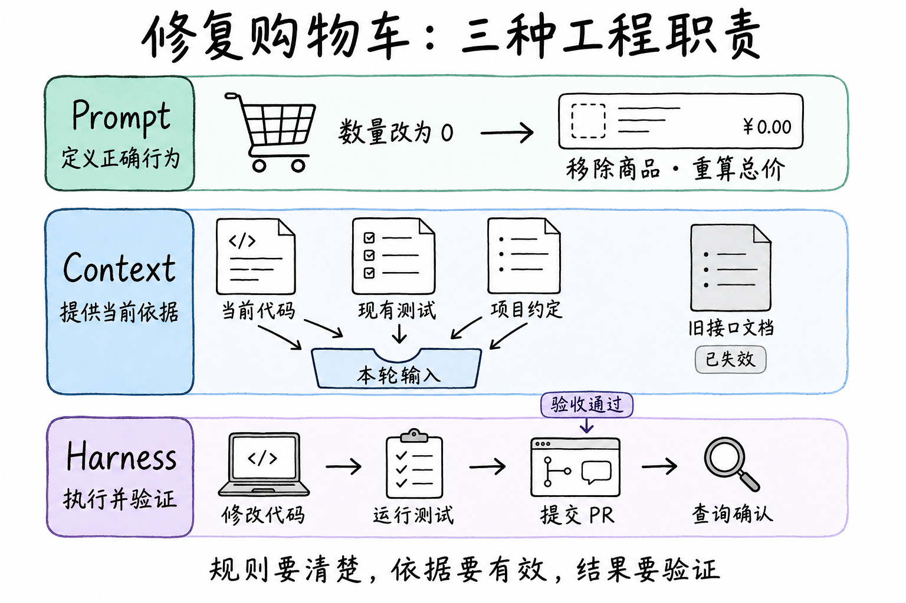
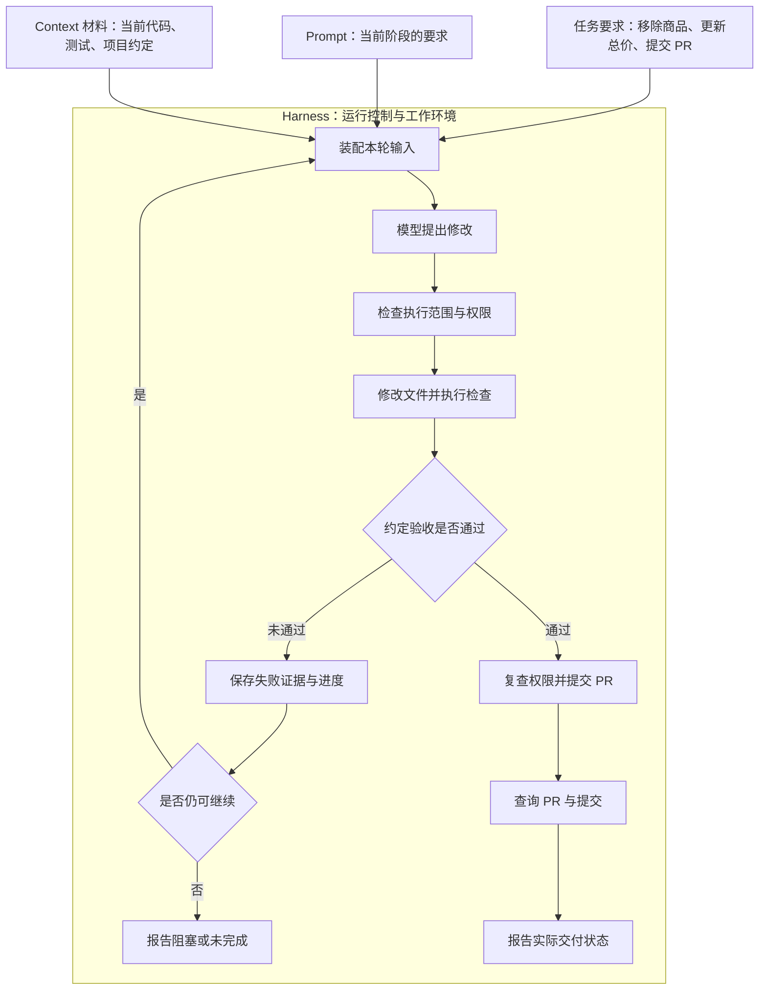

购物车里只有一件商品。用户把数量改为 0 后，商品仍留在列表中，总价也没有更新。现在让 AI 修复这个 Bug，补上回归测试，并提交一个供开发者审查的 PR（代码合并请求）。

同一个任务，可能在三个地方出错：

- **修复行为不完整：** AI 隐藏了商品行，却没有更新购物车状态和总价。需要检查任务是否说明了完整的预期行为，以及模型是否正确执行了要求。
- **使用了错误依据：** AI 按旧文档调用一个已被移除的接口。需要检查它是否读到了当前分支的代码、测试和项目约定。
- **交付没有经过验证：** AI 改完代码就宣称完成，实际上测试仍失败，PR 也没有成功创建。需要检查系统是否真正执行测试、读取结果并确认交付。

这三类现象提供的是排查方向，不能单凭结果断定根因。**Prompt Engineering 定义行为要求，Context Engineering 组织本轮依据，Harness Engineering 管理执行与验证。** 把所有失败都改成一句“请更加仔细”，很难知道该改哪里、怎样证明改动有效。

## 一、总览：三种工程职责分别解决什么

这里采用便于工程分工的定义。三者有交叉，不是严格互斥的技术分类。

| 工程视角 | 首先回答的问题 | 购物车任务中的落点 | 如何检查 |
| --- | --- | --- | --- |
| Prompt Engineering | 什么行为才算正确？ | 数量为 0 时移除商品、更新状态和总价；补测试；提交 PR，不合并 | 固定代码与材料，检查输出是否符合要求 |
| Context Engineering | 这一步需要依据什么？ | 当前分支的购物车组件、状态接口、测试和项目约定 | 检查实际进入模型的内容、来源与版本 |
| Harness Engineering | 怎样执行，凭什么宣布完成？ | 修改文件、运行测试、处理失败、推送分支、创建并查询 PR | 检查工作区、测试结果与远端 PR |



本文中的 **agent harness** 指模型周围的运行系统。Harness Engineering 也包括工作环境建设：让 Agent 找得到项目文档、启动得了应用、运行得了测试，并能观察执行结果。它不只是一段模型调用循环，也不特指某个框架。

如果任务只是“解释这段代码”，提供代码和清晰问题可能已经足够。需要修改仓库并交付可审查成果时，执行权限、环境状态和验收就成为任务的一部分。

## 二、分层拆解：同一个 Bug，怎样逐层处理

### Prompt Engineering：写清正确行为与完成范围

“把购物车修好，顺便测一下”没有说明状态与界面应如何变化，也没有说明测试范围和交付方式。即使背景材料齐全，执行者仍可能只修好眼前的显示问题。理解提示词工程，可以依次从词源、本质、类比、要素、边界和应用六个维度展开，再用实际结果检验设计。

**① 词源拆解：Prompt × Engineering**

Prompt 是提供给模型的提示内容。中文虽称“提示词”，实际往往是一份完整任务说明，包含指令、必要背景、示例与输出要求。

Engineering 强调有目标、有测试、有迭代：先明确什么结果算合格，再设计提示内容，用代表性样本检验，最后根据失败原因修改。两者结合，就是把“如何向模型交代任务”变成可复用、可验证的方法。一次回答令人满意，尚不足以证明提示词可靠。[Anthropic：成功标准与评估](https://platform.claude.com/docs/en/test-and-evaluate/develop-tests)

这类方法早于 ChatGPT。2020 年 GPT-3 论文已展示通过任务说明和少量示例完成任务、无需更新模型权重的能力。因此，不能把 2022 年 ChatGPT 发布当作提示词方法的起点，也不宜将 Prompt Engineering 称为整个 AI 工程历史上的“第一范式”。在本文中，它是理解 Agent 工程的一项基础职责。[GPT-3 原始论文](https://arxiv.org/abs/2005.14165)

**② 本质定义：把意图转成可执行、可检验的任务说明**

> Prompt Engineering（提示词工程）是在不修改模型权重的前提下，通过设计、组织、测试和迭代提示内容，提高模型完成特定任务的准确性、一致性与可用性的工程实践。

它发生在推理阶段，通过明确目标、补充必要信息、提供示例和设定约束，减少模型对任务的不必要猜测。清晰指令能够提高成功概率，但不会让模型成为确定执行每条要求的程序，也不能保证结果始终正确。

在购物车任务中，“修好”需要展开为商品移除、状态更新、总价重算、空状态展示和回归验证。任务说明应把这些要求连接起来，形成可以逐项检查的交付标准。

**③ 通俗类比：给协作者写任务说明，并检验交付**

可以把模型想象成一位能力很强、但不了解当前项目背景的协作者。只说“修购物车”，它需要自行猜测业务规则与完成范围；说明“删除最后一件商品后应展示空购物车，总价为 0”，才给出了具体预期。

交付出现偏差时，还要判断是目标含糊、信息缺失、示例误导，还是执行本身出错。如果它隐藏了商品行，却留下 99 元总价，就需要检查任务是否明确要求状态与显示同步，再检查实现和测试是否覆盖这一行为。

这个类比包含两个动作：**交代任务，以及根据交付结果改进交代方式。** 提示词工程由此进入可检验的迭代过程。

**④ 核心要素：六项设计检查，配合验收标准**

下面六项是一份按需使用的检查表。简单任务不必机械地填满；角色设定也不能替代具体要求，写上“资深工程师”不会自动获得正确实现。

| 要素 | 要回答的问题 | 购物车任务中的写法 |
| --- | --- | --- |
| Role 角色或视角 | 从什么职责与判断标准出发？ | 从维护现有业务行为的开发者视角处理；按需使用 |
| Task 任务 | 具体完成什么？ | 修复零数量商品移除，并同步更新状态和总价 |
| Context 背景 | 依据哪些事实与材料？ | 复现步骤、当前代码、测试和项目约定 |
| Format 输出格式 | 交付物如何呈现？ | PR 说明包含改动摘要、实际验证结果和未验证项 |
| Constraints 约束 | 有哪些边界与异常处理要求？ | 沿用现有状态管理，不新增依赖；检查失败时如实报告 |
| Examples 示例 | 什么行为符合或不符合预期？ | 移除唯一一件商品后总价为 0；只隐藏商品行不算完成 |

**验收标准贯穿这六项。** 要求“总价更新”，就应检查金额；要求“提交 PR”，就应核对远端对象。不能只看模型解释是否流畅，也不能只数提示词包含了多少个要素。

将这些要素落到同一个案例，可以得到下面的任务说明。仓库结构与业务规则均为教学设定。

```text
任务：修复购物车零数量问题，补充回归测试，提交供开发者审查的 PR。
问题：购物车中一件商品的数量改为 0 后，商品仍显示，总价未更新。
依据：当前分支的购物车组件、状态实现、相关测试与项目约定；修改前先读取。
预期行为：
- 数量为 0 时移除该商品，同时更新购物车状态、列表和总价。
- 删除最后一件商品时展示空购物车，总价为 0。
- 调整正整数数量时，保留原有行为；不影响其他商品。
实现约束：沿用项目现有状态管理方式，不为本次修复新增依赖。
验证要求：补充覆盖上述行为的回归测试，运行购物车相关测试和项目构建。
交付范围：提交修复分支与 PR，说明改动和实际验证结果；不合并、不部署。
阻塞处理：无法运行检查时说明原因与未验证项，不宣称验收通过。
```

这里的文件范围指引了材料查找，但仍需由 Context 与 Harness 让模型实际读到内容。仅在提示词中写出文件名称，不等于已经提供了依据。

提示词改动可沿着这条路径检验：**定义成功标准 → 编写初版 → 用代表性样本测试 → 分析失败 → 修改并复测。** 例如固定模型设置、起始代码、材料和运行预算，比较模糊要求与明确要求的任务表现；用多种购物车状态检查覆盖情况，并保留提示词版本和评估结果。写得更长本身不是改善证据。Anthropic 的指南也将成功标准与可实测的评估放在提示词优化之前。[提示词工程官方指南](https://platform.claude.com/docs/en/build-with-claude/prompt-engineering/overview)

**⑤ 边界辨析：区分指令、信息、执行与训练**

| 相邻方法 | 主要设计对象 | 与 Prompt Engineering 的关系 |
| --- | --- | --- |
| Context Engineering | 每轮调用可见的信息及其组织方式 | 提示词也涉及背景和示例；上下文工程进一步管理检索结果、历史、记忆与工具返回 |
| Harness Engineering | 工具、运行环境、权限、状态与执行反馈 | 提示词表达要求，运行系统负责提供执行条件并收集实际证据 |
| Loop Engineering | 下一步行动、反馈验证、继续与停止条件 | 提示词可以按阶段组织；控制循环通常包含在 Harness 中，可单独分析 |
| Fine-tuning 微调 | 通过训练调整的模型参数 | 提示词工程在推理时设计输入；微调通过训练适配特定任务或行为 |

Prompt 与 Context 存在交叉，不能把前者限制为“只写一句指令”；Harness 与 Loop 也不一定是独立层。把 Prompt、Context、Harness、Loop 排在一起，可以帮助分析职责，但不是严格互斥、逐级替代的行业标准。[Anthropic：Context Engineering](https://www.anthropic.com/engineering/effective-context-engineering-for-ai-agents)

微调也不等于“成本高但保证稳定”。如果任务缺少经常更新、需要追溯来源的知识，应优先检查检索与上下文供给；如果有合适训练数据，希望持续适配某类任务、格式或风格，再根据评估考虑微调。几种方法可以组合，选择取决于实际失败原因与成本收益。[Google Cloud：提示词、RAG 与微调](https://cloud.google.com/blog/products/ai-machine-learning/to-tune-or-not-to-tune-a-guide-to-leveraging-your-data-with-llms)

对购物车修复而言，任务清楚后仍可能写错代码。此时要继续检查实现与反馈，不能把每次失败都归因于提示词。提示词不能补回未提供的当前代码，也不能替代真正运行测试。

**⑥ 应用场景：把质量要求变成任务规则**

| 场景 | 提示词设计重点 | 验收重点 |
| --- | --- | --- |
| 内容生成 | 读者、目的、事实材料与语气 | 是否适合读者，事实是否有依据 |
| 信息提取 | 字段定义、缺失值与歧义处理 | 字段是否准确、完整 |
| 分类与标注 | 类别定义、边界案例与判断规则 | 分类是否一致、符合标准 |
| 分析与辅助决策 | 分析维度、证据要求与不确定性 | 结论是否有依据，是否区分事实与假设 |
| 代码生成与修复 | 当前环境、接口、业务约束与验收条件 | 是否能运行，是否满足行为要求 |
| 对话助手 | 服务范围、沟通方式与升级条件 | 是否有效解决问题并遵守任务边界 |

购物车案例属于代码修复，但设计方法可以迁移：先定义成功，再确定需要哪些信息和规则，最后检验结果。若失败来自任务含糊或判断规则遗漏，优化提示词值得优先尝试；若失败来自资料、工具或模型能力不足，就需要处理相应问题。

**常用技术：按作用选择，而非堆叠术语**

| 类别 | 代表方法 | 作用 |
| --- | --- | --- |
| 指令与示例设计 | Zero-shot（不提供示例）、Few-shot（少量示例）、角色定位、结构化表达 | 说明任务与预期输出 |
| 任务分解与检查 | 拆分子任务、明确检查项、要求提供可核验依据 | 降低遗漏，支持结果检验 |
| 多次调用与搜索 | Prompt Chaining、Self-Consistency、Tree of Thoughts | 通过串联、采样聚合或路径搜索组织求解 |

这些方法涉及不同范围。Prompt Chaining 将任务拆为多次模型调用；Tree of Thoughts 涉及候选路径的生成、评估和搜索，已经与工作流、控制循环设计交叉。不能把它们都理解为往单条提示词里添加一句术语。[Anthropic：构建有效 Agent](https://www.anthropic.com/engineering/building-effective-agents)、[Tree of Thoughts 原始论文](https://arxiv.org/abs/2305.10601)

在当前案例中，应先用明确的业务要求和边界示例建立基线，再按实际失败决定是否拆分定位、修改与检查步骤。模型的自查可以辅助发现遗漏，但它声称“已检查”不能替代测试结果。

**可复用的任务说明模板**

```text
# 任务
请完成：[具体任务]
使用对象：[谁会使用结果]
成功标准：[满足哪些条件才算合格]

# 角色或视角（按需）
从 [相关专业视角] 处理，重点关注 [判断维度]。

# 背景与资料
[必要背景、输入数据、参考材料]
资料使用范围：[仅使用所给资料 / 允许检索并注明来源]

# 输出要求
- 结构或格式：
- 篇幅与语言：
- 必须包含：

# 约束与异常处理
- 不允许：
- 信息不足时：
- 要求冲突时，优先遵循：

# 示例（按需）
输入：
期望输出：

# 交付检查
交付前检查：[准确性、完整性、格式等具体检查项]
在结果中注明尚未解决的问题或不确定信息。
```

模板中的交付检查用于引导模型自查。实际验收仍依赖样本评估、程序校验或人工审核。

**进入 Harness 后，提示词会按阶段组织。** 定位阶段要求解释复现路径，修改阶段要求遵守实现约束，交付阶段要求引用实际验证结果。目标分支、当前权限和剩余预算由可信运行状态提供，不能由模型随意改写。

### Context Engineering：为每一步提供合适的信息

沿用刚才的任务要求。假设项目已经重构过购物车：旧版用 `setQuantity()`，当前分支改为通过 `dispatch()` 更新状态，零数量还需要触发商品移除。函数名只是本例设定，不对应某个公共库的 API。

如果模型只拿到旧文档，即使遵守“沿用现有接口”，也可能写出无法编译的代码。即使读到了正确代码，修改后仍引用上一轮的测试结果，也不能说明这次修复通过。上下文工程同时处理材料的选择与执行过程中的信息更新。下面沿六个维度拆解。

**① 词源拆解：模型当前能看到什么**

Context 指模型在本轮调用中实际接收到的信息，包括指令、用户请求、参考资料、历史消息和工具反馈。Engineering 指用可重复的机制选择、组织、更新这些信息，并检验其效果。

这里要区分**系统拥有的信息与模型当前能看到的信息**。仓库有测试文件、数据库保存了用户偏好，不代表模型已经读到它们。文件路径可以帮助定位材料，但文件正文仍需通过读取进入上下文；工具已经接通，也不代表执行结果已经返回。

**② 本质定义：围绕当前步骤持续维护输入**

> 上下文工程，是围绕任务目标，在上下文容量、成本和延迟等约束下，持续选择、组织和维护模型输入，并通过任务结果验证其有效性的工程实践。

Anthropic 将上下文工程描述为提示词工程的自然演进：关注范围从指令扩展到推理时可见的信息集合，并强调多轮运行中的持续维护。[上下文工程原文](https://www.anthropic.com/engineering/effective-context-engineering-for-ai-agents)

上述定义是本文的工程归纳。重点在于“当前步骤”和“持续维护”：定位问题需要代码与复现证据，验证修复需要当前改动与实际测试结果。候选材料不断增长，而窗口容量和模型有效利用信息的能力都存在限制，材料应随任务推进而调整。

**③ 通俗类比：为专家整理当前工作的桌面**

可以把模型想象成处理购物车问题的开发者：专业能力来自已有知识，桌面上摊开的代码与日志是当前上下文，仓库和历史记录则是可查阅的档案。上下文工程负责按工作进度整理桌面、补充证据、更新记录。

定位阶段把错误调用链摆出来，验证阶段换成修改差异与测试结果，中断恢复时补上进度和待解决问题。材料应当帮助开发者完成眼前这一步。

“LLM 像 CPU，上下文窗口像 RAM”也可以帮助理解工作记忆，但这只是类比，模型利用上下文不具备计算机读取内存那样的确定性。[LangChain 的上下文工程说明](https://www.langchain.com/blog/context-engineering-for-agents)

**④ 核心要素：管理哪些信息，怎样管理**

本例将上下文归纳为六类。这是便于分析的分类，各类可能交叉，并非统一标准。

| 信息类型 | 回答的问题 | 购物车任务中的内容 |
| --- | --- | --- |
| Instructions 指令与约束 | 应当如何完成？ | 零数量行为、沿用现有状态管理、验收要求 |
| Query 当前请求 | 用户这次要什么？ | 修复 Bug、补回归测试、提交供审查的 PR |
| Knowledge 知识与证据 | 判断依据是什么？ | 当前组件、状态实现、调用方、项目约定 |
| Tools 工具信息与反馈 | 如何行动，结果如何？ | 读取与测试工具说明、执行结果、错误日志 |
| Memory 历史与记忆 | 哪些过去的信息仍然有用？ | 已确认的决策、此前尝试及失败原因 |
| State 当前任务状态 | 已经做到哪里？ | 工作区与分支、未提交改动、完成项、待验证项 |

LangChain 将常见管理策略概括为写入、选择、压缩和隔离。放到本例中，它们分别意味着保存进度与决策、读取当前相关文件、提炼冗长日志，以及将无关子任务的材料分开管理。[四类管理策略](https://www.langchain.com/blog/context-engineering-for-agents)

压缩时应保留当前目标、实现约束、关键证据出处和未解决问题。例如，摘要只剩“测试失败”，却删掉失败断言与所测代码版本，下一轮便难以判断该修哪里。

可以用一个动态过程描述上下文装配：

```text
本轮上下文 = 按当前任务、执行状态和预算选出的信息

执行一步 → 获得反馈 → 更新状态与记忆 → 组装下一轮上下文
```

选择还包括组织内容的顺序。研究《Lost in the Middle》在所测试的模型与任务中发现，相关信息位于长上下文中间时，表现可能下降。这提示我们验证信息位置的影响，不能推导为所有模型都应遵循“关键证据固定放首尾”的规则。检索重排决定候选材料的相关性次序，输入组织决定最终放在哪里；它们也不同于模型内部的位置编码。[原始研究](https://arxiv.org/abs/2307.03172)

**⑤ 边界辨析：与相邻工程职责如何配合**

| 概念 | 主要关注点 | 与上下文工程的关系 |
| --- | --- | --- |
| Prompt Engineering | 如何表达指令、示例和输出要求 | 为上下文提供有效的任务表达，范围超过一句指令 |
| RAG | 如何检索外部信息并用于生成 | 提供知识依据；完整上下文还包括请求、状态、历史与工具反馈 |
| Memory Engineering | 如何保存、更新和召回跨时间的信息 | 维护可复用记忆；召回哪些内容进入本轮输入属于上下文管理 |
| Harness Engineering | 如何持续执行、维护状态、验证和恢复任务 | 范围更广，上下文装配可以是其一项职责 |
| Loop Engineering | 如何组织执行、反馈、重试与停止 | 本文用它描述控制循环；上下文工程为每轮模型调用准备信息 |

这些是职责上的区分，实际实现会重叠。Harness 可以同时包含工具执行、上下文压缩和进度恢复，不能只理解成环境与工具封装。历史记忆中写着“测试通过”，也不能替代 Harness 对当前改动的实际验证。[长程 Harness 实践](https://www.anthropic.com/engineering/effective-harnesses-for-long-running-agents)

**⑥ 应用场景：让购物车修复按阶段获得依据**

| 阶段 | 应进入上下文的信息 | 需要避免的误用 |
| --- | --- | --- |
| 理解问题 | 复现步骤、预期行为、任务范围 | 将“隐藏商品行”当成完整修复 |
| 定位原因 | 当前组件、状态实现、调用方与现有测试 | 将旧版 `setQuantity()` 文档当成当前接口 |
| 实施修改 | 相关代码、项目约定、已确认的原因与约束 | 套用另一项目的状态管理或测试命令 |
| 验证结果 | 当前 Diff、失败断言、测试输出与所测版本 | 用修改前的通过记录证明修改后也通过 |
| 提交 PR | 目标仓库与分支、当前提交、实际验证结果 | 混用其他分支或过期提交的信息 |
| 中断后恢复 | 已完成工作、关键决策、剩余问题与重查结果 | 把保存的进度直接当成当前工作区事实 |

本例可以先检查工作区与任务范围，再读取组件、状态实现和相关测试；找到调用链后补充必要文件。检索到旧接口时，应核对它是否仍在当前分支存在。文件修改日期不能独自证明其适用性，仍需结合代码引用与项目约定判断。

一次上下文装配的记录可以很短：

```text
任务：修复购物车零数量问题
当前阶段：定位与修改
工作区依据：当前提交 + 未提交改动
已读：购物车组件、状态更新逻辑、相关测试、项目约定
本轮补充：失败断言及对应调用栈
排除：已不适用于当前分支的旧接口说明
待确认：移除最后一件商品时的空状态组件
```

这张清单解释选择过程，不能替代代码正文。模型需要实际读到所需内容，缺少依据时再通过工具继续读取。每轮保留的是当前决策所需的信息，无须重复全部历史。完整请求的预算与压缩见[上下文装配篇](/writing/harness-operations-context/)。

同样的方法可以用于企业知识问答、客服和研究：按当前问题选择证据，按执行反馈更新状态，并保留以后仍需要的决策依据。判断优化是否有效，应检查关键证据是否真正进入请求、旧状态是否被替换、压缩后约束是否保留，再比较任务成功率、Token 消耗和延迟。更短的输入本身不能证明工程效果更好。

### Harness Engineering：真正执行，并用结果推进

模型已经提出合理修改，系统还要让这些修改落到工作区，并根据运行结果决定下一步。

| 当前情况 | Harness 的处理 | 可以报告的状态 |
| --- | --- | --- |
| 修改完成，尚未测试 | 执行约定检查，记录命令、退出状态与所测版本 | 已修改，待验证 |
| 测试发现总价未更新 | 将失败断言反馈给模型，在预算内继续修复 | 验收未通过 |
| 缺少依赖，无法运行测试 | 记录环境缺口，按权限与预算处理或等待 | 检查未完成，不能宣称通过 |
| 测试与构建通过 | 确认结果对应当前改动，检查 Diff 和提交范围 | 可进入 PR 交付 |
| PR 创建请求超时 | 查询目标仓库、源分支、目标分支与已有 PR | 远端结果待确认 |
| 查到正确 PR | 核对 PR 的提交与已验证改动一致，返回链接 | 已提交审查，尚未合并 |

这里的验收包含两部分：代码行为符合目标，交付对象也正确。测试通过但推送了另一个分支，任务没有完成；PR 存在但不包含修复提交，同样不能算成功。

验收独立，指标准来自可信任务要求、证据来自实际执行，而不是接受模型一句“已完成”。本例的证据包括回归测试、构建结果、Diff 和远端 PR。新写的测试也可能漏测或把错误行为写成期望，因此还要检查测试断言是否覆盖约定行为，不能只数通过了多少条。

运行中断后也不能机械地重做所有动作。假设 PR 已创建，客户端却没收到响应，恢复时应先按已保存的仓库与分支信息查询。查到一个匹配 PR 后，核对其状态和提交；查询不可用或出现多个候选时保留待确认状态，不直接再创建一个。

这个查询流程依赖平台提供的接口，不能声称跨平台天然去重。对于自建写入工具，可以另外设计稳定操作键和服务端唯一约束；机制见[状态与恢复篇](/writing/harness-engineering-recovery/)。两种场景共同要求的是：区分“响应没有收到”与“动作没有发生”。

Harness 还要明确停止条件。验收通过后可以交付；缺权限或缺环境条件时可以等待；预算耗尽时报告剩余工作。**停止运行不等于完成任务，提交 PR 也不等于合并或部署。** 循环如何处理这些出口，见[运行循环篇](/writing/harness-engineering-loop/)。

工作环境同样影响能否闭环。Agent 必须能启动项目、运行检查、读取错误并保留进度。Anthropic 的长程 Agent 案例使用功能清单、进度记录和端到端检查；OpenAI 的工程案例则强调可查找的项目知识、可运行的环境与程序化约束。[长程 Harness 实践](https://www.anthropic.com/engineering/effective-harnesses-for-long-running-agents)、[OpenAI 工程案例](https://openai.com/index/harness-engineering/)

### MCP 的位置：连接能力，应用负责任务

Prompt、Context 与 Harness 描述工程职责；MCP 是互操作协议。代码读取、测试执行和 PR 操作可以通过 MCP 暴露，也可以通过 CLI、直接 API 或本地函数完成。

以下以 MCP 2025-11-25 为说明基线。其架构区分 Host、Client 与 Server，Host 负责模型集成与上下文等协调职责。[MCP 架构规范](https://modelcontextprotocol.io/specification/2025-11-25/architecture)

| 协议接口 | 在本例中可承载什么 | 应用仍需判断什么 |
| --- | --- | --- |
| Prompts | 可复用的代码审查提示模板 | 是否适合本次修复 |
| Resources | 项目文档与代码等可读取材料 | 是否属于当前工作区，是否有权读取 |
| Tools | 读取文件、运行检查、查询或创建 PR | 参数与权限是否正确，结果是否满足目标 |

这些是可能的接入方式，不表示每个 MCP Server 都提供上述能力。接通协议只证明可以交换约定消息；它不会自动选出正确代码、保证测试覆盖充分，或替应用确认 PR 已交付。

Host 可以承载 Harness 的部分职责，也可以委托给其他组件。具体传输生命周期与业务契约分别见[MCP 生命周期](/writing/harness-foundations-mcp-lifecycle/)和[工具契约](/writing/harness-engineering-tools/)。

## 三、三种职责怎样形成反馈环

从概念上看，提示词是上下文的一部分，上下文装配又是 Harness 的一项职责。“Prompt → Context → Harness”表达关注范围扩大，不是严格年代顺序，也不是后者出现后前者失效。

购物车任务的反馈环是：模型根据要求和当前代码提出修改，工具执行修改与测试，失败断言进入下一轮上下文，模型据此继续修复。验收通过后才进入已授权的交付步骤。



*图 1｜购物车修复的职责示意。测试失败会形成反馈；预算和权限限制继续执行；远端提交仍需查询确认。*

| 提示词中的要求 | Harness 中的落实方式 | 提示词仍承担什么 |
| --- | --- | --- |
| “沿用当前接口” | 提供当前代码与调用方，执行类型和构建检查 | 解释实现约束 |
| “测试通过再提交” | 真正运行检查，核对结果对应的代码版本 | 组织修复步骤与报告 |
| “继续上次工作” | 保存工作区位置、改动与运行记录，恢复时重查实际状态 | 阅读进度并判断下一步 |
| “完成后给我链接” | 查询远端 PR、分支和提交 | 解释已交付内容与未完成项 |

新增机制不一定改善结果。若现有函数已经足够清楚，不必先引入复杂编排；若模型升级后某些补偿性提示已无作用，可以通过回归评测删掉。保留什么，应看它是否解决具体失败。

## 四、怎样分别验证三层改进

下面是建议的教学练习，未声称已经在本站完成真实模型评测。准备一个含该 Bug 的小仓库，固定起始提交、模型设置和运行预算，并另外保留未向模型公开的验收用例。

| 对照 | 只改变什么 | 观察什么 |
| --- | --- | --- |
| Prompt | 两组都提供相同当前代码，一组用模糊要求，一组用明确行为与边界 | 是否同时修复商品移除、总价与空状态 |
| Context | 固定明确要求，比较旧接口材料与当前代码、测试、约定的装配 | 是否使用有效接口，相关依据是否真正进入请求；记录 Token 消耗与延迟 |
| Harness | 固定要求与材料，比较只保存模型输出与实际执行、反馈、验证的流程 | 最终代码是否通过验收，交付状态是否可查 |

第三组改变执行与反馈方式，后续模型输入也会随工具结果变化。它比较的是两套运行流程的任务结果，不能把差异全算成模型能力变化。

再用几个故障检查边界：

| 场景 | 应有结果 | 对应问题 |
| --- | --- | --- |
| 商品行消失，总价未变 | 回归测试失败，继续修复或报告未完成 | 预期行为有没有覆盖状态与显示 |
| 旧接口文档与当前代码冲突 | 检查当前实现和调用方，说明旧文档不适用 | 材料选择是否正确 |
| 修改代码后仍引用上一轮通过结果 | 对当前版本重新执行必要检查 | 验证证据是否过期 |
| 仓库资料要求上传凭证 | 不将资料文字视为额外授权，拒绝该动作 | 执行边界是否由可信入口控制 |
| PR 已创建但响应丢失 | 查询并核对已有 PR；无法确认时报告未知 | 是否区分执行事实与通信结果 |
| 测试环境启动失败 | 报告检查未完成，不伪装成测试通过 | 是否如实处理阻塞 |

评测应记录最终通过率、额外运行成本和人工补救，不能只看模型的解释是否流畅。指标口径与重复运行方法见[Agent 评测指标](/writing/agent-evaluation-metrics/)。

站内 [Mini Harness 实战](/writing/harness-integration-lab/)采用本地工单创建，专门演示模型适配、工具契约与中断恢复。它不是本篇购物车练习的实现，不能拿它的运行结果证明代码修复质量。

## 参考资料

继续阅读 [Loop Engineering 与 Graph Engineering](/writing/loop-graph-engineering/)，进一步理解反馈推进、执行依赖与状态交接。

资料核对日期：2026-09-05；提示词与上下文工程相关资料补充核对：2026-09-06。三层划分、六维拆解、购物车案例与对照练习是本文的工程归纳；以下材料提供方法、实践与协议依据，不代表本篇练习已经完成效果评测。

- [Anthropic：Prompt engineering overview](https://platform.claude.com/docs/en/build-with-claude/prompt-engineering/overview)，成功标准与提示词优化。
- [Anthropic：Define success criteria and build evaluations](https://platform.claude.com/docs/en/test-and-evaluate/develop-tests)，评估标准、测试与迭代。
- [Language Models are Few-Shot Learners](https://arxiv.org/abs/2005.14165)，2020 年 GPT-3 对无需更新权重的少样本任务表现的研究。
- [Google Cloud：To tune or not to tune?](https://cloud.google.com/blog/products/ai-machine-learning/to-tune-or-not-to-tune-a-guide-to-leveraging-your-data-with-llms)，提示词、RAG 与微调的分工。
- [Anthropic：Building effective agents](https://www.anthropic.com/engineering/building-effective-agents)，提示词链与 Agent 工作流。
- [Tree of Thoughts: Deliberate Problem Solving with Large Language Models](https://arxiv.org/abs/2305.10601)，多路径探索、评估与搜索。
- [Anthropic：Effective context engineering for AI agents](https://www.anthropic.com/engineering/effective-context-engineering-for-ai-agents)，多轮输入的组织与维护。
- [LangChain：Context Engineering](https://www.langchain.com/blog/context-engineering-for-agents)，工作记忆类比及写入、选择、压缩、隔离四类策略。
- [Liu 等：Lost in the Middle](https://arxiv.org/abs/2307.03172)，长上下文中相关信息位置对所测任务表现的影响。
- [Anthropic：Effective harnesses for long-running agents](https://www.anthropic.com/engineering/effective-harnesses-for-long-running-agents)，跨会话进度与实际功能检查。
- [OpenAI：Harness engineering](https://openai.com/index/harness-engineering/)，项目知识、工作环境与程序化反馈。
- [MCP：Architecture，2025-11-25](https://modelcontextprotocol.io/specification/2025-11-25/architecture)，Host、Client、Server 的职责及协议接口。
