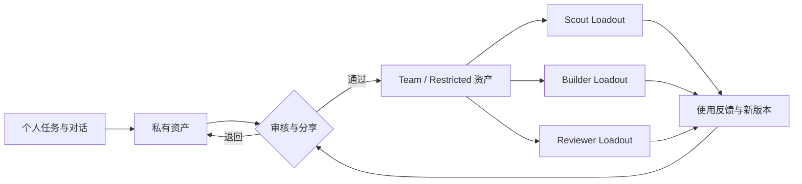

团队记忆的难点不是让所有 Agent 看见同一份数据，而是让不同角色继承恰当的经验。TencentDB Agent Memory 用资产、可见性和 Loadout 把“共享”拆成一组显式动作。

*图 1｜经验先成为有归属的资产，再经审核和装配进入不同角色。*

## 四类资产承担不同用途

Chat Memory 保存事实、偏好、决策和交互；Skill 保存带触发边界、步骤、资源和验证规则的可执行经验；Wiki 组织文档关系；CodeGraph 组织符号、调用与影响路径。它们不该使用完全相同的审核标准。

错误 Chat Memory 可能让回答失真，错误 Skill 可能直接放大执行副作用，过期 Wiki 会误导判断，陈旧 CodeGraph 会制造错误影响分析。控制面需要同时展示内容、来源、Owner、版本、状态、使用情况和绑定关系。

## 可见性回答谁能看，Loadout 回答谁应该拿

官方设计区分 `private`、`team`、`restricted` 与面向 Agent 的定向装配。Owner 管理自己的资产，Team 角色和 ACL 决定可见范围；Loadout 再把特定资产绑定给 Scout、Builder、Reviewer 等 Agent。

这比单纯的多租户 scope 多一步：一个人有权读取团队 Wiki，不代表每个自动运行的 Agent 都应该默认获得它。最小权限不仅减少泄漏，也减少无关上下文和错误 Skill 被触发的机会。

## 发布 Skill 应像发布代码

从会话提炼出的 Skill 只有在适用条件、输入输出、失败路径和验证方法被检查后，才有资格从个人候选进入团队资产。更新后需要版本、灰度、回滚和使用反馈；高风险 Skill 还应限制工具权限与运行环境，而不是仅靠“审核通过”四个字。

同样，文档和代码变化后，Wiki ingest 与 CodeGraph sync 必须形成明确的新鲜度信号。团队经验复用的前提，是资产能持续退出，而不是只会不断增加。

这把 [Agent 记忆设计：一条记忆跨团队流动之后](/writing/agent-memory-governance/)中的抽象治理问题具体化：Owner、状态、版本、可见性和 Agent 绑定都应成为一等字段，而不是埋在 Prompt 约定中。

## Beta 阶段最重要的是保持可逆

官方明确把 Team Memory 标注为 Beta，路线图仍包含记忆编辑、搜索和 Agent 模板等能力。这时最稳妥的采用方式是小范围、可观察、可退出：固定提交或版本；为关键资产保留原始来源；默认私有；共享需要审核；高风险 Skill 在隔离环境验证；Proxy 失败时能够绕过或降级。

官方资产与权限说明

- [Memory Hub 与团队玩法](https://github.com/TencentCloud/TencentDB-Agent-Memory/blob/2ee22397f6091b8cd3ea847bc1edb04d3bec0c94/README_CN.md#memory-hub-不是展板是操作台)
- [团队记忆与可见性](https://github.com/TencentCloud/TencentDB-Agent-Memory/blob/2ee22397f6091b8cd3ea847bc1edb04d3bec0c94/README_CN.md#一支-agent-团队共享经验不共享隐私)
- [`MemoryKnowledge` 源码目录](https://github.com/TencentCloud/TencentDB-Agent-Memory/tree/2ee22397f6091b8cd3ea847bc1edb04d3bec0c94/MemoryKnowledge)

