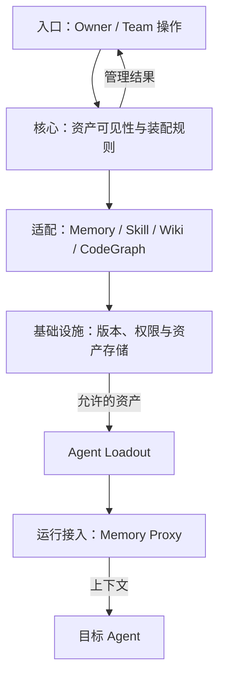
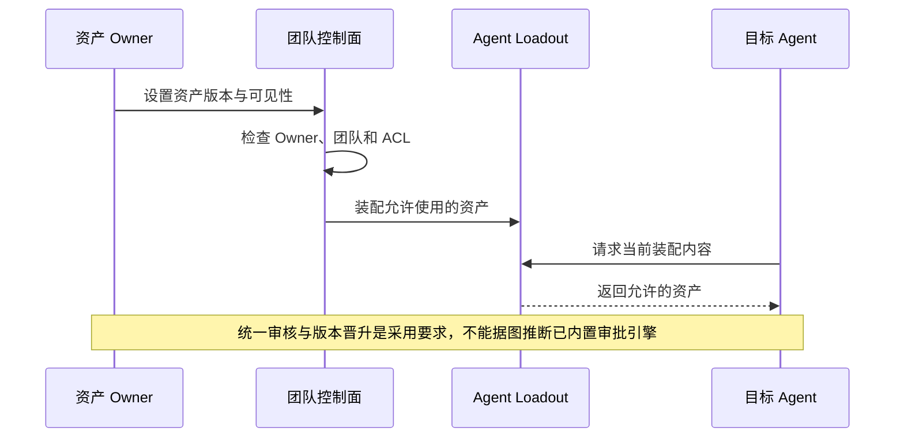

## 定位与价值

本篇检查一条私有经验如何成为团队资产，再进入特定 Agent 的 Loadout；有权查看不等于应该自动加载。

完整定位与安装见[项目总览](/writing/tencentdb-agent-memory-overview/)。

研究基线：[TencentCloud/TencentDB-Agent-Memory @ 2ee2239](https://github.com/TencentCloud/TencentDB-Agent-Memory/blob/2ee22397f6091b8cd3ea847bc1edb04d3bec0c94/README.md)；源码与社区核对日期为 2026-09-06。

## 技术架构



*图 1｜职责与数据流；逻辑分层不要求分开部署。*

## 核心机制



*图 2｜本篇关键流程的职责示意；部署者提出的验收要求与框架内建行为需按正文区分。*

### 资产与可见性的分工

#### 四类资产承担不同用途

Chat Memory 保存事实、偏好、决策和交互；Skill 保存带触发边界、步骤、资源和验证规则的可执行经验；Wiki 组织文档关系；CodeGraph 组织符号、调用与影响路径。它们不该使用完全相同的审核标准。

错误 Chat Memory 可能让回答失真，错误 Skill 可能直接放大执行副作用，过期 Wiki 会误导判断，陈旧 CodeGraph 会制造错误影响分析。控制面需要同时展示内容、来源、Owner、版本、状态、使用情况和绑定关系。

#### 可见性回答谁能看，Loadout 回答谁应该拿

官方设计区分 `private`、`team`、`restricted` 与面向 Agent 的定向装配。Owner 管理自己的资产，Team 角色和 ACL 决定可见范围；Loadout 再把特定资产绑定给 Scout、Builder、Reviewer 等 Agent。

这比单纯的多租户 scope 多一步：一个人有权读取团队 Wiki，不代表每个自动运行的 Agent 都应该默认获得它。最小权限不仅减少泄漏，也减少无关上下文和错误 Skill 被触发的机会。


### Loadout 与发布验证

#### 发布 Skill 应像发布代码

从会话提炼出的 Skill 只有在适用条件、输入输出、失败路径和验证方法被检查后，才有资格从个人候选进入团队资产。更新后需要版本、灰度、回滚和使用反馈；高风险 Skill 还应限制工具权限与运行环境，而不是仅靠“审核通过”四个字。

同样，文档和代码变化后，Wiki ingest 与 CodeGraph sync 必须形成明确的新鲜度信号。团队经验复用的前提，是资产能持续退出，而不是只会不断增加。

这把 [Agent 记忆设计：一条记忆跨团队流动之后](/writing/agent-memory-governance/)中的抽象治理问题具体化：Owner、状态、版本、可见性和 Agent 绑定都应成为一等字段，而不是埋在 Prompt 约定中。

#### Beta 阶段最重要的是保持可逆

官方明确把 Team Memory 标注为 Beta，路线图仍包含记忆编辑、搜索和 Agent 模板等能力。这时最稳妥的采用方式是小范围、可观察、可退出：固定提交或版本；为关键资产保留原始来源；默认私有；共享需要审核；高风险 Skill 在隔离环境验证；非必要记忆服务失败时可降级为不注入记忆，但身份、数据范围和执行权限必须保持原约束；如果关键授权依赖该服务，则应停止操作。

<details>
<summary>官方资产与权限说明</summary>

- [Memory Hub 与团队玩法](https://github.com/TencentCloud/TencentDB-Agent-Memory/blob/2ee22397f6091b8cd3ea847bc1edb04d3bec0c94/README_CN.md#memory-hub-不是展板是操作台)
- [团队记忆与可见性](https://github.com/TencentCloud/TencentDB-Agent-Memory/blob/2ee22397f6091b8cd3ea847bc1edb04d3bec0c94/README_CN.md#一支-agent-团队共享经验不共享隐私)
- [`MemoryKnowledge` 源码目录](https://github.com/TencentCloud/TencentDB-Agent-Memory/tree/2ee22397f6091b8cd3ea847bc1edb04d3bec0c94/MemoryKnowledge)

</details>

## 快速上手

在固定提交的 MemoryProxy 目录安装开发依赖后运行。此最小实验只检查查询抽取，团队 ACL 与 Loadout 仍按本篇场景另行验收。

```bash
npx vitest run src/common/__tests__/user-query-extractor.test.ts
```

安装与基础示例见[项目总览](/writing/tencentdb-agent-memory-overview/#快速上手)。本篇从同一环境继续，按文中的故障场景检查结果。

模型、执行环境与存储等共用配置，以及安装常见问题，见[总览的三个配置项](/writing/tencentdb-agent-memory-overview/#快速上手)。本轮已核对测试文件与运行入口，未在本文环境执行这条上游测试命令。

## 生态与社区

许可证、官方集成、提交与 Issue 样本统一见[项目总览的生态与社区](/writing/tencentdb-agent-memory-overview/#生态与社区)。

## 源码阅读路径

公共安装入口见项目总览。本篇沿相关模块追踪到具体实现与测试：

| 顺序 | 目录 → 文件 | 函数、对象或验证重点 |
| --- | --- | --- |
| 1 | [MemoryCore/src/metadata/service/permission-checker.ts](https://github.com/TencentCloud/TencentDB-Agent-Memory/blob/2ee22397f6091b8cd3ea847bc1edb04d3bec0c94/MemoryCore/src/metadata/service/permission-checker.ts) | 资产可见性与权限检查 |
| 2 | [MemoryCore/src/core/skill/skill-permission.ts](https://github.com/TencentCloud/TencentDB-Agent-Memory/blob/2ee22397f6091b8cd3ea847bc1edb04d3bec0c94/MemoryCore/src/core/skill/skill-permission.ts) | Skill 具体权限规则 |
| 3 | [MemoryProxy/src/common/__tests__/user-query-extractor.test.ts](https://github.com/TencentCloud/TencentDB-Agent-Memory/blob/2ee22397f6091b8cd3ea847bc1edb04d3bec0c94/MemoryProxy/src/common/__tests__/user-query-extractor.test.ts) | 代理查询抽取测试；不覆盖完整团队 ACL |
