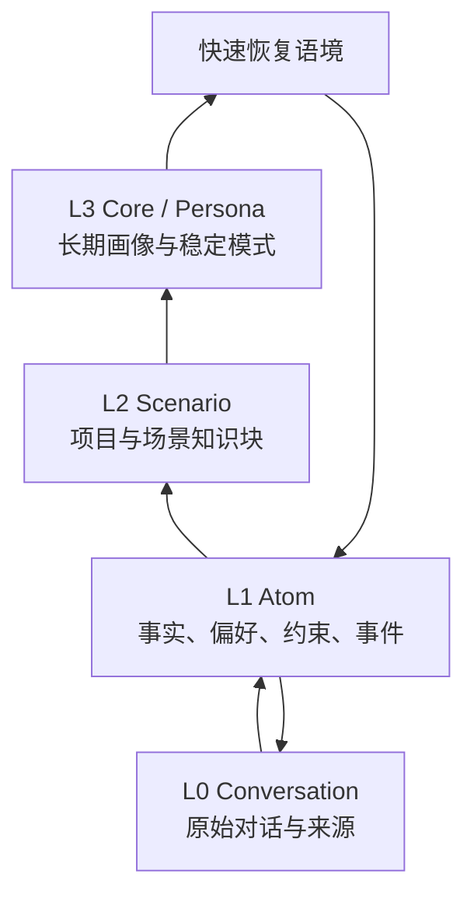

> TencentDB Agent Memory 研究系列：[1. 全景](/writing/tencentdb-agent-memory-overview/)｜[2. 接入链路](/writing/tencentdb-agent-memory-proxy/)｜[3. 分层记忆](/writing/tencentdb-agent-memory-layers/)｜[4. 团队治理](/writing/tencentdb-agent-memory-governance/)｜[5. 整体判断](/writing/tencentdb-agent-memory-synthesis/)

TencentDB Agent Memory 的 L0–L3 表示认识被提炼的程度：从原始对话，逐步形成事实、场景和长期画像。它与 OpenViking 的 L0/L1/L2 读取精度不是同一套概念。

*图 1｜高层用于快速进入语境，具体判断仍应能回到低层证据。*

## 四层不是越高越真实

L0 保存完整交互，适合核对原话、时间和来源；L1 把对话拆成可精确召回的事实与约束；L2 围绕项目或场景组织信息；L3 总结长期 Persona 与稳定模式。层级越高，读取越便宜、覆盖越广，也离原始证据越远。

例如“这次不要重构旧鉴权模块”可以成为 L1 项目约束，多个相关结论形成 L2 场景；只有在跨任务长期稳定时，才可能影响更高层认识。若一次临时妥协被直接提升为 Persona，系统会把偶然偏好变成持续偏见。

## 写入是一条异步认识管线

对话先被 L0 Recorder 捕获，再由 L1 Extractor、去重逻辑、Scene Extractor 与 Persona Generator 分阶段加工。分层处理让每一步可以使用不同触发条件和存储，但也会产生延迟、重复、层间漂移与部分失败。

因此每条派生记忆至少要保留来源会话、生成时间、生成器版本和作用域。高层内容修改或删除时，还要明确是只改当前画像，还是使下游重新从低层重建。官方路线图把 L1–L3 可编辑列为后续工作，也说明人工校准仍在演进。

## 读取要高层恢复、低层核验

召回可以先用 L2/L3 快速进入场景，再通过 BM25、向量检索与 RRF 回到 L1/L0 的具体材料，并受条数、字符和超时预算约束。高层不应替代证据，而应成为检索路由。

生产评测至少包含三类反例：临时要求没有污染长期 Persona；过期事实不会因高层摘要继续生效；用户可以从一个错误 L3 追到来源并完成修正。相关方法可参考 [Agent 记忆设计：保留历史还是维护当前事实](/writing/agent-memory-writing/)。

源码模块与官方说明

- [技术实现说明](https://github.com/TencentCloud/TencentDB-Agent-Memory/blob/2ee22397f6091b8cd3ea847bc1edb04d3bec0c94/README_CN.md#技术实现)
- [`MemoryCore/src/core`](https://github.com/TencentCloud/TencentDB-Agent-Memory/tree/2ee22397f6091b8cd3ea847bc1edb04d3bec0c94/MemoryCore/src/core)
- [路线图：记忆编辑与搜索](https://github.com/TencentCloud/TencentDB-Agent-Memory/blob/2ee22397f6091b8cd3ea847bc1edb04d3bec0c94/ROADMAP_CN.md)

---

上一篇：[Proxy 接入链路](/writing/tencentdb-agent-memory-proxy/)。

下一篇：[资产、权限与 Loadout 如何组织团队经验](/writing/tencentdb-agent-memory-governance/)。
