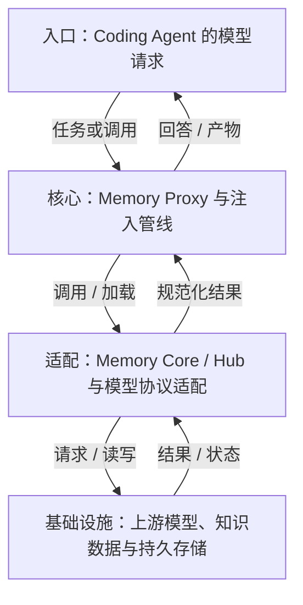
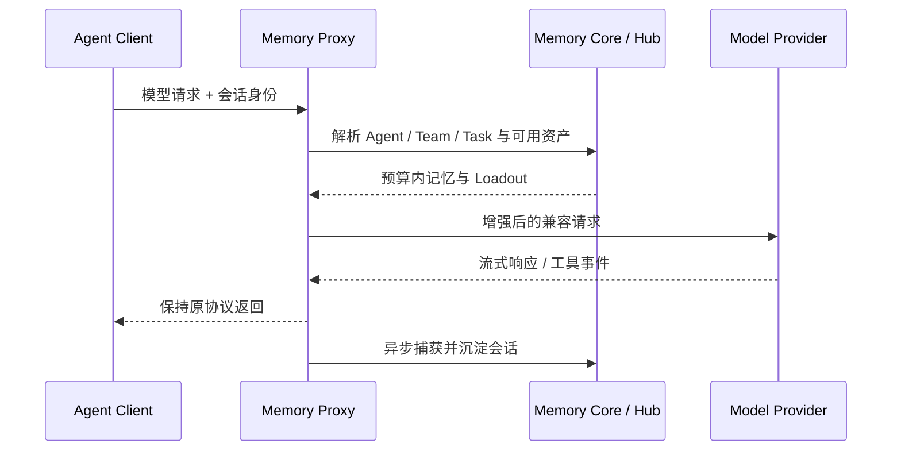
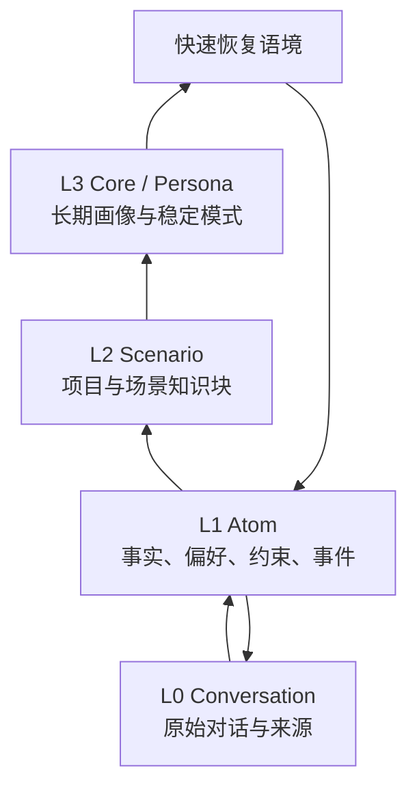

## 定位与价值

TencentDB Agent Memory 是通过协议代理给多种 Agent 接入团队记忆的服务系统；它集中处理检索注入、回写和资产装配，减少每个客户端分别修改记忆逻辑的工作。

适合愿意维护代理与团队资产控制面的部署；当前 Team Memory 为 Beta，不适合将接入成功直接当作隔离、治理和生产 SLA 已满足。

研究基线：[TencentCloud/TencentDB-Agent-Memory @ 2ee2239](https://github.com/TencentCloud/TencentDB-Agent-Memory/blob/2ee22397f6091b8cd3ea847bc1edb04d3bec0c94/README.md)；源码与社区核对日期为 2026-09-06。

## 技术架构



*图 1｜按职责归纳的调用地图；箭头表示请求与结果，不表示四个独立部署服务。*

## 核心机制

### 代理怎样注入并回写

#### 先看四个平面

| 平面 | 核心职责 | 需要验证的边界 |
|---|---|---|
| 接入面 | Proxy 兼容不同 Agent 的模型协议 | 注入是否改变原始请求，流式与工具调用是否完整 |
| 记忆面 | L0 对话、L1 原子、L2 场景、L3 Persona | 提炼错误能否回到原文并被修正 |
| 知识面 | Wiki、CodeGraph、Skill | 文档和代码变化后资产是否及时更新 |
| 控制面 | Team、Owner、可见性、ACL、Loadout | 哪个身份能读、改、分享和装配什么 |

这四层解释了为什么它不能只与一个记忆算法比较。Memory Core 负责提炼和召回，Memory Knowledge 负责文档与代码，Memory Hub/Panel 负责资产与权限，Proxy 负责不改 Agent 源码的接入路径。系统覆盖面更广，也拥有更大的部署和治理面。

TencentDB Agent Memory 选择把 Memory Proxy 放在 Agent 与模型端点之间。使用者修改 base URL，就可以让 Claude Code、Codex、Hermes 等客户端经过同一条记忆链路，不必分别实现插件、Hook 或 MCP Server。



*图 2｜Proxy 同时承担协议兼容、上下文装配与会话捕获。*

#### 为什么选择协议代理

插件模式能使用客户端原生生命周期，但每个平台接口不同，版本升级也容易漂移。Proxy 复用模型协议作为公共边界，让不原生支持 Memory 的 Agent 也能接入，并能统一执行 `mem:sync`、`mem:create-skill` 等会话指令。

代价是代理必须透明处理模型参数、流式片段、错误码、取消、重试和工具事件。只要某个字段被错误改写，“记忆接入成功”也可能以客户端能力退化为代价。因此兼容性测试不能只验证普通文本对话。

#### 注入不是简单拼接

Proxy 需要先从可信凭证解析用户、团队、Agent 和 Task，再取得该角色被允许使用的 Chat Memory、Skill、Wiki、CodeGraph 与任务描述。随后按优先级、字符或 Token 预算装配上下文，并保留来源，避免把所有团队资产变成全局 System Prompt。

这里最危险的捷径，是把客户端传来的名称直接当权限身份。模型可见字段适合描述任务，不适合作为授权凭据。真正的 Owner、Team 和 Agent 绑定应来自服务端认证与控制面。

#### 回写必须脱离主响应的成败

会话捕获和记忆提炼通常适合异步执行，避免阻塞模型响应。但异步意味着返回成功时，记忆可能尚未生成；代理崩溃时，也可能出现响应已交付而回写未知。系统需要会话 ID、幂等键、队列状态和重放策略，才能区分“尚未沉淀”与“重复沉淀”。

与 [Harness 接入与实战：工具、执行策略与 MCP](/writing/harness-integration-mcp/)类似，协议连通只说明数据能流动，不说明业务结果已经确定。对 Proxy，应至少覆盖流式中断、工具调用、多模型切换、重试重复、记忆服务超时和撤权后的重新注入。

TencentDB Agent Memory 的 L0–L3 表示认识被提炼的程度：从原始对话，逐步形成事实、场景和长期画像。它与 OpenViking 的 L0/L1/L2 读取精度不是同一套概念。



*图 3｜高层用于快速进入语境，具体判断仍应能回到低层证据。*


### 记忆如何分层提炼

#### 四层不是越高越真实

L0 保存完整交互，适合核对原话、时间和来源；L1 把对话拆成可精确召回的事实与约束；L2 围绕项目或场景组织信息；L3 总结长期 Persona 与稳定模式。高层摘要旨在用较少内容覆盖更多背景，但实际成本取决于长度和装配策略；抽象程度越高，越需要核对原始证据。

例如“这次不要重构旧鉴权模块”可以成为 L1 项目约束，多个相关结论形成 L2 场景；只有在跨任务长期稳定时，才可能影响更高层认识。若一次临时妥协被直接提升为 Persona，系统会把偶然偏好变成持续偏见。

#### 写入是一条异步认识管线

对话先被 L0 Recorder 捕获，再由 L1 Extractor、去重逻辑、Scene Extractor 与 Persona Generator 分阶段加工。分层处理让每一步可以使用不同触发条件和存储，但也会产生延迟、重复、层间漂移与部分失败。

因此每条派生记忆至少要保留来源会话、生成时间、生成器版本和作用域。高层内容修改或删除时，还要明确是只改当前画像，还是使下游重新从低层重建。官方路线图把 L1–L3 可编辑列为后续工作，也说明人工校准仍在演进。

#### 读取要高层恢复、低层核验

召回可以先用 L2/L3 快速进入场景，再通过 BM25、向量检索与 RRF 回到 L1/L0 的具体材料，并受条数、字符和超时预算约束。高层不应替代证据，而应成为检索路由。

生产评测至少包含三类反例：临时要求没有污染长期 Persona；过期事实不会因高层摘要继续生效；用户可以从一个错误 L3 追到来源并完成修正。相关方法可参考 [Agent 记忆设计：保留历史还是维护当前事实](/writing/agent-memory-writing/)。

<details>
<summary>官方安装与仓库入口</summary>

- [项目 README](https://github.com/TencentCloud/TencentDB-Agent-Memory/blob/2ee22397f6091b8cd3ea847bc1edb04d3bec0c94/README_CN.md)
- [完整安装指南](https://github.com/TencentCloud/TencentDB-Agent-Memory/blob/2ee22397f6091b8cd3ea847bc1edb04d3bec0c94/INSTALL_CN.md)
- [`MemoryProxy` 源码目录](https://github.com/TencentCloud/TencentDB-Agent-Memory/tree/2ee22397f6091b8cd3ea847bc1edb04d3bec0c94/MemoryProxy)

</details>

<details>
<summary>源码模块与官方说明</summary>

- [技术实现说明](https://github.com/TencentCloud/TencentDB-Agent-Memory/blob/2ee22397f6091b8cd3ea847bc1edb04d3bec0c94/README_CN.md#技术实现)
- [`MemoryCore/src/core`](https://github.com/TencentCloud/TencentDB-Agent-Memory/tree/2ee22397f6091b8cd3ea847bc1edb04d3bec0c94/MemoryCore/src/core)
- [路线图：记忆编辑与搜索](https://github.com/TencentCloud/TencentDB-Agent-Memory/blob/2ee22397f6091b8cd3ea847bc1edb04d3bec0c94/ROADMAP_CN.md)

</details>

## 快速上手

需要 Git、Docker Compose 与两组模型配置；启动脚本会拉取镜像和创建本地服务。配置好后用教学请求确认代理响应与记忆回读。

```bash
git clone https://github.com/TencentCloud/TencentDB-Agent-Memory.git
cd TencentDB-Agent-Memory
git checkout 2ee22397f6091b8cd3ea847bc1edb04d3bec0c94
cd deploy/global-images
cp .env.example .env
# 编辑 .env，填完 MEMORY_* 和 PROXY_* 两组模型参数
./start-all.sh
```

三个常用配置：

| 配置或安装选项 | 作用 |
| --- | --- |
| `MEMORY_LLM_MODEL` | 记忆提炼使用的模型；配套填写同组 URL/KEY |
| `PROXY_UPSTREAM_MODEL` | 主请求转发模型；配套填写同组 URL/KEY |
| `PROXY_PORT` | 客户端应连接的代理端口，默认 8096 |

其余选项见 [配置参考](https://github.com/TencentCloud/TencentDB-Agent-Memory/blob/2ee22397f6091b8cd3ea847bc1edb04d3bec0c94/deploy/global-images/.env.example)。

常见坑：不要把客户端模型地址指向 Memory Core；应按启动输出连接 Proxy。默认 latest 镜像不是源码提交锁定，复现实验需额外固定镜像摘要。

验证范围：已核对固定源码的入口、参数与依赖；未以本文示例调用真实模型或部署外部服务。

## 生态与社区

截至 2026-09-06，2026-08-08 至 09-06 UTC 的抽样取得 18 条默认分支提交（上限 30 条）。见 [提交记录](https://github.com/TencentCloud/TencentDB-Agent-Memory/commits/feat/server_team/)。

Issue 取 08-08 至 08-30 UTC 创建的最近最多 3 条非 PR 条目，排除机器人和提问者自答；3 条中 2 条观察到维护者文字回复。 [#1218](https://github.com/TencentCloud/TencentDB-Agent-Memory/issues/1218)：5.35 小时。 [#1217](https://github.com/TencentCloud/TencentDB-Agent-Memory/issues/1217)：6.06 小时。 样本：[#1218](https://github.com/TencentCloud/TencentDB-Agent-Memory/issues/1218)、[#1217](https://github.com/TencentCloud/TencentDB-Agent-Memory/issues/1217)、[#1214](https://github.com/TencentCloud/TencentDB-Agent-Memory/issues/1214)。小样本不代表 SLA，“未观察到”也不代表其他渠道无人处理。

固定快照许可证：[MIT](https://github.com/TencentCloud/TencentDB-Agent-Memory/blob/2ee22397f6091b8cd3ea847bc1edb04d3bec0c94/LICENSE)。允许商业使用，但分发时仍须保留版权与许可声明。

仓库维护 Proxy 的 Agent 协议适配、Memory Panel 和 SDK；各 Agent 本体由各自厂商维护。

## 源码阅读路径

按下面顺序阅读固定提交：先找包或命令入口，再进入核心抽象、具体实现和测试。

| 顺序 | 目录 → 文件 | 函数、对象或检查重点 |
| --- | --- | --- |
| 1 | [MemoryProxy/package.json](https://github.com/TencentCloud/TencentDB-Agent-Memory/blob/2ee22397f6091b8cd3ea847bc1edb04d3bec0c94/MemoryProxy/package.json) | Proxy 启动与构建入口 |
| 2 | [MemoryProxy/src/index.ts](https://github.com/TencentCloud/TencentDB-Agent-Memory/blob/2ee22397f6091b8cd3ea847bc1edb04d3bec0c94/MemoryProxy/src/index.ts) | 服务启动与退出 |
| 3 | [MemoryProxy/src/injection/pipeline.ts](https://github.com/TencentCloud/TencentDB-Agent-Memory/blob/2ee22397f6091b8cd3ea847bc1edb04d3bec0c94/MemoryProxy/src/injection/pipeline.ts) | InjectionPipeline：注入管线 |
| 4 | [MemoryProxy/src/injection/adapters/openai.ts](https://github.com/TencentCloud/TencentDB-Agent-Memory/blob/2ee22397f6091b8cd3ea847bc1edb04d3bec0c94/MemoryProxy/src/injection/adapters/openai.ts) | OpenAIAdapter：协议具体实现 |
| 5 | [MemoryProxy/src/common/__tests__/user-query-extractor.test.ts](https://github.com/TencentCloud/TencentDB-Agent-Memory/blob/2ee22397f6091b8cd3ea847bc1edb04d3bec0c94/MemoryProxy/src/common/__tests__/user-query-extractor.test.ts) | 用户查询抽取用例 |
