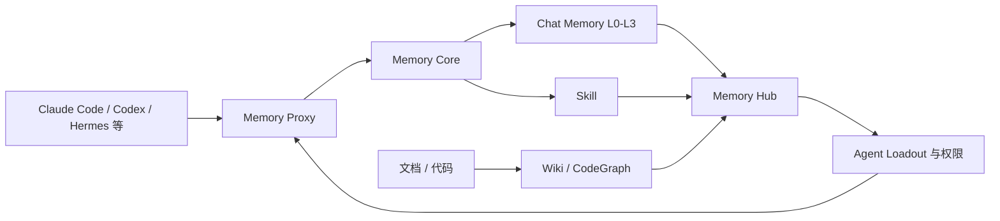

> TencentDB Agent Memory 研究系列：[1. 全景](/writing/tencentdb-agent-memory-overview/)｜[2. 接入链路](/writing/tencentdb-agent-memory-proxy/)｜[3. 分层记忆](/writing/tencentdb-agent-memory-layers/)｜[4. 团队治理](/writing/tencentdb-agent-memory-governance/)｜[5. 整体判断](/writing/tencentdb-agent-memory-synthesis/)

> 版本范围：2026-09-05 核查的 `TencentCloud/TencentDB-Agent-Memory` 提交 [`2ee2239`](https://github.com/TencentCloud/TencentDB-Agent-Memory/tree/2ee22397f6091b8cd3ea847bc1edb04d3bec0c94)，位于默认的 `feat/server_team` 分支。官方标注 Team Memory 为 Beta；本文把现有设计与路线图严格分开，不把规划能力写成稳定承诺。

TencentDB Agent Memory 的主语不只是“某个用户有哪些事实”，而是“一支 Agent 团队如何积累、审核、装配和继承经验”。它把 Chat Memory、Skill、Wiki 与 CodeGraph 都视为记忆资产，再通过统一服务交给不同 Agent 使用。

*图 1｜统一接入、分层记忆、知识资产和团队控制面共同构成系统。*

## 先看四个平面

| 平面 | 核心职责 | 需要验证的边界 |
|---|---|---|
| 接入面 | Proxy 兼容不同 Agent 的模型协议 | 注入是否改变原始请求，流式与工具调用是否完整 |
| 记忆面 | L0 对话、L1 原子、L2 场景、L3 Persona | 提炼错误能否回到原文并被修正 |
| 知识面 | Wiki、CodeGraph、Skill | 文档和代码变化后资产是否及时更新 |
| 控制面 | Team、Owner、可见性、ACL、Loadout | 哪个身份能读、改、分享和装配什么 |

这四层解释了为什么它不能只与一个记忆算法比较。Memory Core 负责提炼和召回，Memory Knowledge 负责文档与代码，Memory Hub/Panel 负责资产与权限，Proxy 负责不改 Agent 源码的接入路径。系统覆盖面更广，也拥有更大的部署和治理面。

## 本系列怎样深入

第二篇从 Proxy 看一次请求如何获得记忆、又怎样回写经验；第三篇只研究 L0–L3 的提炼与召回，避免和 OpenViking 的读取精度混淆；第四篇进入资产 Owner、版本、状态、可见性、ACL 与 Agent Loadout；终篇再判断“团队经验复利”成立需要哪些前提。

它在 [Agent 记忆设计母系列](/writing/agent-memory-design-competitive-analysis/)中代表团队经验治理路线。现阶段最重要的不是给 Beta 系统下成熟度总分，而是分清已经存在的机制、仍在快速变化的接口和部署者必须补齐的证据。

---

下一篇：[Proxy 如何让不同 Agent 共享一条记忆链路](/writing/tencentdb-agent-memory-proxy/)。

下一篇从入口开始，因为“零代码接入”是否可靠，决定后面的记忆能力能否安全进入真实任务。
