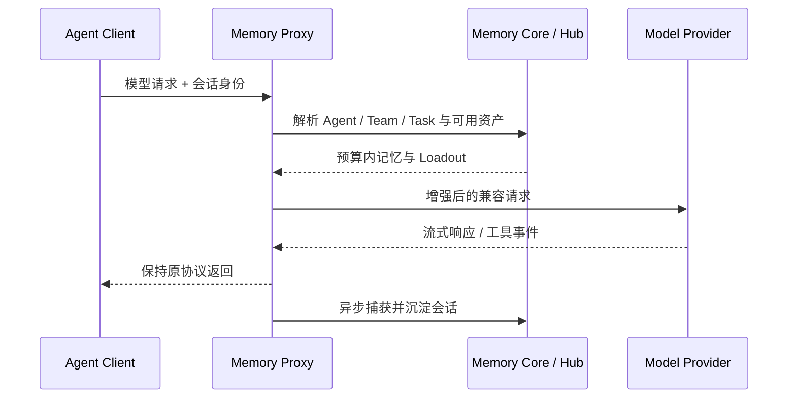

> TencentDB Agent Memory 研究系列：[1. 全景](/writing/tencentdb-agent-memory-overview/)｜[2. 接入链路](/writing/tencentdb-agent-memory-proxy/)｜[3. 分层记忆](/writing/tencentdb-agent-memory-layers/)｜[4. 团队治理](/writing/tencentdb-agent-memory-governance/)｜[5. 整体判断](/writing/tencentdb-agent-memory-synthesis/)

TencentDB Agent Memory 选择把 Memory Proxy 放在 Agent 与模型端点之间。使用者修改 base URL，就可以让 Claude Code、Codex、Hermes 等客户端经过同一条记忆链路，不必分别实现插件、Hook 或 MCP Server。

*图 1｜Proxy 同时承担协议兼容、上下文装配与会话捕获。*

## 为什么选择协议代理

插件模式能使用客户端原生生命周期，但每个平台接口不同，版本升级也容易漂移。Proxy 复用模型协议作为公共边界，让不原生支持 Memory 的 Agent 也能接入，并能统一执行 `mem:sync`、`mem:create-skill` 等会话指令。

代价是代理必须透明处理模型参数、流式片段、错误码、取消、重试和工具事件。只要某个字段被错误改写，“记忆接入成功”也可能以客户端能力退化为代价。因此兼容性测试不能只验证普通文本对话。

## 注入不是简单拼接

Proxy 需要先从可信凭证解析用户、团队、Agent 和 Task，再取得该角色被允许使用的 Chat Memory、Skill、Wiki、CodeGraph 与任务描述。随后按优先级、字符或 Token 预算装配上下文，并保留来源，避免把所有团队资产变成全局 System Prompt。

这里最危险的捷径，是把客户端传来的名称直接当权限身份。模型可见字段适合描述任务，不适合作为授权凭据。真正的 Owner、Team 和 Agent 绑定应来自服务端认证与控制面。

## 回写必须脱离主响应的成败

会话捕获和记忆提炼通常适合异步执行，避免阻塞模型响应。但异步意味着返回成功时，记忆可能尚未生成；代理崩溃时，也可能出现响应已交付而回写未知。系统需要会话 ID、幂等键、队列状态和重放策略，才能区分“尚未沉淀”与“重复沉淀”。

与 [Harness 接入与实战：工具、执行策略与 MCP](/writing/harness-integration-mcp/)类似，协议连通只说明数据能流动，不说明业务结果已经确定。对 Proxy，应至少覆盖流式中断、工具调用、多模型切换、重试重复、记忆服务超时和撤权后的重新注入。

官方安装与仓库入口

- [项目 README](https://github.com/TencentCloud/TencentDB-Agent-Memory/blob/2ee22397f6091b8cd3ea847bc1edb04d3bec0c94/README_CN.md)
- [完整安装指南](https://github.com/TencentCloud/TencentDB-Agent-Memory/blob/2ee22397f6091b8cd3ea847bc1edb04d3bec0c94/INSTALL_CN.md)
- [`MemoryProxy` 源码目录](https://github.com/TencentCloud/TencentDB-Agent-Memory/tree/2ee22397f6091b8cd3ea847bc1edb04d3bec0c94/MemoryProxy)

---

上一篇：[系统全景](/writing/tencentdb-agent-memory-overview/)。

下一篇：[L0 到 L3 如何把对话沉淀为可召回认识](/writing/tencentdb-agent-memory-layers/)。
