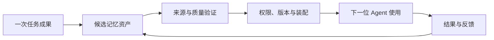

> TencentDB Agent Memory 研究系列：[1. 全景](/writing/tencentdb-agent-memory-overview/)｜[2. 接入链路](/writing/tencentdb-agent-memory-proxy/)｜[3. 分层记忆](/writing/tencentdb-agent-memory-layers/)｜[4. 团队治理](/writing/tencentdb-agent-memory-governance/)｜[5. 整体判断](/writing/tencentdb-agent-memory-synthesis/)

TencentDB Agent Memory 最有辨识度的判断是：Agent 产生的不只是聊天事实，还会产生可以被团队继承的 Skill、Wiki 与 CodeGraph。Memory Proxy 降低多 Agent 接入成本，L0–L3 把对话逐级提炼，Memory Hub 再用 Owner、版本、可见性和 Loadout 控制经验如何流动。

*图 1｜经验只有经过验证、授权和反馈，才可能形成团队复利。*

## 覆盖面是价值，也是成本

当团队同时使用多个 Agent，希望把项目约束、历史事故、代码关系和工作方法按角色复用时，这套路线比单一事实记忆更贴近组织问题。若应用只需要轻量个性化，[Mem0 全景](/writing/mem0-series-overview/)更容易控制；若核心是海量上下文的目录导航与逐层读取，[OpenViking 全景](/writing/openviking-series-overview/)的对象模型更集中。

更广的系统边界也意味着更多故障面：Proxy 可能产生协议偏差，异步提炼可能产生层间漂移，Wiki 与 CodeGraph 可能陈旧，Loadout 可能越权，Skill 可能把错误经验转成行动。任何一个问题都不能只靠更强模型解决。

## Beta 阶段最重要的是保持可逆

官方明确把 Team Memory 标注为 Beta，路线图仍包含记忆编辑、搜索和 Agent 模板等能力。这时最稳妥的采用方式是小范围、可观察、可退出：固定提交或版本；为关键资产保留原始来源；默认私有；共享需要审核；高风险 Skill 在隔离环境验证；Proxy 失败时能够绕过或降级。

## 最后的判断

团队记忆的真正单位不是“存了多少条”，而是有多少经过验证的认识，在正确的时间进入正确的角色，并且能够被撤回。这个项目已经把团队经验的主要对象与控制面画了出来；它能否形成生产级复利，取决于后续是否把纠错、兼容、可观测和退出机制做成同等重要的能力。

---

上一篇：[团队治理](/writing/tencentdb-agent-memory-governance/)。

本系列到此完成。回到 [TencentDB Agent Memory 系统全景](/writing/tencentdb-agent-memory-overview/)，可以看到系统重点不是让所有 Agent 共享更多上下文，而是让经验拥有来源、归属和行动边界。接下来可回到 [Agent 记忆设计母系列](/writing/agent-memory-design-competitive-analysis/)，在完成单项目理解后再建立横向关联。
