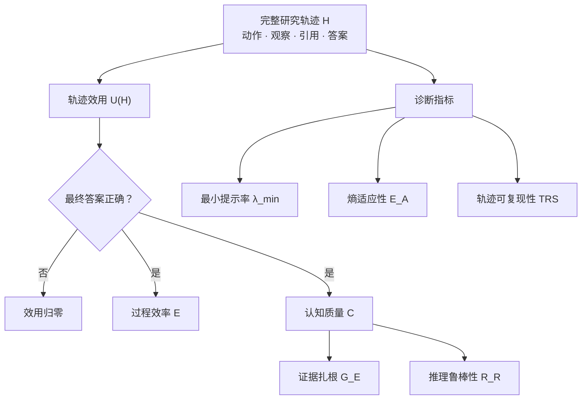
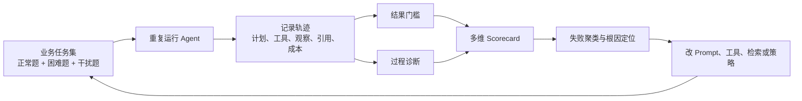

> [!NOTE]
> **论文出处**：Yanyu Chen、Jiyue Jiang、Jiahong Liu、Yifei Zhang、Xiao Guo、Irwin King，*TRACE: Trajectory-Aware Comprehensive Evaluation for Deep Research Agents*，The Web Conference 2026（WWW ’26），pp. 2524–2534。论文：[arXiv:2602.21230](https://arxiv.org/abs/2602.21230)；正式 DOI：[10.1145/3774904.3792738](https://doi.org/10.1145/3774904.3792738)。本文依据 arXiv v1（2026-02-05）精读，实验数字均为论文自报结果。

如果只用一句话概括 TRACE，我会说：**它试图把 Deep Research Agent 的评测对象，从“最终答案”改成“产生答案的整条研究轨迹”。**

这一步很重要。一个 Agent 可能碰巧答对，却反复搜索、引用不支持结论的材料，甚至先被错误信息带偏、最后靠一次幸运检索翻盘。Pass@1 会把这些过程压成同一个“1”；TRACE 则追问：它花了多少代价、证据是否真的支撑声明、陷入误导后多久恢复，以及只差多少提示就能稳定完成任务。

但更值得深读的，不只是 TRACE 提出了哪些指标，而是这些指标**真正测到了什么、依赖了什么，以及在什么条件下会失真**。

## 一、TRACE 想拆穿的两种幻觉

论文把现有评测的缺口归纳为两类。

第一类是“高分幻觉”：Pass@1 只判断最终答案是否正确。同样答对一道题，三步完成与三十步完成没有差别；逐条核验证据与凭印象拼接答案也没有差别。对长程研究 Agent 来说，这会把效率、成本和可信度全部藏起来。

第二类是“静态基准幻觉”：当所有 Agent 在极难任务上都接近 0 分，Pass@1 无法区分“完全不会”和“给一点提示就会”；普通题集也难以稳定测量面对误导信息时的恢复能力。

TRACE 因此给出两组互补工具：

- **轨迹效用**回答：这次任务不仅做成了吗，而且做得是否经济、可信、稳健？
- **脚手架与策略诊断**回答：在独立完成之外，这个 Agent 的潜在能力和行为稳定性如何？

这也是 TRACE 最值得复用的思想：**排行榜只适合比较结果，诊断系统必须保留过程。**

## 二、顶层效用：正确性是门槛，不是全部

TRACE 将一条轨迹记为 $\mathcal{H}$，顶层效用定义为：

$$
U(\mathcal{H})=
\mathbb{I}\!\left(\mathbb{J}(A_{final},A_{gt})\right)
\cdot \mathcal{E}(\mathcal{H})^{\omega_E}
\cdot \mathcal{C}(\mathcal{H})^{\omega_C}
$$

其中，$\mathbb{J}$ 判断最终答案是否正确；指示函数 $\mathbb{I}$ 把错误答案的效用直接置零；$\mathcal{E}$ 是过程效率，$\mathcal{C}$ 是认知质量。论文实验令 $\omega_E=\omega_C=0.5$。

这个设计同时做了两件事：

1. **用正确性守住底线。** 过程再漂亮，答错仍然不能算成功。
2. **用几何平均执行“最弱环节原则”。** 高效率不能补偿低可信度，反之亦然；任何一项接近零，整体效用都会被显著拉低。

论文附录证明了几何平均对接近零的分量具有比算术平均更高的敏感度。不过，这个证明只说明函数具有预期的数学性质，**并不能自动证明分量本身有效，也不能证明权重选择符合真实业务价值**。如果效率、证据或鲁棒性测偏了，几何平均只会更强烈地放大偏差。

> [!IMPORTANT]
> TRACE 不是“结果评测的替代品”，而是“结果门槛之上的过程评测”。把答案正确性直接乘在最外层，说明作者仍然把成功结果放在第一优先级。

### 一个不能被总分掩盖的问题

顶层效用适合排序，却不适合单独诊断。两个 Agent 都得到 0.70，一个可能是“效率高、证据弱”，另一个可能是“效率低、证据强”。生产评测应同时展示 $U$、$\mathcal{E}$、$\mathcal{G}_E$、$\mathcal{R}_R$ 及其置信区间，而不是再制造一个新的单分数幻觉。

此外，论文的聚合口径值得进一步说明。Table 3 中部分模型的 Utility 高于以小数表示的 Pass@1，例如 AgentFounder 的 Pass@1 为 0.601、Utility 为 0.81。若 $U$ 在失败任务上为 0，且单任务效用按 $[0,1]$ 理解，那么跨全部任务直接取均值不应出现这种关系。合理的可能性包括：Utility 只在成功轨迹上聚合、经过了额外归一化，或效率项并不严格有界于 1。论文没有把这一步写清楚，复现时必须先确定聚合定义。

## 三、过程效率：它测的是“搜索是否持续推进”

TRACE 的效率分数为：

$$
\mathcal{E}(\mathcal{H})=
\frac{1+\gamma\ln T}
{1+\ln\left(\sum_{t=1}^{T}C(a_t)p_t\right)}
$$

$C(a_t)$ 表示动作成本，$p_t$ 是冗余探索惩罚。论文没有简单地把“步数多”判为低效，而是引入边际信息增益（Marginal Information Gain，MIG）：

$$
g_t=\max\left(0,
\cos(\Phi(o_t),\Phi(A_{gt}))-
\sup_{i<t}\cos(\Phi(o_i),\Phi(A_{gt}))
\right)
$$

当前观察 $o_t$ 与标准答案 $A_{gt}$ 的语义相似度，只有超过此前所有观察的最高值，才算带来新的信息增益。若连续两步 $g_t=0$，再根据相邻观察的相似程度追加惩罚：

$$
p_t=1+\mathbb{I}(g_t=0\land g_{t-1}=0)
\cdot\alpha\cdot\cos(\Phi(o_t),\Phi(o_{t-1}))
$$

这一设计比“工具调用越少越好”聪明：复杂研究本来就需要多步探索，真正应该惩罚的是连续、相似、没有推进的信息采集。

但 MIG 也是 TRACE 最明显的代理指标之一。

- **它依赖标准答案。** 线上真实任务通常没有 $A_{gt}$，因此这套效率只能用于离线基准，不能直接作为生产监控指标。
- **相似度不等于信息量。** 一条关键反例可能与标准答案表述并不相似，却会显著改变结论；一条措辞高度相似的低质量材料则可能得到高分。
- **“破纪录”定义会低估验证。** 第二个独立来源即使完成了重要交叉核验，只要没有超过历史最高相似度，$g_t$ 仍可能为 0。
- **冗余不只发生在相似观察之间。** Agent 可以不断打开主题不同但都无关的页面，这些步骤彼此不相似，却同样浪费成本。

因此，MIG 更准确的名字也许是“**相对标准答案的语义前沿增量**”，而不是真实的信息论增益。

## 四、认知质量：证据扎根与错误恢复

TRACE 将认知质量写成两个分量的加权和：

$$
\mathcal{C}(\mathcal{H})=
\beta\mathcal{G}_E(\mathcal{H})+
(1-\beta)\mathcal{R}_R(\mathcal{H})
$$

论文实验中 $\beta=0.5$。一个分量检查答案能否被引用证据支持，另一个检查 Agent 遇到信息陷阱后的恢复速度。

### 4.1 证据扎根 $\mathcal{G}_E$

最终答案先被拆成 $N$ 个原子声明 $c_i$，再由 NLI 模型判断引用证据 $E_i$ 对声明的蕴含概率：

$$
\mathcal{G}_E(\mathcal{H})=
\left(\prod_{i=1}^{N}P_{NLI}(c_i\mid E_i)\right)^{1/N}
$$

几何平均让任何一条无依据声明都付出较大代价。这比“有链接就算引用成功”更接近研究质量，因为它检查的是**证据与声明之间的关系**。

仍要注意，证据扎根不是事实正确性的同义词：

- NLI 判断会继承声明拆分、上下文截取和模型本身的误差；
- 证据能够蕴含声明，不代表来源可靠、权威或彼此独立；
- 多个网页互相转载同一错误信息，仍可能形成很高的表面支持度；
- 几何平均对单点误判非常敏感，既严厉惩罚幻觉，也可能严厉惩罚评测器噪声。

生产版应把“声明—证据蕴含”“来源质量”“来源独立性”“时效性”拆成不同字段，避免用一个 NLI 概率承载全部信任问题。

### 4.2 推理鲁棒性 $\mathcal{R}_R$

DeepResearch-Bench 会在任务中嵌入看似合理的误导信息。TRACE 记录 Agent 遇到陷阱后，经过多少步重新获得正向 MIG：

$$
\mathcal{R}_R(\mathcal{H})=
\exp\left(-\lambda\cdot
\frac{1}{|\mathcal{T}_{trap}|}
\sum_{t\in\mathcal{T}_{trap}}D_{recover}(t)
\right)
$$

这个指标的洞察很实用：鲁棒性不是“永不犯错”，而是“发现错误并尽快恢复”。它比单纯统计是否点击过错误页面，更贴近真实研究过程。

但“下一次 $g_k>0$”只说明 Agent 找到了更接近标准答案的新观察，不一定说明它**撤销了错误信念**。更严格的恢复判据应同时检查：

1. 是否显式识别冲突；
2. 是否降低或删除受污染声明的置信度；
3. 是否通过独立来源完成核验；
4. 最终答案是否不再受陷阱影响。

另一个实现边界是：没有预先标注的陷阱集合 $\mathcal{T}_{trap}$，该指标就无法计算。这解释了为什么 TRACE 需要自建带陷阱的基准。

## 五、脚手架评测：在 0 分区间里继续区分能力

当任务难到所有 Agent 的 Pass@1 都接近 0，普通排行榜会失去分辨率。TRACE 借用了“脚手架”思想：给 Agent 提供标准轨迹的前 $\lambda$ 比例，寻找达到目标成功率所需的最小提示量。

$$
\lambda_{min}(\pi,q)=
\min_{\lambda\in[0,1]}\lambda
\quad\text{s.t.}\quad
\mathbb{E}_{\mathcal{H}\sim P(\cdot\mid\pi,q,h(\lambda))}
[\mathcal{A}(\mathcal{H})]\ge\theta_{succ}
$$

论文把 $\theta_{succ}$ 设为 0.9，并在不同提示比例上重复运行。$\lambda_{min}$ 越低，说明 Agent 只需较少引导就能稳定跨过难点。

在论文的 TRACE-Scaffolding 子集上，AgentFounder-30B 与 DeepSeek-V3.1-671B 的 Pass@1 都是 4.0%，但平均最小提示率分别为 0.22 和 0.35；WebSailor-V2-30B 的 Pass@1 为 2.0%，最小提示率为 0.28。这个例子很好地说明：**独立成功率相同，不代表距离成功的距离相同。**

不过，$\lambda_{min}$ 测到的是“在特定 oracle 前缀帮助下的可提升性”，还不能直接等同于通用的“潜在能力”：

- 一个问题可能有多条同样优秀的路径，单一 oracle 前缀会偏向与其策略相似的 Agent；
- 更多提示不一定单调更好，错误锚定或风格冲突可能让 Agent 表现变差；
- 0.9 阈值、每档 10 次运行和提示切分粒度都会影响估计方差与成本；
- 没有高质量 oracle 轨迹，就无法构造可比较的脚手架。

比单点 $\lambda_{min}$ 更稳妥的做法，是报告完整的“提示量—成功率曲线”、曲线下面积和置信区间。

## 六、策略指纹：有启发，但可观测性不足

TRACE 还提出两个诊断维度：

- **熵适应性 $\mathcal{E}_A$**：信息增益与下一步策略熵下降之间的相关性，试图判断 Agent 能否把新信息转化为决策确定性。
- **轨迹可复现性 TRS**：对同一任务运行多次，衡量策略是否稳定。

论文 Table 7 据此把 AgentFounder 描述为“系统化且高效”，WebSailor-V2 描述为“适应且理性”，DeepSeek-V3.1 描述为“一致但低效”，ReAct 基线描述为“启发式且不稳定”。这些标签适合帮助团队形成诊断假设，但不宜当作心理学意义上的“人格”。

尤其是策略熵：闭源 Agent 通常不会暴露完整动作分布，工具调用日志也不等于底层策略概率。论文没有充分解释不同系统间如何获得完全可比的 $H_t$。如果可观测性不同，这个指标可能把“接口暴露程度”混入“策略适应能力”。

## 七、实验结果：排名反转成立，但因果解释要克制

论文在 650 道自建 DeepResearch-Bench 任务上评测 TRACE，并用 BrowseComp-en 的 123 道题和 GAIA text-only 的 103 道题做泛化测试。自建数据又分为 TRACE-Core（500）、TRACE-Robustness（100）和 TRACE-Scaffolding（50）。

下面是论文 Table 3 中 5 个开源 SOTA Agent 在 TRACE-Core 上的结果：

| Agent | Pass@1 ↑ | Utility ↑ | 效率 $\mathcal{E}$ ↑ | 认知质量 $\mathcal{C}$ ↑ | 扎根 $\mathcal{G}_E$ ↑ | 鲁棒 $\mathcal{R}_R$ ↑ | MHR ↓ |
| --- | ---: | ---: | ---: | ---: | ---: | ---: | ---: |
| DeepSeek-V3.1-671B | **65.8** | 0.65 | 0.68 | 0.85 | 0.90 | 0.80 | 0.35 |
| WebSailor-V2-30B | 62.5 | 0.78 | 0.85 | 0.88 | 0.92 | 0.84 | 0.28 |
| AgentFounder-30B | 60.1 | **0.81** | **0.88** | **0.91** | **0.95** | **0.87** | **0.22** |
| ReSum-GRPO | 58.8 | 0.75 | 0.86 | 0.82 | 0.88 | 0.76 | 0.33 |
| GLM-4.5-355B | 55.2 | 0.62 | 0.70 | 0.80 | 0.85 | 0.75 | 0.41 |

按 Pass@1，DeepSeek-V3.1 排名第一；按 Utility，它降到第 4。AgentFounder 则从 Pass@1 第 3 升到 Utility 第 1。这确实展示了 TRACE 的核心价值：单一正确率会掩盖过程差异。

需要纠正一个容易传播的说法：**DeepSeek 的 Utility 并非这 5 个开源 SOTA 中“垫底”，GLM-4.5 的 0.62 更低。** 更准确的表述是“DeepSeek 从正确率第一下降到综合效用第四”。

还要区分观察与因果。论文认为 DeepSeek 较低的效率可能与大模型产生不够节俭的高成本轨迹有关，也把 AgentFounder、WebSailor、ReSum 的优势分别联系到预训练、高不确定性数据和上下文摘要机制。这些是有启发的解释，但仅凭横向结果不能排除基础模型、搜索工具、提示词和实现细节等混杂因素。论文的同基座受控实验增强了证据，却仍不足以把每个分数变化唯一归因于某一种训练机制。

> [!WARNING]
> 截至本文核对时，arXiv 论文页没有列出 TRACE 或其 650 题 DeepResearch-Bench 的官方代码、数据链接。它与 2025 年同名的 100 题 *DeepResearch Bench* 是不同数据集。没有评测代码、oracle 轨迹与原始运行日志，论文的完整结果暂时难以独立复现。

## 八、TRACE 真正改变了什么

我认为 TRACE 最有价值的贡献，不是某个公式，而是四个评测观念的变化。

### 1. 从终态正确，转向成功路径的质量

Agent 是序列决策系统。终态只回答“有没有到达”，轨迹才能回答“为什么到达、能否再次到达、代价是否可接受”。

### 2. 从“不犯错”，转向“能恢复”

开放网络不可能没有噪声。鲁棒性的更现实定义，是识别冲突、修正错误并控制污染范围。

### 3. 从“会/不会”，转向“距离会还有多远”

脚手架曲线为极难任务提供了连续信号。它也能告诉开发者下一步该优化独立规划，还是只需补一个关键提示。

### 4. 从排行榜，转向能力剖面

一个总分只适合做入口，不能做诊断终点。效率、扎根、恢复、稳定性和提示依赖度共同构成 Agent 的能力剖面。

## 九、从论文到生产：一套 TRACE-Lite 落地方案

原版 TRACE 严重依赖标准答案、oracle 轨迹、嵌入模型和 NLI 模型，完整运行成本也很高。企业不必照搬全部公式，可以保留其结构，替换不可观测的代理量。

| 层级 | 论文 TRACE | 生产 TRACE-Lite |
| --- | --- | --- |
| 结果门槛 | GPT-4-Turbo 判断答案正确 | 确定性状态检查优先；开放答案再用双 Judge + 人工抽检 |
| 真实成本 | 动作成本 $C(a_t)$ | Token、工具费、延迟、调用次数、人工介入时间 |
| 信息推进 | 与标准答案的 embedding MIG | 新增可验证声明、填补证据缺口、消除冲突、完成子目标 |
| 证据质量 | 原子声明的 NLI 几何平均 | 蕴含度 + 来源等级 + 来源独立性 + 时效性 |
| 错误恢复 | 陷阱后的正向 MIG 延迟 | 注入可控干扰，记录识别、撤销、复核与最终去污染 |
| 潜在能力 | oracle 前缀的 $\lambda_{min}$ | 分级提示曲线：目标提示、计划提示、证据提示、局部解答 |
| 稳定性 | TRS，$K=5$ | 多次运行的成功率分布、成本分布与路径簇 |

建议把评测流水线设计成以下闭环：

### 最小可行指标集

如果团队资源有限，我会先落地 6 项，不急着合成总分：

1. **任务成功率**：以环境终态或可执行测试为准；
2. **成功条件下的 P50/P95 成本**：Token、延迟、工具费分别报告；
3. **无效工具调用率**：未推进任何子目标的调用占比；
4. **声明支持率**：有可访问证据且证据确实支持的原子声明比例；
5. **干扰恢复率与恢复延迟**：是否识别、是否撤销、花了几步；
6. **重复运行可靠性**：至少 5 次运行，报告均值、方差和最差一次。

等这些指标稳定后，再引入几何平均作为发布门禁。否则，一个漂亮的总分很容易掩盖评测器本身还不可靠。

### 成本控制策略

完整 TRACE 不适合每个提交都跑。可以分层：

- **PR 级**：小规模确定性任务，检查成功率、工具错误和硬性成本上限；
- **每日级**：覆盖主要业务切片，计算过程指标并做回归比较；
- **发布级**：多次重复运行、干扰测试、脚手架曲线和人工抽检；
- **生产级**：只采集真实成本、失败轨迹和证据异常，定期回流为离线测试。

这样既保留 TRACE 的过程视角，也不会让评测成本反过来拖慢开发。

## 十、如何正确阅读 TRACE 的分数

使用 TRACE 或类似框架时，应坚持四条纪律：

- **先看门槛，再看剖面，最后看总分。** 错误答案不能靠低成本“洗白”，成功答案也不能靠一个高 Utility 掩盖证据问题。
- **把代理指标写进指标名称。** 例如“embedding-MIG”比“信息增益”诚实，“NLI 支持度”比“事实正确性”准确。
- **同时评测 Agent 与评测器。** Judge、NLI、声明拆分器和来源分类器都要用人工样本校准。
- **报告不确定性。** Agent 有采样方差，Judge 也有方差；只报一个小数点后两位的分数，会制造虚假的精确感。

## 结语：TRACE 是一张更好的地图，还不是完整的道路

TRACE 最重要的提醒是：**“答对”只是一条轨迹的结果，不是对 Agent 能力的完整解释。** 对 Deep Research Agent 而言，可信能力至少还包括高效探索、证据约束、错误恢复、少量提示下的可提升性，以及跨多次运行的稳定性。

它也有清晰边界：MIG 借用了标准答案，NLI 只是一种代理判断，陷阱恢复依赖人工构造，脚手架依赖 oracle，聚合口径和部分诊断指标的实现细节仍需澄清。论文最后提出把 $U(\mathcal{H})$ 用作强化学习奖励，但这仍是未来方向，而不是已经验证的结论。

所以，TRACE 最适合被当作**评测系统的设计语言**，而不是一套无需修改即可照抄的公式。真正成熟的实践，是沿用它“结果门槛 + 过程剖面 + 压力测试 + 重复运行”的结构，再用业务中可观测、可校准、可复现的信号替换论文代理量。

## 参考资料

- Chen, Y., Jiang, J., Liu, J., Zhang, Y., Guo, X., & King, I. (2026). [TRACE: Trajectory-Aware Comprehensive Evaluation for Deep Research Agents](https://arxiv.org/abs/2602.21230). *Proceedings of the ACM Web Conference 2026*, 2524–2534. [DOI](https://doi.org/10.1145/3774904.3792738)
- Du, M., Xu, B., Zhu, C., Wang, X., & Mao, Z. (2025). [DeepResearch Bench: A Comprehensive Benchmark for Deep Research Agents](https://arxiv.org/abs/2506.11763). 注：这是独立的 100 题报告质量基准，不是 TRACE 论文自建的 650 题同名数据集。
