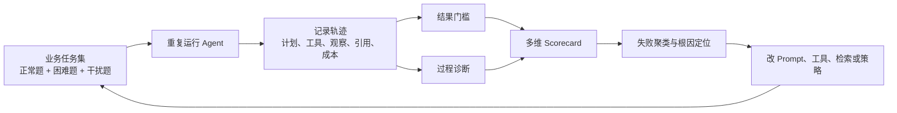

> 系列：[1. 可靠性地图](/writing/ai-agent-reliability-boundaries/)｜[2. 自治落地](/writing/agent-reliability-adoption/)｜[3. Harness 原理](/writing/anthropic-harness/)｜[4. Harness 实践](/writing/anthropic-harness-practice/)｜[5. TRACE 模型](/writing/trace-framework-deep-dive/)｜[6. TRACE 落地](/writing/trace-lite-production/)｜[7. 整体思考](/writing/trustworthy-agent-engineering-synthesis/)

评测框架进入生产后，最容易从诊断工具重新退化为一个漂亮总分。本篇保留 TRACE 的限制与落地方法，区分论文发现、推断和团队可以持续维护的指标。

## 策略指纹：有启发，但可观测性不足

TRACE 还提出两个诊断维度：

- **熵适应性 $\mathcal{E}_A$**：信息增益与下一步策略熵下降之间的相关性，试图判断 Agent 能否把新信息转化为决策确定性。
- **轨迹可复现性 TRS**：对同一任务运行多次，衡量策略是否稳定。

论文 Table 7 据此把 AgentFounder 描述为“系统化且高效”，WebSailor-V2 描述为“适应且理性”，DeepSeek-V3.1 描述为“一致但低效”，ReAct 基线描述为“启发式且不稳定”。这些标签适合帮助团队形成诊断假设，但不宜当作心理学意义上的“人格”。

尤其是策略熵：闭源 Agent 通常不会暴露完整动作分布，工具调用日志也不等于底层策略概率。论文没有充分解释不同系统间如何获得完全可比的 $H_t$。如果可观测性不同，这个指标可能把“接口暴露程度”混入“策略适应能力”。

## 实验结果：排名反转成立，但因果解释要克制

论文在 650 道自建 DeepResearch-Bench 任务上评测 TRACE，并用 BrowseComp-en 的 123 道题和 GAIA text-only 的 103 道题做泛化测试。自建数据又分为 TRACE-Core（500）、TRACE-Robustness（100）和 TRACE-Scaffolding（50）。

下面是论文 Table 3 中 5 个开源 SOTA Agent 在 TRACE-Core 上的结果：

| Agent | Pass@1 ↑ | Utility ↑ | 效率 $\mathcal{E}$ ↑ | 认知质量 $\mathcal{C}$ ↑ | 扎根 $\mathcal{G}_E$ ↑ | 鲁棒 $\mathcal{R}_R$ ↑ | MHR ↓ |
| --- | ---: | ---: | ---: | ---: | ---: | ---: | ---: |
| DeepSeek-V3.1-671B | **65.8** | 0.65 | 0.68 | 0.85 | 0.90 | 0.80 | 0.35 |
| WebSailor-V2-30B | 62.5 | 0.78 | 0.85 | 0.88 | 0.92 | 0.84 | 0.28 |
| AgentFounder-30B | 60.1 | **0.81** | **0.88** | **0.91** | **0.95** | **0.87** | **0.22** |
| ReSum-GRPO | 58.8 | 0.75 | 0.86 | 0.82 | 0.88 | 0.76 | 0.33 |
| GLM-4.5-355B | 55.2 | 0.62 | 0.70 | 0.80 | 0.85 | 0.75 | 0.41 |

按 Pass@1，DeepSeek-V3.1 排名第一；按 Utility，它降到第 4。AgentFounder 则从 Pass@1 第 3 升到 Utility 第 1。这说明论文报告的两种排序不同，但不能单凭该表确认 Utility 聚合合理。前篇指出，表中 Utility 与 Pass@1、逐任务聚合的关系仍需原始数据澄清；这里保留作者报告值，不视为已独立复算的排名。

需要纠正一个容易传播的说法：**DeepSeek 的 Utility 并非这 5 个开源 SOTA 中“垫底”，GLM-4.5 的 0.62 更低。** 更准确的表述是“DeepSeek 从正确率第一下降到综合效用第四”。

还要区分观察与因果。论文认为 DeepSeek 较低的效率可能与大模型产生不够节俭的高成本轨迹有关，也把 AgentFounder、WebSailor、ReSum 的优势分别联系到预训练、高不确定性数据和上下文摘要机制。这些是有启发的解释，但仅凭横向结果不能排除基础模型、搜索工具、提示词和实现细节等混杂因素。论文的同基座受控实验增强了证据，却仍不足以把每个分数变化唯一归因于某一种训练机制。

> [!WARNING]
> 截至本文核对时，arXiv 论文页没有列出 TRACE 或其 650 题 DeepResearch-Bench 的官方代码、数据链接。它与 2025 年同名的 100 题 *DeepResearch Bench* 是不同数据集。没有评测代码、oracle 轨迹与原始运行日志，论文的完整结果暂时难以独立复现。

## TRACE 真正改变了什么

我认为 TRACE 最有价值的贡献，不是某个公式，而是四个评测观念的变化。

### 1. 从终态正确，转向成功路径的质量

Agent 是序列决策系统。终态只回答“有没有到达”，轨迹才能回答“为什么到达、能否再次到达、代价是否可接受”。

### 2. 从“不犯错”，转向“能恢复”

开放网络不可能没有噪声。鲁棒性的更现实定义，是识别冲突、修正错误并控制污染范围。

### 3. 从“会/不会”，转向“距离会还有多远”

脚手架曲线为极难任务提供了连续信号。它也能告诉开发者下一步该优化独立规划，还是只需补一个关键提示。

### 4. 从排行榜，转向能力剖面

一个总分只适合做入口，不能做诊断终点。效率、扎根、恢复、稳定性和提示依赖度共同构成 Agent 的能力剖面。

## 从论文到生产：一套 TRACE-Lite 落地方案

原版 TRACE 严重依赖标准答案、oracle 轨迹、嵌入模型和 NLI 模型，完整运行成本也很高。企业不必照搬全部公式，可以保留其结构，替换不可观测的代理量。

| 层级 | 论文 TRACE | 生产 TRACE-Lite |
| --- | --- | --- |
| 结果门槛 | GPT-4-Turbo 判断答案正确 | 确定性状态检查优先；开放答案再用双 Judge + 人工抽检 |
| 真实成本 | 动作成本 $C(a_t)$ | Token、工具费、延迟、调用次数、人工介入时间 |
| 信息推进 | 与标准答案的 embedding MIG | 新增可验证声明、填补证据缺口、消除冲突、完成子目标 |
| 证据质量 | 原子声明的 NLI 几何平均 | 蕴含度 + 来源等级 + 来源独立性 + 时效性 |
| 错误恢复 | 陷阱后的正向 MIG 延迟 | 注入可控干扰，记录识别、撤销、复核与最终去污染 |
| 潜在能力 | oracle 前缀的 $\lambda_{min}$ | 分级提示曲线：目标提示、计划提示、证据提示、局部解答 |
| 稳定性 | TRS，$K=5$ | 多次运行的成功率分布、成本分布与路径簇 |

建议把评测流水线设计成以下闭环：

*图 1｜TRACE-Lite 把业务任务、轨迹记录、结果门槛和过程诊断连接成持续回归闭环。*

### 最小可行指标集

如果团队资源有限，我会先落地 6 项，不急着合成总分：

1. **任务成功率**：以环境终态或可执行测试为准；
2. **完整成本口径**：报告包含失败、重试和人工修正的总成本，并除以成功任务数得到每次成功交付成本；再分别报告成功与失败任务的成本、延迟分布。零成功时该单位成本不可计算；
3. **无效工具调用率**：未推进任何子目标的调用占比；
4. **声明支持率**：有可访问证据且证据确实支持的原子声明比例；
5. **干扰恢复率与恢复延迟**：是否识别、是否撤销、花了几步；
6. **重复运行可靠性**：每题先重复 5 次用于发现不稳定性，报告分布和最差一次；这只是探索起点。发布判断需按误差容忍度增加样本，尤其不能用五个样本稳定估计 P95。

发布先检查结果正确性、关键权限和成本上限等独立门槛，再看过程指标。指标稳定后可以增加汇总分用于趋势观察，但不能让效率分抵消安全或证据门槛失败。

### 成本控制策略

完整 TRACE 不适合每个提交都跑。可以分层：

- **PR 级**：小规模确定性任务，检查成功率、工具错误和硬性成本上限；
- **每日级**：覆盖主要业务切片，计算过程指标并做回归比较；
- **发布级**：多次重复运行、干扰测试、脚手架曲线和人工抽检；
- **生产级**：只采集真实成本、失败轨迹和证据异常，定期回流为离线测试。

这样既保留 TRACE 的过程视角，也不会让评测成本反过来拖慢开发。

## 如何正确阅读 TRACE 的分数

使用 TRACE 或类似框架时，应坚持四条纪律：

- **先看门槛，再看剖面，最后看总分。** 错误答案不能靠低成本“洗白”，成功答案也不能靠一个高 Utility 掩盖证据问题。
- **把代理指标写进指标名称。** 例如“embedding-MIG”比“信息增益”诚实，“NLI 支持度”比“事实正确性”准确。
- **同时评测 Agent 与评测器。** Judge、NLI、声明拆分器和来源分类器都要用人工样本校准。
- **报告不确定性。** Agent 有采样方差，Judge 也有方差；只报一个小数点后两位的分数，会制造虚假的精确感。

## 结语：TRACE 是一张更好的地图，还不是完整的道路

TRACE 最重要的提醒是：**“答对”只是一条轨迹的结果，不是对 Agent 能力的完整解释。** 对 Deep Research Agent 而言，可信能力至少还包括高效探索、证据约束、错误恢复、少量提示下的可提升性，以及跨多次运行的稳定性。

它也有清晰边界：MIG 借用了标准答案，NLI 只是一种代理判断，陷阱恢复依赖人工构造，脚手架依赖 oracle，聚合口径和部分诊断指标的实现细节仍需澄清。论文最后提出把 $U(\mathcal{H})$ 用作强化学习奖励，但这仍是未来方向，而不是已经验证的结论。

所以，TRACE 最适合被当作**评测系统的设计语言**，而不是一套无需修改即可照抄的公式。真正成熟的实践，是沿用它“结果门槛 + 过程剖面 + 压力测试 + 重复运行”的结构，再用业务中可观测、可校准、可复现的信号替换论文代理量。

任务契约、样本分层和回归职责的完整实现，可继续阅读 [Agent 评测工程篇](/writing/agent-evaluation-engineering/)；TRACE-Lite 应进入同一条评测流水线，而不是成为另一套孤立看板。

## 参考资料

- Chen, Y., Jiang, J., Liu, J., Zhang, Y., Guo, X., & King, I. (2026). [TRACE: Trajectory-Aware Comprehensive Evaluation for Deep Research Agents](https://arxiv.org/abs/2602.21230). *Proceedings of the ACM Web Conference 2026*, 2524–2534. [DOI](https://doi.org/10.1145/3774904.3792738)
- Du, M., Xu, B., Zhu, C., Wang, X., & Mao, Z. (2025). [DeepResearch Bench: A Comprehensive Benchmark for Deep Research Agents](https://arxiv.org/abs/2506.11763). 注：这是独立的 100 题报告质量基准，不是 TRACE 论文自建的 650 题同名数据集。

---

上一篇：[TRACE 模型](/writing/trace-framework-deep-dive/)。

从能力边界、Harness 建设到过程评测，三个层次已经连起来。终篇重新讨论可靠性的本质：它为什么不是一个功能，而是一条可以追溯和修正的证据链。

下一篇：[整体思考](/writing/trustworthy-agent-engineering-synthesis/)。
