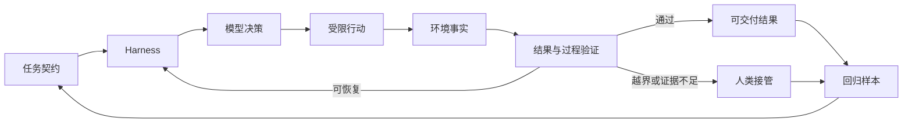

> 系列：[1. 可靠性地图](/writing/ai-agent-reliability-boundaries/)｜[2. 自治落地](/writing/agent-reliability-adoption/)｜[3. Harness 原理](/writing/anthropic-harness/)｜[4. Harness 实践](/writing/anthropic-harness-practice/)｜[5. TRACE 模型](/writing/trace-framework-deep-dive/)｜[6. TRACE 落地](/writing/trace-lite-production/)｜[7. 整体思考](/writing/trustworthy-agent-engineering-synthesis/)

前六篇从三个方向讨论可靠性：Skills、RAG 与权限说明单项机制的边界；Anthropic Harness 说明如何把上下文、工具、验证和执行环境连成闭环；TRACE 说明任务通过以后，为什么还要继续检查成本、证据与恢复过程。

把三条线合起来，会得到一个比“成功率更高”更完整的判断：**可靠性不是 Agent 自己拥有的静态能力，而是任务、环境、人和证据共同维持的一种关系。**

## 可靠性的起点不是模型，而是完成条件

没有验收契约时，系统只能用“看起来完成了”代替完成。写代码要通过测试和审查，研究报告要有可访问且真正支持结论的来源，办公流程要满足格式、权限与下游可用性。不同任务的完成条件不同，可靠性也不能由一张通用排行榜直接推导。

这并不降低模型的重要性。更强的模型可以提升理解、规划与恢复能力，却不能替组织决定哪个数据库可以写、哪封邮件可以发送、什么证据足以支撑一项业务结论。越接近真实行动，这些外部条件越重要。

所以，可信 Agent 工程的第一个产物不应是 Prompt，而是一份任务契约：输入范围、允许动作、验收证据、禁止线、接管条件和恢复方式。模型与 Harness 都要在这份契约下被评估。

## 四类机制解决四个不同问题

Skills 保存做事方法，RAG 提供当前证据，权限和沙箱限制可行动范围，Harness 组织整个观察—行动—验证循环。它们互相补充，却不能彼此替代。

把权限收紧，无法修复错误事实；增加检索，无法保证长任务不偏航；安装更多 Skill，也无法证明选中了正确方法。一个常见反模式，是每次失败都叠加新的提示、工具或知识，希望能力数量最终覆盖所有错误。结果往往是选择噪声、上下文冲突和权限面同时扩大。

更有效的做法是先按失败位置分类：没看到必要约束，修上下文；证据不足，修检索与来源；动作没有达成目标，修反馈和验证；行为越界，修身份、权限与隔离。技术应该对应已观察到的失效模式，而不是对应市场上的功能清单。

## Harness 的本质是把反馈变成下一步决策

模型给出下一步意图，工具让意图接触真实世界，环境返回新的事实，验证器判断是否满足任务契约，Harness 再决定继续、修正、回退还是交还给人。没有环境反馈的 Agent，只是在延长一次生成；没有结果验证的循环，只是在自动重复未经证实的判断。

*图 1｜可靠性不是一次判断，而是任务契约、环境反馈、验证、接管与回归共同形成的证据循环。*

Anthropic 的案例之所以重要，不是因为某个固定产品结构已经成为标准答案，而是它们展示了环境如何改变模型的有效能力：编译器、测试、文件系统、并行隔离和持久 Session 让错误能够被观察，任务才能在多轮执行中持续收敛。

## 只看终态，会把幸运误认为能力

一个 Agent 可能在错误来源、冗余搜索和多次无效调用之后碰巧得到正确答案；也可能在面对一条误导信息时先走错，但快速发现并恢复。只看最终结果，两条轨迹可能获得同样分数，系统却表现出完全不同的成本和风险。

TRACE 的价值正在于把结果门槛与过程诊断分开：正确性仍是必须满足的条件，但成功之后继续测量效率、证据扎根和恢复质量；失败时也通过最小提示率等指标区分“完全不会”与“距离完成还有多远”。

这并不意味着应该把所有维度再压成一个更复杂的总分。过程指标的意义是定位失败、指导改进和设置发布门禁。一个几何平均或加权总分如果遮蔽了证据断裂、安全违规或 P95 成本，评测就再次变成了排行榜装饰。

## 自治范围应该像信用额度一样增长

Agent 的权限不应只分为“每步确认”和“完全自动”。更合理的方式是根据任务风险和累积证据分层：

1. 先处理只读、结果易检查、失败可恢复的任务；
2. 在固定样本上记录完成率、人工接管、权限例外和恢复时间；
3. 稳定通过后开放有限写入，同时保留 Diff、检查点与审计；
4. 外部发送、删除、支付和生产写入仍设置明确批准或禁止线；
5. 版本、模型或环境变化后，重跑受影响的回归样本。

这里的核心不是保守，而是让授权拥有证据基础。系统越能解释成功与失败，组织越容易扩大委托；系统如果无法回放轨迹、判断结果或恢复状态，再多确认弹窗也不会自动产生信任。

## 人类接管不是系统失败，而是系统能力的一部分

对高不确定任务，可靠系统不必保证永不犯错，而要知道什么时候不应继续。证据冲突、目标不清、权限不足、连续重试无进展，都应该成为升级或停止条件。

这改变了人机协同的设计重点：人不需要持续盯着每一步，而是在系统提供清晰状态、关键证据与可选处置时介入。好的接管不是把一堆原始日志交给用户，而是说明已经完成什么、卡在哪里、尝试过什么，以及继续行动需要哪项新决定。

从这个角度看，恢复能力比“从不出错”的承诺更现实，也更可工程化。失败样本进入回归，接管原因进入任务契约，下一次相同问题才可能真正减少人工成本。

## 最后的判断：可信来自可追溯、可接管、可修正

Skills、RAG、权限、Harness 和评测都不是可靠性的终点。它们分别提供方法、证据、边界、反馈和诊断；只有围绕同一份任务契约协作，才形成可信工作系统。

所以，评估一个 Agent 是否可靠，不应只问“它能做什么”，还要问：完成由什么证明，失败何时可见，越界如何阻止，人类怎样接管，这次经验如何修改下一次运行。

可靠性的真正标志不是从不失败，而是每一次成功都有证据，每一次失败都有位置，每一次授权都能被撤回，每一次修正都能进入回归。它不是一个可以采购的功能，而是一条必须由产品、工程和组织共同维护的证据链。

---

上一篇：[TRACE 落地](/writing/trace-lite-production/)。

本系列到此完成。带着“完成由什么证明”回到[第一篇的可靠性地图](/writing/ai-agent-reliability-boundaries/)，Skills、RAG 与权限会从能力列表变成证据链上的不同环节。
